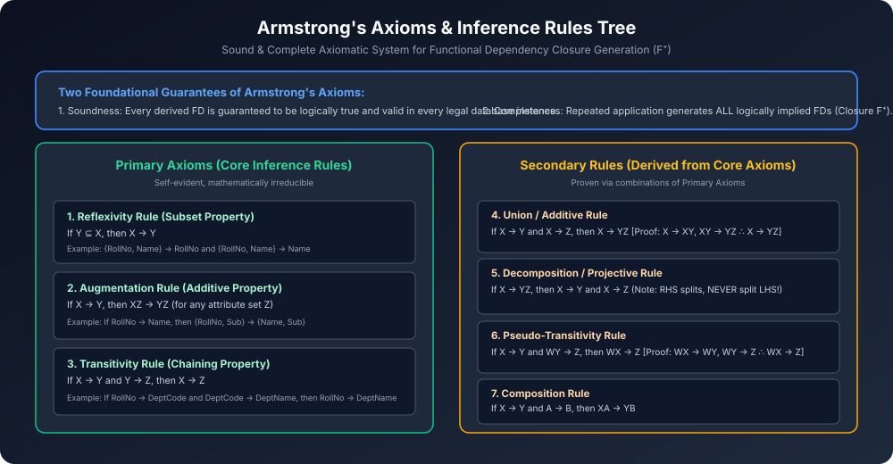

# Module 02: Armstrong's Axioms and Inference Rules

> **Course:** Database Management Systems (AKTU Code: **BCS501**)  
> **Topic Focus:** Axiomatic System for FDs, Primary Axioms (Reflexivity, Augmentation, Transitivity), Derived Secondary Rules, Soundness and Completeness Proofs, Exam Traps.

---

## 1. Why Do We Need Inference Rules?

Given a set of functional dependencies $F$ on relation schema $R$, bahut si aisi dependencies hoti hain jo direct $F$ me written nahi hoti, lekin wo logically hold karti hain.
- Un sabhi logically implied dependencies ke poore collection ko **Closure of Functional Dependencies** ($F^+$) kehte hain.
- William W. Armstrong ne 1974 me formal inference rules ka ek set propose kiya jisse bina actual data check kiye, purely algebraic method se saari valid dependencies derive ki ja sakein.

---

## 2. Primary Axioms (Armstrong's Core Axioms)

Yeh teen basic axioms irreducible hain aur baaki saare rules inhi ke basis par prove hote hain:

### 2.1 Reflexivity Rule (Subset Axiom)
- **Statement:** Agar $Y \subseteq X$, toh $X 
ightarrow Y$ hamesha valid hai.
- **Hindi:** Agar right-hand side attribute left-hand side ka hissa hai, toh dependency trivially hold karegi.
- **Example:** $\{Roll\_No, Name\} 
ightarrow Roll\_No$.

### 2.2 Augmentation Rule (Additive Axiom)
- **Statement:** Agar $X 
ightarrow Y$, toh kisi bhi attribute set $Z$ ke liye $XZ 
ightarrow YZ$ valid hoga.
- **Hindi:** Dono taraf agar same attributes jod diye jayein, toh dependency intact rehti hai.
- **Example:** Agar $Roll\_No 
ightarrow Name$, toh $\{Roll\_No, Semester\} 
ightarrow \{Name, Semester\}$.

### 2.3 Transitivity Rule (Chaining Axiom)
- **Statement:** Agar $X 
ightarrow Y$ aur $Y 
ightarrow Z$, toh $X 
ightarrow Z$ valid hoga.
- **Hindi:** Dependency chain banakar aage propagate hoti hai.
- **Example:** $Roll\_No 
ightarrow Dept\_ID$ aur $Dept\_ID 
ightarrow Dept\_Name \implies Roll\_No 
ightarrow Dept\_Name$.

---

## 3. Secondary / Derived Inference Rules (With Formal Proofs)

Primary axioms ko use karke hum practical calculations ke liye ye secondary rules derive karte hain:

### 3.1 Union / Additive Rule
- **Statement:** Agar $X 
ightarrow Y$ aur $X 
ightarrow Z$, toh $X 
ightarrow YZ$.
- **Formal Proof:**
  1. $X 
ightarrow Y$ (Given)
  2. $X 
ightarrow XX$ (Reflexivity) $\implies$ Augmenting step 1 by $X$: $X 
ightarrow XY$.
  3. $X 
ightarrow Z$ (Given) $\implies$ Augmenting by $Y$: $XY 
ightarrow YZ$.
  4. By Transitivity ($X 
ightarrow XY$ and $XY 
ightarrow YZ$): **$X 
ightarrow YZ$**. (Q.E.D.)

### 3.2 Decomposition / Projective Rule
- **Statement:** Agar $X 
ightarrow YZ$, toh $X 
ightarrow Y$ aur $X 
ightarrow Z$.
- **Formal Proof:**
  1. $YZ 
ightarrow Y$ (Reflexivity, because $Y \subseteq YZ$).
  2. $X 
ightarrow YZ$ (Given).
  3. By Transitivity: **$X 
ightarrow Y$**.
  4. Similarly, $YZ 
ightarrow Z$ (Reflexivity) $\implies$ By Transitivity: **$X 
ightarrow Z$**. (Q.E.D.)

> [!WARNING]
> **CRITICAL AKTU EXAM TRAP:**
> Right-Hand Side (RHS) attributes ko decompose kiya ja sakta hai ($X 
ightarrow YZ \implies X 
ightarrow Y, X 
ightarrow Z$).
> Par **Left-Hand Side (LHS) ko KABHI decompose nahi kiya ja sakta!**
> $$XY 
ightarrow Z \quad \mathbf{
ot\implies} \quad X 
ightarrow Z 	ext{ or } Y 
ightarrow Z$$
> Example: $\{Date\_of\_Birth, Mother\_Name\} 
ightarrow Person$, lekin akele $Date\_of\_Birth 
ot
ightarrow Person$!

### 3.3 Pseudo-Transitivity Rule
- **Statement:** Agar $X 
ightarrow Y$ aur $WY 
ightarrow Z$, toh $WX 
ightarrow Z$.
- **Formal Proof:**
  1. $X 
ightarrow Y$ (Given) $\implies$ Augment by $W$: $WX 
ightarrow WY$.
  2. $WY 
ightarrow Z$ (Given).
  3. By Transitivity ($WX 
ightarrow WY$ and $WY 
ightarrow Z$): **$WX 
ightarrow Z$**. (Q.E.D.)

### 3.4 Composition Rule
- **Statement:** Agar $X 
ightarrow Y$ aur $A 
ightarrow B$, toh $XA 
ightarrow YB$.
- **Formal Proof:**
  1. $X 
ightarrow Y \implies XA 
ightarrow YA$ (Augment by $A$).
  2. $A 
ightarrow B \implies YA 
ightarrow YB$ (Augment by $Y$).
  3. By Transitivity: **$XA 
ightarrow YB$**.

---

## 4. Soundness and Completeness (Theoretical Guarantees)

Armstrong's Axiom system computer science ke sabse robust axiomatic frameworks me se ek hai kyunki yeh do essential properties satisfy karta hai:

1. **Soundness (Sabhi derived FDs sahi hain):**
   - Agar koi FD $X 
ightarrow Y$ Armstrong axioms se derive hoti hai, toh wo relation $R$ ke har legal instance me 100% physically valid hogi. Koi bhi wrong/false dependency derive nahi ho sakti!
2. **Completeness (Koi bhi valid FD chootegi nahi):**
   - Agar koi FD $X 
ightarrow Y$ relation schema ke rules ke hisaab se logically imply hoti hai, toh wo Armstrong axioms ke finite steps se zaroor derive ho sakti hai. Iska matlab closure $F^+$ poori tarah calculate ho sakta hai!

---

## 5. Architectural Diagram

---

## 6. Solved AKTU Practice Derivation

**Problem:** Given $F = \{A 
ightarrow B, B 
ightarrow C, CD 
ightarrow E\}$. Prove that $AD 
ightarrow E$ holds using Armstrong's Axioms.

**Solution Step-by-Step:**
1. $A 
ightarrow B$ (Given)
2. $B 
ightarrow C$ (Given)
3. From (1) and (2), by **Transitivity Rule**: $A 
ightarrow C$.
4. Take $A 
ightarrow C$ and augment both sides with attribute $D$ (**Augmentation Rule**):  
   $$AD 
ightarrow CD$$
5. Given $CD 
ightarrow E$.
6. From step 4 ($AD 
ightarrow CD$) and step 5 ($CD 
ightarrow E$), by **Transitivity Rule**:  
   $$\mathbf{AD 
ightarrow E}$$
Hence Proved!
