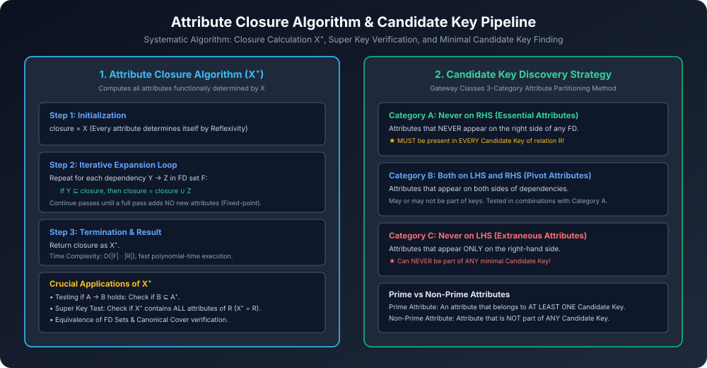

# Module 03: Attribute Closure & Candidate Key Algorithms

> **Course:** Database Management Systems (AKTU Code: **BCS501**)  
> **Topic Focus:** Attribute Closure Algorithm ($X^+$), Applications of Closure, Candidate Key Finding Algorithm, Attribute Categorization (LHS/RHS matrix), Prime vs Non-Prime Attributes, Solved Gateway Numericals.

---

## 1. What is Attribute Closure ($X^+$)?

Relation schema $R$ aur FD set $F$ ke context me, attribute set $X$ ka **Attribute Closure** ($X^+$) un sabhi attributes ka collection hota hai jo $X$ se functionally determine kiye ja sakte hain using Armstrong's Axioms.

Formal Definition:
$$X^+ = \{ A \in R \mid F Dash X 
ightarrow A \}$$

### 1.1 The Classical Attribute Closure Algorithm
```
Algorithm: Compute_Attribute_Closure(R, F, X)
Input:  Relation schema R, Set of Functional Dependencies F, Attribute set X
Output: Attribute closure X⁺

1. Set closure = X;
2. Repeat:
     old_closure = closure;
     For each functional dependency (Y → Z) in F:
         If Y ⊆ closure:
             closure = closure ∪ Z;
   Until (closure == old_closure);
3. Return closure;
```
- **Time Complexity:** $O(|F| 	imes |R|)$ — Polynomial time, extremely fast!

---

## 2. Core Applications of Attribute Closure in DBMS

1. **Testing If a Functional Dependency Holds:**
   - Problem: Check if $X 
ightarrow Y$ logically follows from $F$.
   - Method: Compute $X^+$. If $Y \subseteq X^+$, then **YES**, the dependency holds; otherwise NO.
2. **Super Key Identification:**
   - If $X^+ = R$ (contains every attribute of the relation), then $X$ is a **Super Key** of $R$.
3. **Candidate Key Identification:**
   - If $X$ is a Super Key AND no proper subset $X' \subset X$ is a super key (minimality condition), then $X$ is a **Candidate Key**!

---

## 3. Systematic Candidate Key Finding Algorithm (AKTU Gateway Method)

Jab ek relation me multiple attributes aur 5-6 FDs hoti hain, toh brute force har subset ka closure nikalna exponential ($2^n$) ho jaata hai. Gateway Classes aur standard database theory ka **3-Category Partitioning Method** candidate keys ko 30 seconds me solve kar deta hai:

```
Step 1: Divide all attributes of relation R into 3 categories:
  ┌────────────────────────┬──────────────────────────────────────────┬─────────────────────────────┐
  │ Category A (Essential) │ Category B (Pivot / Middle)              │ Category C (Extraneous)     │
  ├────────────────────────┼──────────────────────────────────────────┼─────────────────────────────┤
  │ Attributes that NEVER  │ Attributes that appear on BOTH LHS & RHS │ Attributes that appear ONLY │
  │ appear on the RHS      │ of dependencies.                         │ on RHS (Never on LHS).      │
  ├────────────────────────┼──────────────────────────────────────────┼─────────────────────────────┤
  │ MUST be in EVERY CK!   │ May be combined with Cat A.              │ CANNOT be in ANY CK!        │
  └────────────────────────┴──────────────────────────────────────────┴─────────────────────────────┘
```

### 3.1 Step-by-Step Procedure
1. Find all attributes belonging to **Category A** (Never on RHS).
2. Calculate closure of $(	ext{Category A})^+$.
   - **Case 1:** If $(	ext{Category A})^+ = R$, then Category A is the **Unique Candidate Key**! You are finished!
   - **Case 2:** If $(	ext{Category A})^+ 
e R$, then combine Category A with single attributes from **Category B**, then pairs, and check which combinations produce a closure equal to $R$.
3. Never include attributes from **Category C** in candidate key tests.

---

## 4. Prime vs Non-Prime Attributes

Yeh distinction 2NF aur 3NF testing ke liye mandatory hai:
- **Prime Attribute:** Agar koi attribute relation ke **kisi bhi ek Candidate Key** ka hissa hai, toh use Prime Attribute kehte hain.
- **Non-Prime Attribute:** Wo attributes jo relation ke **kisi bhi Candidate Key** me shaamil nahi hote.

Example: If Candidate Keys are $\{AB, BC\}$, then:
- Prime Attributes = $\{A, B, C\}$
- Non-Prime Attributes = All remaining attributes in $R$.

---

## 5. Architectural Diagram



---

## 6. Solved Gateway Classes AKTU Numerical Problems

### Numerical 1 (From Gateway Slide Deck)
**Question:** Given relation $R(A, B, C, D, E, F)$ with Functional Dependencies:
$$F = \{ A 
ightarrow B, B 
ightarrow C, C 
ightarrow D, D 
ightarrow E, E 
ightarrow F \}$$
Find all Candidate Keys of $R$, and classify Prime and Non-Prime attributes.

**Solution:**
1. **Analyze Attributes:**
   - RHS contains: $\{B, C, D, E, F\}$.
   - Attribute $A$ never appears on the RHS $\implies$ Category A (Essential) = $\{A\}$.
2. **Compute Closure of $\{A\}$:**
   - $A^+ = \{A\}$
   - Since $A 
ightarrow B \in F \implies A^+ = \{A, B\}$
   - Since $B 
ightarrow C \in F \implies A^+ = \{A, B, C\}$
   - Since $C 
ightarrow D \in F \implies A^+ = \{A, B, C, D\}$
   - Since $D 
ightarrow E \in F \implies A^+ = \{A, B, C, D, E\}$
   - Since $E 
ightarrow F \in F \implies A^+ = \{A, B, C, D, E, F\} = R$.
3. **Conclusion:**
   - Since $A^+ = R$ and $\{A\}$ has no proper subset, **$A$ is the only Candidate Key**.
   - **Prime Attributes:** $\{A\}$
   - **Non-Prime Attributes:** $\{B, C, D, E, F\}$

---

### Numerical 2 (Multiple Candidate Keys)
**Question:** Given relation $R(A, B, C, D)$ with $F = \{ AB 
ightarrow CD, C 
ightarrow A, D 
ightarrow B \}$. Find all Candidate Keys.

**Solution:**
1. **Categorization:**
   - RHS has: $\{A, B, C, D\}$. Every attribute appears on RHS!
   - Essential Category A = $\emptyset$.
   - All attributes $\{A, B, C, D\}$ are in Category B.
2. **Check pairs:**
   - $(AB)^+ = \{A, B, C, D\} = R \implies \mathbf{AB}$ is a Candidate Key.
   - $(BC)^+$: Since $C 
ightarrow A$, $(BC)^+ \supseteq \{A, B, C\} 
ightarrow D \implies (BC)^+ = R \implies \mathbf{BC}$ is a Candidate Key.
   - $(CD)^+$: Since $C 
ightarrow A$ and $D 
ightarrow B$, $(CD)^+ \supseteq \{A, B, C, D\} = R \implies \mathbf{CD}$ is a Candidate Key.
   - $(AD)^+$: Since $D 
ightarrow B$, $(AD)^+ \supseteq \{A, B, D\} 
ightarrow C \implies (AD)^+ = R \implies \mathbf{AD}$ is a Candidate Key.
3. **Total Candidate Keys:** $\{AB, BC, CD, AD\}$.
4. **Prime Attributes:** $\{A, B, C, D\}$ (Every attribute is prime!).
5. **Non-Prime Attributes:** $\emptyset$ (None).
