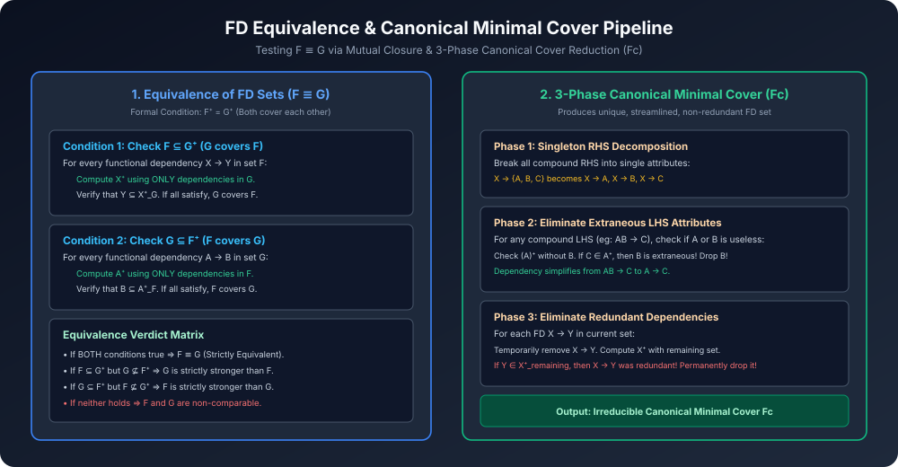

# Module 04: Equivalence & Canonical Minimal Cover

> **Course:** Database Management Systems (AKTU Code: **BCS501**)  
> **Topic Focus:** Equivalence of Functional Dependency Sets ($F \equiv G$), Mutual Closure Testing, Canonical Cover ($F_c$), Extraneous Attribute Elimination, Redundant Dependency Elimination, Solved Gateway AKTU Numericals.

---

## 1. Equivalence of Two FD Sets ($F \equiv G$)

Do functional dependency sets $F$ aur $G$ tab **Equivalent** kehlaate hain jab unke dwara generate kiye gaye closures exactly same hon:
$$F \equiv G \iff F^+ = G^+$$

### 1.1 Fast Mutual Cover Testing Algorithm
Inhe test karne ke liye saare combinations ka closure nikalne ki zaroorat nahi hoti. Sirf do tests perform karne hote hain:

1. **Test 1: Does $G$ cover $F$? ($F \subseteq G^+$)**
   - For every dependency $X 
ightarrow Y \in F$:
     - Compute the attribute closure of $X$ using **ONLY the dependencies of $G$** ($X^+_G$).
     - If $Y \subseteq X^+_G$ holds for every FD in $F$, then $G$ covers $F$.
2. **Test 2: Does $F$ cover $G$? ($G \subseteq F^+$)**
   - For every dependency $A 
ightarrow B \in G$:
     - Compute the attribute closure of $A$ using **ONLY the dependencies of $F$** ($A^+_F$).
     - If $B \subseteq A^+_F$ holds for every FD in $G$, then $F$ covers $G$.
3. **Conclusion:**
   - If BOTH Test 1 and Test 2 pass $\implies \mathbf{F \equiv G}$.

---

## 2. Canonical Cover / Minimal Cover ($F_c$)

Database schema ko optimize karne ke liye hume aisa equivalent FD set chahiye jisme koi bhi extra (redundant) attribute ya rule na ho. Is minimal non-redundant set ko **Canonical Cover** ($F_c$) ya **Minimal Cover** kehte hain.

### 2.1 Formal Properties of a Canonical Cover
Ek set $F_c$ canonical cover tabhi hota hai jab:
1. **Singleton RHS:** Har FD ke right side par strictly **sirf ek attribute** ho ($X 
ightarrow A$).
2. **No Extraneous LHS Attributes:** Left-hand side par koi faltu attribute na ho (e.g., agar $A 
ightarrow B$ se kaam chal raha hai toh $AC 
ightarrow B$ me $C$ extraneous hai).
3. **No Redundant Dependencies:** Koi aisi dependency na ho jisko hata dene par bhi closure me koi farq na pade.

---

## 3. The 3-Phase Canonical Cover Algorithm

```
Step 1: Right-Hand Side Decomposition
        RHS ke sabhi multi-attributes ko singleton me tod do.
        Eg: X → ABC becomes {X → A, X → B, X → C}

Step 2: Extraneous Attribute Removal (from LHS)
        Har composite LHS dependency (eg: AB → C) ke liye check karo:
        - Kya A ko hataya ja sakta hai? Calculate (B)⁺. If C ∈ (B)⁺, then A is extraneous!
        - Kya B ko hataya ja sakta hai? Calculate (A)⁺. If C ∈ (A)⁺, then B is extraneous!
        - Extraneous attribute ko permanently delete karo.

Step 3: Redundant Dependency Removal
        Har remaining dependency X → Y ke liye:
        - Us dependency ko temporarily set se bahar nikalo: F' = F - {X → Y}.
        - Remaining set F' ko use karke X⁺ calculate karo.
        - Agar Y ∈ X⁺_F', iska matlab X → Y baaki bachi FDs se already derive ho raha hai!
        - Yeh redundant hai! Isko permanently delete karo!
```

---

## 4. Architectural Diagram



---

## 5. Gateway Classes Solved AKTU Examination Numericals

### Numerical 1 (Full Canonical Cover Calculation)
**Question:** Given relation $R(A, B, C)$ and FD set:
$$F = \{ A 
ightarrow BC, \quad B 
ightarrow C, \quad A 
ightarrow B, \quad AB 
ightarrow C \}$$
Find the Canonical Cover ($F_c$).

**Step 1: Singleton RHS Decomposition**
- $A 
ightarrow BC$ splits into $A 
ightarrow B$ and $A 
ightarrow C$.
- Current set:
  $$F_1 = \{ A 
ightarrow B, \quad A 
ightarrow C, \quad B 
ightarrow C, \quad A 
ightarrow B, \quad AB 
ightarrow C \}$$
- Duplicate $A 
ightarrow B$ removed:
  $$F_1 = \{ A 
ightarrow B, \quad A 
ightarrow C, \quad B 
ightarrow C, \quad AB 
ightarrow C \}$$

**Step 2: Check Extraneous Attribute in $AB 
ightarrow C$**
- Check if $B$ can be dropped from LHS:
  - Compute closure of $A$ without using $AB 
ightarrow C$:
    - In $\{A 
ightarrow B, A 
ightarrow C, B 
ightarrow C\}$, $A^+ = \{A, B, C\}$.
    - Since $C \in A^+$, $A$ alone can derive $C$! Therefore, **$B$ is extraneous** in $AB 
ightarrow C$!
  - Dependency $AB 
ightarrow C$ simplifies to $A 
ightarrow C$.
- Since $A 
ightarrow C$ already exists in our set, duplicate is removed.
- Set after Step 2:
  $$F_2 = \{ A 
ightarrow B, \quad A 
ightarrow C, \quad B 
ightarrow C \}$$

**Step 3: Check Redundant Dependencies**
1. Test $A 
ightarrow B$:
   - Remove it. Remaining: $\{A 
ightarrow C, B 
ightarrow C\}$.
   - $A^+ = \{A, C\}$. Since $B 
otin A^+$, $A 
ightarrow B$ is **NOT redundant**. Keep it.
2. Test $A 
ightarrow C$:
   - Remove it. Remaining: $\{A 
ightarrow B, B 
ightarrow C\}$.
   - $A^+ = \{A, B, C\}$ (using $A 
ightarrow B$ and $B 
ightarrow C$).
   - Since $C \in A^+$, $A 
ightarrow C$ is derived via transitivity!
   - Therefore, **$A 
ightarrow C$ is REDUNDANT**! Remove it!
3. Test $B 
ightarrow C$:
   - Remove it. Remaining: $\{A 
ightarrow B\}$.
   - $B^+ = \{B\}$. Since $C 
otin B^+$, $B 
ightarrow C$ is **NOT redundant**. Keep it.

**Final Answer:**
$$\mathbf{F_c = \{ A 
ightarrow B, \quad B 
ightarrow C \}}$$
