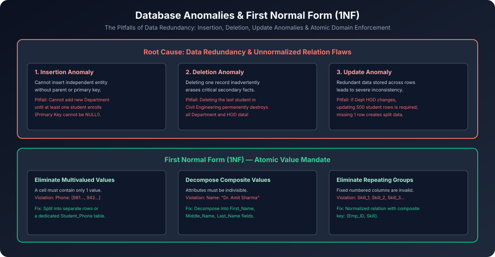

# Module 05: Database Anomalies & First Normal Form (1NF)

> **Course:** Database Management Systems (AKTU Code: **BCS501**)  
> **Topic Focus:** Relational Database Normalization Philosophy, Dr. E.F. Codd's Objectives, Insertion Anomaly, Deletion Anomaly, Modification/Update Anomaly, 1NF Atomic Value Rules, Repeating Groups Elimination.

---

## 1. Why Normalization? Core Philosophy & Objectives

Jab ek single table me multiple alag-alag entities ka data bina soche-samjhe combine kar diya jaata hai, toh database me **Data Redundancy** (unnecessary duplicate values) aa jaati hai.
- Data Redundancy storage waste karti hai aur query performance degrade karti hai.
- Sabse bada khatra: **Operational Anomalies** (Insert, Update, Delete ke waqt data corrupt hona).

**Normalization** ek systematic formal process hai jisme unnormalized relation ko progressively higher normal forms (1NF $
ightarrow$ 2NF $
ightarrow$ 3NF $
ightarrow$ BCNF) me decompose kiya jaata hai taaki:
1. Redundancy minimize ho sake.
2. Anomalies eliminate ho sakein.
3. Lossless join and integrity constraints preserve rahein.

---

## 2. The Three Classic Database Anomalies

Maan lijiye hamare paas ek combined table hai:
`STUDENT_DEPT(Roll_No, Name, Branch, HOD, HOD_Cabin)`

| Roll_No | Name | Branch | HOD | HOD_Cabin |
| :--- | :--- | :--- | :--- | :--- |
| 101 | Aman | CSE | Dr. Sharma | Block-A, 101 |
| 102 | Priya | CSE | Dr. Sharma | Block-A, 101 |
| 103 | Rohan | ECE | Dr. Verma | Block-B, 204 |
| 104 | Sneha | ME | Dr. Gupta | Block-C, 301 |

### 2.1 Insertion Anomaly
- **Definition:** Kisi nayi information ko database me add na kar paana jab tak kisi unrelated entity ka data available na ho.
- **Example:** College me ek naya department shuru hua: `AI_DS`, jiske HOD `Dr. Kapoor` hain. Lekin abhi tak kisi student ne admission nahi liya.
- **Problem:** Kyunki `Roll_No` Primary Key hai (aur Primary Key NULL nahi ho sakti by Entity Integrity Constraint), hum naye department ka record table me **insert hi nahi kar sakte**!

### 2.2 Deletion Anomaly
- **Definition:** Kisi ek entity ka data delete karte waqt kisi important secondary entity ka data accidently permanent delete ho jaana.
- **Example:** `Mechanical Engineering (ME)` department me sirf ek student `104 - Sneha` padh rahi thi. Sneha ne college chhod diya aur uska record delete kiya gaya.
- **Problem:** Sneha ki row delete hote hi ME branch, uske HOD `Dr. Gupta`, aur cabin number ka saara record database se **hamesha ke liye gayab ho gaya**!

### 2.3 Update / Modification Anomaly
- **Definition:** Redundant data ko update karte waqt agar sabhi copies update na hon, toh data inconsistency create hona.
- **Example:** CSE ke HOD `Dr. Sharma` retire ho gaye aur nayi HOD `Dr. Anita` ban gayi.
- **Problem:** Agar CSE me 500 students hain, toh 500 rows me jakar HOD change karna padega. Agar server crash ya network issue ki wajah se 490 rows update hui aur 10 reh gayi, toh database contradictory answer dega!

---

## 3. First Normal Form (1NF)

### 3.1 Formal Definition of 1NF
> A relation schema $R$ is in **First Normal Form (1NF)** if and only if the domain of each attribute contains only **atomic (indivisible) values**, and each attribute value in a tuple is a **single value** from that domain.

### 3.2 1NF Violations and Solutions

#### 1. Multi-Valued Attributes
- **Violation:** Kisi ek cell ke andar multiple values pack karna:
  `Roll_No: 101 | Name: Aman | Mobile: [9899112233, 9811223344]`
- **1NF Solution:** Multiple values ko alag-alag rows me expand karo:
  - Row 1: `(101, Aman, 9899112233)`
  - Row 2: `(101, Aman, 9811223344)`
  - Or create a separate related table: `STUDENT_PHONE(Roll_No, Phone)`.

#### 2. Composite Attributes
- **Violation:** Aise attributes jo sub-parts me divide ho sakte hain unhe single column me rakhna:
  `Address: "Flat 402, Royal Apts, Sector 62, Noida, UP, 201301"`
- **1NF Solution:** Break into atomic sub-components: `House_No`, `Street`, `Sector`, `City`, `State`, `Pincode`.

#### 3. Repeating Groups / Numbered Columns
- **Violation:** Ek hi type ke data ke liye predefined numbered columns banana:
  `STUDENT(Roll_No, Skill_1, Skill_2, Skill_3)`
- **1NF Solution:** Dynamic child table create karo: `STUDENT_SKILLS(Roll_No, Skill)`.

---

## 4. Architectural Diagram

---

## 5. Summary Checklist: Is Relation in 1NF?

- [x] Har column atomic values store karta hai? (No lists, no sets, no JSON arrays inside cells).
- [x] Har row uniquely identifiable hai? (Primary Key identified).
- [x] Columns ke names unique hain?
- [x] Rows ka order meaningful nahi hai?
