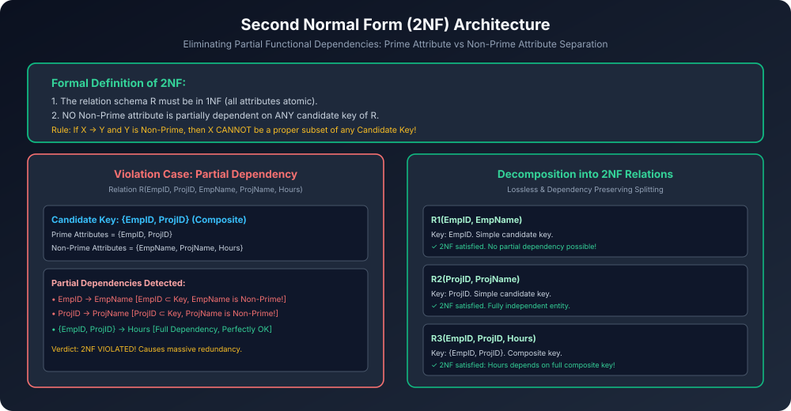

# Module 06: Second Normal Form (2NF)

> **Course:** Database Management Systems (AKTU Code: **BCS501**)  
> **Topic Focus:** Second Normal Form Formal Criteria, Full Functional Dependency, Partial Functional Dependency Violation, Special Theorem for Simple Keys, 2NF Decomposition Algorithm with AKTU Solved Problem.

---

## 1. Second Normal Form (2NF) Formal Definition

Ek relation schema $R$ **Second Normal Form (2NF)** me tab hota hai jab:
1. Wo relation already **1NF** me ho.
2. Us relation me **koi bhi Partial Functional Dependency na ho**.

### 1.1 Mathematical Formulation
$$orall (X 
ightarrow Y) \in F \quad 	ext{such that } Y 	ext{ is a Non-Prime Attribute:}$$
$$\mathbf{X 	ext{ is NOT a proper subset of ANY Candidate Key of } R.}$$

- **Prime Attribute:** Jo kisi bhi ek candidate key ka member ho.
- **Non-Prime Attribute:** Jo kisi bhi candidate key ka member na ho.
- **Partial Dependency:** $	ext{Proper Subset of Candidate Key} 
ightarrow 	ext{Non-Prime Attribute}$.

---

## 2. The Powerful "Simple Candidate Key" Theorem (AKTU Shortcut)

> **Theorem:** Agar kisi relation ke sabhi candidate keys **Simple (Single Attribute)** hain (yaani koi bhi candidate key composite nahi hai), toh wo relation **by default hamesha 2NF me hoga**!

**Proof:**
- Partial dependency tabhi ho sakti hai jab candidate key ka koi proper non-empty subset ho.
- Agar Candidate Key $K = \{A\}$ hai, toh iska koi non-empty proper subset exist hi nahi karta!
- Isliye partial dependency create hona mathematically impossible hai!

---

## 3. Systematic 2NF Decomposition Algorithm

```
Input:  Relation R with FD set F and Candidate Keys CK
Output: Set of relations in 2NF

1. Find all Candidate Keys of R.
2. Identify all Prime Attributes and Non-Prime Attributes.
3. Check every FD X → Y in F:
   - If Y is Non-Prime AND X is a proper subset of some Candidate Key:
     → Partial Dependency Detected!
4. Decompose R:
   - Create new relation R1(X, Y) with Primary Key X.
   - Remove Y from original relation: R_remaining = R - Y.
5. Repeat until no partial dependencies remain.
```

---

## 4. Architectural Diagram



---

## 5. Gateway Classes Solved AKTU Examination Problem

**Problem:** Given relation $R(	ext{Emp\_ID}, 	ext{Project\_ID}, 	ext{Emp\_Name}, 	ext{Project\_Name}, 	ext{Hours})$ with functional dependencies:
$$F = \{ \quad \{	ext{Emp\_ID}, 	ext{Project\_ID}\} 
ightarrow 	ext{Hours}, \quad 	ext{Emp\_ID} 
ightarrow 	ext{Emp\_Name}, \quad 	ext{Project\_ID} 
ightarrow 	ext{Project\_Name} \quad \}$$

1. **Find Candidate Key:**
   - $\{	ext{Emp\_ID}, 	ext{Project\_ID}\}^+ = \{	ext{Emp\_ID}, 	ext{Project\_ID}, 	ext{Hours}, 	ext{Emp\_Name}, 	ext{Project\_Name}\} = R$.
   - Candidate Key = $\{\mathbf{Emp\_ID, Project\_ID}\}$.
2. **Classify Attributes:**
   - **Prime Attributes:** $\{	ext{Emp\_ID}, 	ext{Project\_ID}\}$
   - **Non-Prime Attributes:** $\{	ext{Emp\_Name}, 	ext{Project\_Name}, 	ext{Hours}\}$
3. **Test Each Functional Dependency for 2NF:**
   - $\{	ext{Emp\_ID}, 	ext{Project\_ID}\} 
ightarrow 	ext{Hours}$: Determinant is Full Candidate Key. **(Full FD - OK)**
   - $	ext{Emp\_ID} 
ightarrow 	ext{Emp\_Name}$: LHS $	ext{Emp\_ID} \subset 	ext{Candidate Key}$ and RHS $	ext{Emp\_Name}$ is Non-Prime! **(Partial FD - VIOLATION!)**
   - $	ext{Project\_ID} 
ightarrow 	ext{Project\_Name}$: LHS $	ext{Project\_ID} \subset 	ext{Candidate Key}$ and RHS $	ext{Project\_Name}$ is Non-Prime! **(Partial FD - VIOLATION!)**
4. **Decomposition into 2NF:**
   - $R_1(\mathbf{Emp\_ID}, 	ext{Emp\_Name})$ with Key = $	ext{Emp\_ID}$.
   - $R_2(\mathbf{Project\_ID}, 	ext{Project\_Name})$ with Key = $	ext{Project\_ID}$.
   - $R_3(\mathbf{Emp\_ID, Project\_ID}, 	ext{Hours})$ with Key = $\{	ext{Emp\_ID}, 	ext{Project\_ID}\}$.
5. **Conclusion:** All three relations $R_1, R_2, R_3$ are strictly in 2NF, lossless, and dependency preserving!
