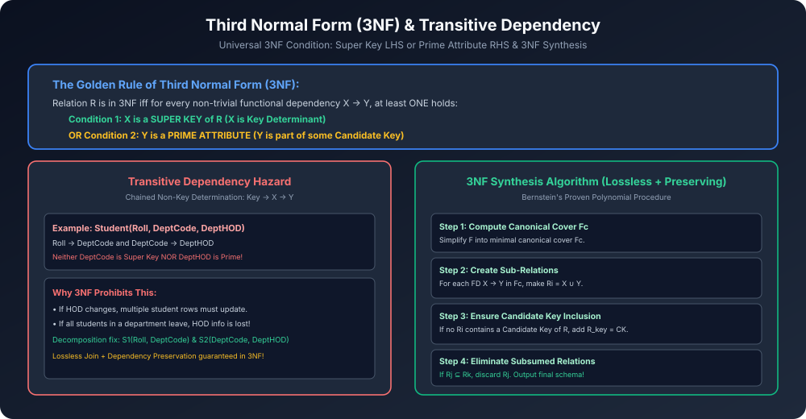

# Module 07: Third Normal Form (3NF)

> **Course:** Database Management Systems (AKTU Code: **BCS501**)  
> **Topic Focus:** Third Normal Form Criteria, Removal of Transitive Dependency, Universal 3NF Test Condition ($X$ is Super Key OR $Y$ is Prime Attribute), Bernstein's 3NF Synthesis Algorithm, Gateway Classes Solved Numericals.

---

## 1. Third Normal Form (3NF) Formal Definition

Ek relation schema $R$ **Third Normal Form (3NF)** me tab hota hai jab:
1. Wo relation already **2NF** me ho.
2. Us relation me **koi bhi Transitive Dependency na ho**.

### 1.1 The Universal 3NF Test Condition (AKTU Standard)
Relation $R$ ke har non-trivial functional dependency $X 
ightarrow Y$ ke liye, neeche diye gaye do conditions me se **kam se kam ek condition** true honi chahiye:

$$\mathbf{X 
ightarrow Y 	ext{ satisfies 3NF if:}}$$
1. **$X$ is a Super Key of $R$** (Determinant super key hai)  
   $$\mathbf{OR}$$
2. **$Y$ is a Prime Attribute** ($Y$ kisi bhi candidate key ka hissa hai)

> [!TIP]
> Agar kisi FD me LHS Super Key nahi hai, lekin uska RHS Prime Attribute hai, toh wo dependency **3NF me fully ALLOWED hai**! Yeh 3NF ka sabse bada relaxer hai jo ise BCNF se alag banata hai!

---

## 2. Transitive Dependency Hazard

- **Transitive Dependency:** Jab ek non-prime attribute kisi doosre non-prime attribute par depend karta hai through candidate key:
  $$	ext{Key} 
ightarrow X \quad 	ext{and} \quad X 
ightarrow Y \implies 	ext{Key} 
ightarrow Y$$
  (Where $X$ is not a super key and $Y$ is non-prime).
- **Practical Hazard:** Redundancy, Update Anomaly, aur Deletion Anomaly paida hoti hai.

---

## 3. Bernstein's 3NF Synthesis Algorithm

Yeh algorithm guarantee karta hai ki relation 3NF me decompose ho jaye aur saath hi **Lossless Join** aur **Dependency Preservation** dono properties 100% preserve rahein:

```
Algorithm: 3NF_Synthesis(R, F)
1. Find Canonical Cover Fc of F.
2. For each FD (X → Y) in Fc:
       Create a new relation schema: Ri = X ∪ Y;
3. If none of the generated relations Ri contains a Candidate Key of R:
       Create an additional relation R_key containing any candidate key of R;
4. Eliminate redundant relations:
       If Rj ⊆ Rk, remove Rj;
5. Return the resulting set of relations.
```

---

## 4. Architectural Diagram



---

## 5. Gateway Classes Solved AKTU Examination Problem

**Problem:** Given relation $R(A, B, C, D)$ with FD set:
$$F = \{ AB 
ightarrow C, \quad C 
ightarrow D, \quad D 
ightarrow A \}$$
Find all Candidate Keys, determine the highest Normal Form of $R$, and decompose into 3NF if not already in 3NF.

### Step 1: Find Candidate Keys
- Attributes on RHS: $\{A, C, D\}$.
- Attribute $B$ never appears on RHS $\implies B$ must be in every key!
- $(AB)^+ = \{A, B, C, D\} = R \implies \mathbf{AB}$ is a Candidate Key.
- $(BC)^+ = \{B, C, D, A\} = R \implies \mathbf{BC}$ is a Candidate Key (via $C 
ightarrow D 
ightarrow A$).
- $(BD)^+ = \{B, D, A, C\} = R \implies \mathbf{BD}$ is a Candidate Key (via $D 
ightarrow A$, then $AB 
ightarrow C$).
- **Candidate Keys:** $\{AB, BC, BD\}$.
- **Prime Attributes:** $\{A, B, C, D\}$ (All attributes are Prime!).
- **Non-Prime Attributes:** $\emptyset$ (None!).

### Step 2: Determine Highest Normal Form
Let us test each FD in $F$:
1. $AB 
ightarrow C$:
   - Is LHS $AB$ a Super Key? **YES** ($AB$ is a Candidate Key). $\implies$ Satisfies 3NF and BCNF.
2. $C 
ightarrow D$:
   - Is LHS $C$ a Super Key? **NO** ($C^+ = \{A, C, D\} 
e R$).
   - Is RHS $D$ a Prime Attribute? **YES** ($D$ is part of Candidate Key $BD$). $\implies$ **Satisfies 3NF!**
3. $D 
ightarrow A$:
   - Is LHS $D$ a Super Key? **NO** ($D^+ = \{A, D\} 
e R$).
   - Is RHS $A$ a Prime Attribute? **YES** ($A$ is part of Candidate Key $AB$). $\implies$ **Satisfies 3NF!**

### Conclusion:
- Relation $R$ is in **3NF** because for every FD where LHS is not a super key, RHS is a prime attribute!
- Relation $R$ is **NOT in BCNF** because in $C 
ightarrow D$ and $D 
ightarrow A$, the determinants $C$ and $D$ are not super keys!
- **Highest Normal Form = 3NF.**
