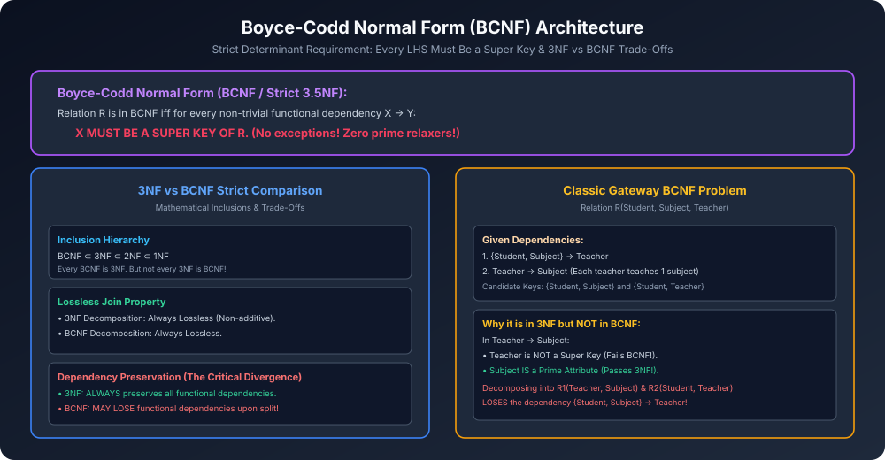

# Module 08: Boyce-Codd Normal Form (BCNF)

> **Course:** Database Management Systems (AKTU Code: **BCS501**)  
> **Topic Focus:** Boyce-Codd Normal Form (BCNF), Strict Super Key Determinant Condition, BCNF vs 3NF Deep Comparison, The Classic Database Trade-Off: Dependency Preservation vs Redundancy, Solved Gateway AKTU Numerical.

---

## 1. Motivation Behind BCNF

1974 me Raymond Boyce aur Edgar Codd ne observe kiya ki 3NF kuch specific conditions me redundancy aur anomalies ko poori tarah eliminate nahi kar pata.
- Yeh situation tab aati hai jab ek table me **multiple overlapping Candidate Keys** hoti hain!
- 3NF ka relaxer rule ("$Y$ is a Prime Attribute") un dependencies ko allow kar deta hai jisme determinant Super Key nahi hota.
- Is loophole ko close karne ke liye **Boyce-Codd Normal Form (BCNF)** introduce kiya gaya, jise aksar **3.5 Normal Form** bhi kaha jaata hai.

---

## 2. Formal Definition of BCNF

Ek relation schema $R$ **Boyce-Codd Normal Form (BCNF)** me tab hota hai jab:
1. Wo relation already **1NF** me ho.
2. Har non-trivial functional dependency $X 
ightarrow Y$ ke liye:

$$\mathbf{X 	ext{ MUST BE A SUPER KEY OF } R}$$

Yahan koi "OR" condition nahi hai! Determinant $X$ ko compulsory roop se Super Key hona hi padega!

---

## 3. Comprehensive Comparison: 3NF vs BCNF

| Parameter | Third Normal Form (3NF) | Boyce-Codd Normal Form (BCNF) |
| :--- | :--- | :--- |
| **FD Requirement ($X 
ightarrow Y$)** | $X$ is Super Key **OR** $Y$ is Prime Attribute | $X$ **MUST** be Super Key |
| **Strictness** | Relaxed (allows prime attribute on RHS) | Extremely strict (zero exceptions) |
| **Lossless Join Decomposition** | Always guaranteed ($\checkmark$) | Always guaranteed ($\checkmark$) |
| **Dependency Preservation** | **Always guaranteed ($\checkmark$)** | **NOT always possible ($	imes$)** |
| **Storage Redundancy** | Minimal (slight redundancy may remain) | Zero redundancy for functional dependencies |
| **Practical Industry Choice** | Most widely used in transactional DBs | Used when dependency loss is acceptable |

---

## 4. Architectural Diagram

---

## 5. Classic Gateway Classes Solved Numerical: The Trade-Off Case

**Problem:** Given relation $R(	ext{Student}, 	ext{Subject}, 	ext{Teacher})$ with functional dependencies:
$$F = \{ \quad \{	ext{Student}, 	ext{Subject}\} 
ightarrow 	ext{Teacher}, \quad 	ext{Teacher} 
ightarrow 	ext{Subject} \quad \}$$
*(Assumption: Har student ek subject ke liye ek teacher ko assign hota hai, aur har teacher sirf ek subject padhata hai).*

### Step 1: Candidate Keys
- $(	ext{Student}, 	ext{Subject})^+ = \{	ext{Student}, 	ext{Subject}, 	ext{Teacher}\} = R \implies \{\mathbf{Student, Subject}\}$ is Candidate Key 1.
- $(	ext{Student}, 	ext{Teacher})^+ = \{	ext{Student}, 	ext{Teacher}, 	ext{Subject}\} = R \implies \{\mathbf{Student, Teacher}\}$ is Candidate Key 2.
- **Prime Attributes:** $\{	ext{Student}, 	ext{Subject}, 	ext{Teacher}\}$ (All attributes are Prime!).

### Step 2: 3NF Test
1. $\{	ext{Student}, 	ext{Subject}\} 
ightarrow 	ext{Teacher}$:
   - LHS $\{	ext{Student}, 	ext{Subject}\}$ is a Candidate Key (Super Key). $\implies$ **Satisfies 3NF**.
2. $	ext{Teacher} 
ightarrow 	ext{Subject}$:
   - LHS $	ext{Teacher}$ is NOT a Super Key.
   - RHS $	ext{Subject}$ IS a Prime Attribute (part of Candidate Key 1).
   - $\implies$ **Satisfies 3NF!**
- **Verdict for 3NF:** Relation $R$ is in **3NF**!

### Step 3: BCNF Test
- Look at $	ext{Teacher} 
ightarrow 	ext{Subject}$:
  - Determinant $	ext{Teacher}$ is **NOT a Super Key**!
  - In BCNF, there is NO prime attribute relaxation!
- **Verdict for BCNF:** Relation $R$ **FAILS BCNF**!

### Step 4: Decomposing into BCNF & The Great Loss
To bring into BCNF, decompose using the violating dependency $	ext{Teacher} 
ightarrow 	ext{Subject}$:
- $R_1(\mathbf{Teacher}, 	ext{Subject})$ with Key = $	ext{Teacher}$ (in BCNF).
- $R_2(\mathbf{Student, Teacher})$ with Key = $\{	ext{Student}, 	ext{Teacher}\}$ (in BCNF).
- Both sub-relations are in BCNF and the join is Lossless ($R_1 \cap R_2 = \{	ext{Teacher}\}$, which is a key in $R_1$).
- **The Critical Flaw:** Original dependency $\{	ext{Student}, 	ext{Subject}\} 
ightarrow 	ext{Teacher}$ cannot be tested in either $R_1$ or $R_2$ alone!
- **Dependency Preservation is LOST!**
