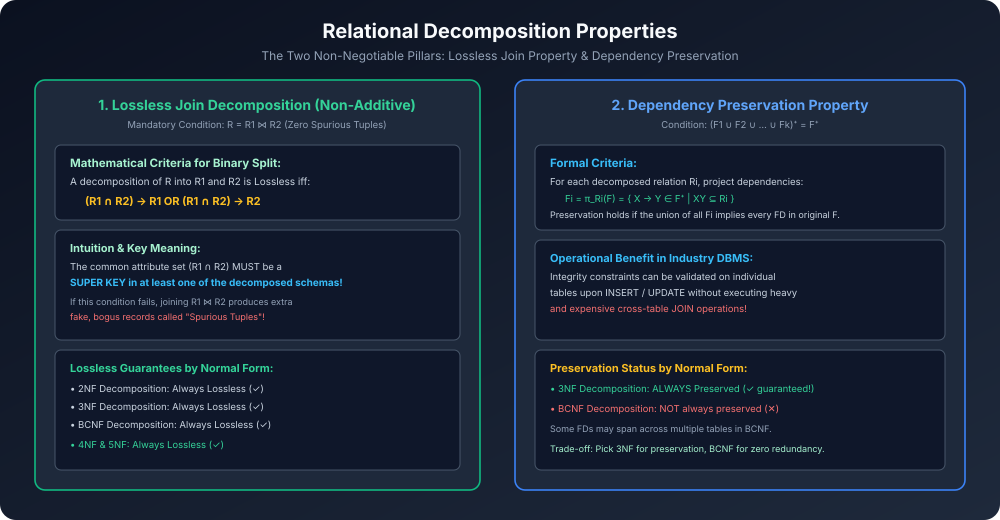

# Module 09: Decomposition Properties (Lossless Join & Dependency Preservation)

> **Course:** Database Management Systems (AKTU Code: **BCS501**)  
> **Topic Focus:** Relational Decomposition, Lossless (Non-Additive) Join Decomposition, Binary Decomposition Theorem, Spurious Tuples Hazard, Dependency Preservation Formal Verification, 3NF vs BCNF Synthesis Trade-Off.

---

## 1. Why Do We Decompose Relations?

Unnormalized tables me redundancy aur insertion/deletion/update anomalies hoti hain. Inhe hatane ke liye hum large relation $R$ ko do ya do se zyada smaller relations $\{R_1, R_2, \dots, R_k\}$ me divide karte hain.
Lekin agar decomposition galat tareeqe se kiya jaye, toh do bade nuksaan hote hain:
1. **Data Loss / Fake Data Creation (Lossy Join)**
2. **Constraint Enforcement Cost Explosion (Loss of Functional Dependencies)**

Isliye relational database theory me decomposition ko valid maanne ke liye **do core properties** ka satisfy hona mandatory hai.

---

## 2. Property 1: Lossless Join Decomposition (Non-Additive Join)

### 2.1 Formal Definition
Ek relation $R$ ka decomposition $\{R_1, R_2\}$ **Lossless Join Decomposition** tab kehlata hai jab unka Natural Join wapas exactly original relation $R$ produce kare:
$$R_1 owtie R_2 = R$$

- Agar $R \subset (R_1 owtie R_2)$ ho jaye, yaani join karne par extra rows (fake data) generate ho jayein, toh use **Lossy (Additive) Decomposition** kehte hain.
- Un extra fake rows ko **Spurious Tuples** kaha jaata hai!

### 2.2 Binary Decomposition Theorem (Universal AKTU Test)
Do sub-relations $R_1$ aur $R_2$ ke binary decomposition ke lossless hone ki **necessary and sufficient condition** yeh hai:

$$\mathbf{(R_1 \cap R_2) 
ightarrow R_1 \quad 	ext{OR} \quad (R_1 \cap R_2) 
ightarrow R_2}$$

- **Hindi Intuition:** Dono tables ke common attributes $(R_1 \cap R_2)$ ko kam se kam kisi **ek table ka Super Key** hona hi chahiye!

---

## 3. Spurious Tuples Hazard (Illustrated Example)

Maan lijiye relation hai `EMP_PROJ(EmpId, ProjId, Location)`:
Suppose isko galat attributes par decompose kiya gaya:
- $R_1(	ext{EmpId}, 	ext{Location})$
- $R_2(	ext{ProjId}, 	ext{Location})$

Common attribute is `Location`. Lekin `Location` na toh $R_1$ ka key hai, na $R_2$ ka!
Jab hum $R_1 owtie R_2$ karenge on `Location`, toh ek hi location par kaam karne wale saare employees saare projects ke saath cross-join ho jayenge, jisse **fake assignment records (Spurious Tuples)** ban jayenge!
User ko lagega ki Employee X Project Y par kaam kar raha hai jabki wo actually nahi kar raha tha!

---

## 4. Property 2: Dependency Preservation

### 4.1 Formal Definition
Decomposition $\{R_1, R_2, \dots, R_k\}$ **Dependency Preserving** tab hota hai jab original set $F$ ki saari functional dependencies decomposed tables me individually test ki ja sakein:

$$(F_1 \cup F_2 \cup \dots \cup F_k)^+ = F^+$$

Where $F_i$ represents the projection of $F$ onto $R_i$:
$$F_i = \pi_{R_i}(F) = \{ X 
ightarrow Y \in F^+ \mid XY \subseteq R_i \}$$

### 4.2 Why is Dependency Preservation Crucial in Industry?
- Agar dependency preserve hoti hai, toh jab bhi koi user table me naya record `INSERT` ya `UPDATE` karta hai, database engine sirf usi single table par constraint check karta hai ($O(1)$ fast check).
- Agar dependency preserve nahi hui, toh har chote insert par database ko multiple tables ka join perform karna padega jo system ko severely slow kar dega!

---

## 5. Architectural Diagram

---

## 6. Gateway Classes Solved AKTU Examination Problem

**Problem:** Relation $R(A, B, C, D)$ has FD set:
$$F = \{ A 
ightarrow B, \quad B 
ightarrow C, \quad C 
ightarrow D, \quad D 
ightarrow A \}$$
Relation is decomposed into:
$R_1(A, B)$, $R_2(B, C)$, and $R_3(C, D)$.
Check whether this decomposition is:
1. Lossless Join
2. Dependency Preserving

### Step 1: Lossless Join Check
We can combine sequentially:
1. Join $R_1(A, B)$ and $R_2(B, C)$:
   - Common attribute = $R_1 \cap R_2 = \{B\}$.
   - In $R_2$, $B 
ightarrow C$ holds, so $B^+ = \{B, C, D, A\} \supseteq R_2$.
   - Thus, $B$ is a Super Key in $R_2$!
   - Therefore, the join of $R_1$ and $R_2$ is **Lossless**, forming $R_{12}(A, B, C)$.
2. Join $R_{12}(A, B, C)$ and $R_3(C, D)$:
   - Common attribute = $R_{12} \cap R_3 = \{C\}$.
   - In $R_3$, $C 
ightarrow D$ holds, so $C$ is a Super Key in $R_3$!
   - Therefore, the join of $R_{12}$ and $R_3$ is **Lossless**, forming $R(A, B, C, D)$.
- **Verdict 1:** Decomposition is **Lossless Join**!

### Step 2: Dependency Preservation Check
- In $R_1(A, B)$: $A 
ightarrow B$ is preserved.
- In $R_2(B, C)$: $B 
ightarrow C$ is preserved.
- In $R_3(C, D)$: $C 
ightarrow D$ is preserved.
- The only remaining FD in $F$ is $D 
ightarrow A$:
  - From $R_3$, $D 
ightarrow C$ is implied? $D 
ightarrow A 
ightarrow B 
ightarrow C \implies$ via transitivity:
    $(F_1 \cup F_2 \cup F_3)$ has $A 
ightarrow B, B 
ightarrow C, C 
ightarrow D$.
  - Wait, does $\{A 
ightarrow B, B 
ightarrow C, C 
ightarrow D\}$ derive $D 
ightarrow A$?
  - $D^+_{	ext{union}} = \{D\}$. It does NOT derive $A$!
- **Verdict 2:** Dependency $D 
ightarrow A$ is **LOST**! Decomposition is **NOT Dependency Preserving**.
