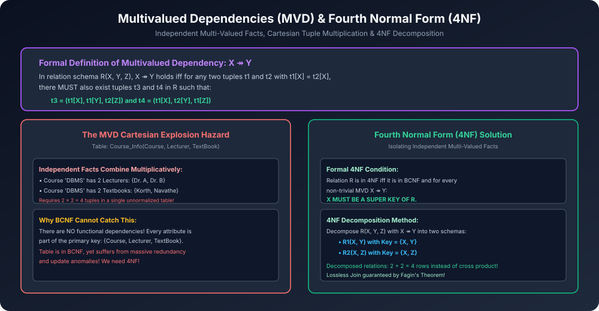

# Module 10: Multivalued Dependencies & Fourth Normal Form (4NF)

> **Course:** Database Management Systems (AKTU Code: **BCS501**)  
> **Topic Focus:** Multivalued Dependencies (MVD: $X 	woheadrightarrow Y$), Limitations of Functional Dependencies, Independent Multivalued Facts, 4NF Definition, Fagin's Theorem, Solved AKTU Example.

---

## 1. Why Functional Dependencies Fall Short

Functional Dependencies ($X 
ightarrow Y$) sirf 1-to-1 ya many-to-1 associations ko model kar sakti hain.
- Lekin real-world me aksar ek entity ke multiple independent attributes hote hain (1-to-many ya many-to-many).
- Jab do ya do se zyada independent multi-valued attributes ko ek hi relation me rakh diya jaata hai, toh **Cartesian Product Explosion** hota hai!
- Is redundancy ko Functional Dependencies detect hi nahi kar paati kyunki koi attribute doosre ko uniquely determine nahi karta. Table ka poora attribute combination milkar Primary Key ban jaata hai, jisse relation BCNF satisfy kar leta hai par tab bhi corrupt aur redundant hota hai!

---

## 2. Multivalued Dependency (MVD: $X 	woheadrightarrow Y$)

### 2.1 Formal Definition
Relation $R(X, Y, Z)$ me jisme $Z = R - (X \cup Y)$, dependency:
$$\mathbf{X 	woheadrightarrow Y}$$
Hold karti hai agar aur sirf agar kisi bhi relation instance me do tuples $t_1$ aur $t_2$ ke liye jahan $t_1[X] = t_2[X]$, relation me do aur tuples $t_3$ aur $t_4$ ka hona **anivarya (mandatory)** ho:
- $t_3 = (t_1[X], \quad t_1[Y], \quad t_2[Z])$
- $t_4 = (t_1[X], \quad t_2[Y], \quad t_1[Z])$

### 2.2 Hindi Intuition
Iska seedha matlab yeh hai ki attribute $Y$ ki values jo $X$ se judi hain, wo $Z$ attribute ki values se **completely independent** hain!
Agar $X$ ke paas $m$ values of $Y$ hain aur $n$ values of $Z$ hain, toh table me compulsory roop se $m 	imes n$ tuples hone padenge!

---

## 3. Properties of Multivalued Dependencies

1. **Complementation Rule:**
   - Agar $X 	woheadrightarrow Y$, toh $X 	woheadrightarrow (R - X - Y)$ bhi hamesha hold karega!
   - (MVDs hamesha pairs me aati hain!).
2. **Trivial MVD:**
   - Ek MVD $X 	woheadrightarrow Y$ trivial hoti hai agar:
     - $Y \subseteq X$, ya fir
     - $X \cup Y = R$.
3. **FD implies MVD:**
   - Agar $X 
ightarrow Y$, toh $X 	woheadrightarrow Y$ automatically true hota hai (MVD is a generalization of FD).

---

## 4. Fourth Normal Form (4NF) Formal Definition

> A relation schema $R$ is in **Fourth Normal Form (4NF)** with respect to a set of dependencies $D$ (FDs and MVDs) if and only if it is in **BCNF**, and for every non-trivial Multivalued Dependency $X 	woheadrightarrow Y$ in $D$:
> $$\mathbf{X 	ext{ is a SUPER KEY of } R}$$

### 4.1 Fagin's Theorem (4NF Decomposition)
Agar relation $R(X, Y, Z)$ me MVD $X 	woheadrightarrow Y$ hold karti hai aur $X$ super key nahi hai, toh $R$ ko do relations me decompose kiya ja sakta hai:
$$R_1(X, Y) \quad 	ext{and} \quad R_2(X, Z)$$
Yeh decomposition hamesha **Lossless Join** hota hai!

---

## 5. Architectural Diagram

---

## 6. Gateway Classes Solved AKTU Examination Problem

**Problem:** Relation `STUDENT_INFO(Roll_No, Hobby, Language)`
Assume ek student ke multiple hobbies aur multiple known languages ho sakte hain, aur hobby aur language ke beech koi direct relation nahi hai.

1. **Identify Dependencies:**
   - $Roll\_No 	woheadrightarrow Hobby$
   - $Roll\_No 	woheadrightarrow Language$
2. **Current Keys & Normal Form:**
   - No attribute determines another. Candidate Key = $\{Roll\_No, Hobby, Language\}$.
   - All FDs trivial $\implies$ Relation is in **BCNF**!
3. **Check 4NF:**
   - In $Roll\_No 	woheadrightarrow Hobby$, the determinant $Roll\_No$ is **NOT a Super Key**!
   - Therefore, relation **FAILS 4NF**!
4. **4NF Decomposition:**
   - $R_1(\mathbf{Roll\_No, Hobby})$
   - $R_2(\mathbf{Roll\_No, Language})$
5. **Result:** Both $R_1$ and $R_2$ are in 4NF, redundancy is eliminated, and join is lossless!
