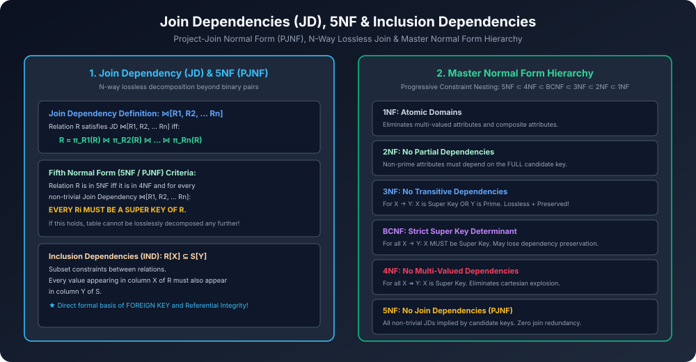

# Module 11: Join Dependencies (JD), 5NF & Inclusion Dependencies

> **Course:** Database Management Systems (AKTU Code: **BCS501**)  
> **Topic Focus:** Join Dependencies $owtie[R_1, \dots, R_n]$, Fifth Normal Form (5NF / Project-Join Normal Form PJNF), Cyclic Constraint Dependencies, Inclusion Dependencies (IND) and Foreign Key Relationship, Master Normal Form Summary.

---

## 1. Limitations of 4NF: The 3-Way Cyclic Join

4NF sirf do independent multi-valued attributes ke binary splits ko handle karta hai ($R 
ightarrow R_1, R_2$).
Lekin database design me aisi cyclic relationships ho sakti hain jinhe do tables me split karne par **lossless join nahi milta**, lekin **teen ya usse zyada tables me split karne par lossless join mil jaata hai**!
- Is generalisation ko capture karne ke liye **Join Dependency (JD)** define ki jaati hai.

---

## 2. Join Dependency (JD) Formal Definition

Ek relation schema $R$ par **Join Dependency** $\mathbf{owtie[R_1, R_2, \dots, R_n]}$ tab hold karti hai jab relation $R$ apne projections ke natural join ke strictly equal ho:

$$R = \pi_{R_1}(R) owtie \pi_{R_2}(R) owtie \dots owtie \pi_{R_n}(R)$$

Where each $R_i \subseteq R$ and $igcup_{i=1}^n R_i = R$.

- **Trivial Join Dependency:** Agar kisi ek $R_i = R$ ho jaye, toh JD trivial hoti hai.

---

## 3. Fifth Normal Form (5NF / Project-Join Normal Form - PJNF)

### 3.1 Formal Definition
Ek relation schema $R$ **Fifth Normal Form (5NF)** me tab hota hai jab:
1. Wo relation already **4NF** me ho.
2. Har non-trivial Join Dependency $owtie[R_1, R_2, \dots, R_n]$ ke liye:
   $$\mathbf{	ext{EVERY } R_i 	ext{ IS A SUPER KEY OF } R}$$

### 3.2 Significance
5NF relational database theory ki ultimate normal form maani jaati hai (with respect to projection and join operators).
- Agar koi table 5NF me hai, toh use aage kisi bhi number of tables me bina spurious tuples ke split nahi kiya ja sakta jab tak un tables ka key original relation ka super key na ho!

---

## 4. Inclusion Dependencies (IND)

### 4.1 Formal Definition
Given two relation schemas $R$ and $S$, attribute sequences $X \subseteq R$ and $Y \subseteq S$ (with matching domain and length):
$$\mathbf{R[X] \subseteq S[Y]}$$
Iska matlab hai ki relation $R$ ke kisi bhi tuple me attribute $X$ ki jo values aayengi, unka relation $S$ ke attribute $Y$ me pehle se present hona mandatory hai!

### 4.2 Connection to Foreign Key Constraints
- Inclusion dependency relational database me **Foreign Key (Referential Integrity)** ka formal theoretical foundation hai!
- SQL syntax:
  ```sql
  FOREIGN KEY (Dept_ID) REFERENCES DEPARTMENT(Dept_ID);
  ```
  Is directly the Inclusion Dependency: $	ext{EMPLOYEE}[	ext{Dept\_ID}] \subseteq 	ext{DEPARTMENT}[	ext{Dept\_ID}]$.

---

## 5. Architectural Diagram



---

## 6. Master Summary of All Normal Forms (AKTU Quick Reference Table)

| Normal Form | Core Requirement | Violation Removed | Lossless Join? | Dependency Preserving? |
| :--- | :--- | :--- | :--- | :--- |
| **1NF** | Atomic attribute values only | Multi-valued & composite attributes | $\checkmark$ | $\checkmark$ |
| **2NF** | In 1NF + No Partial Dependencies | Non-prime depending on proper subset of key | $\checkmark$ | $\checkmark$ |
| **3NF** | In 2NF + For every $X 
ightarrow Y$: $X$ is Super Key **OR** $Y$ is Prime | Transitive dependencies (Non-prime $
ightarrow$ Non-prime) | $\checkmark$ | **$\checkmark$ (Always Guaranteed!)** |
| **BCNF** | In 1NF + For every $X 
ightarrow Y$: $X$ **MUST** be Super Key | Overlapping candidate keys redundancy | $\checkmark$ | $	imes$ (May be lost) |
| **4NF** | In BCNF + For every $X 	woheadrightarrow Y$: $X$ is Super Key | Independent multi-valued attributes (Cartesian product) | $\checkmark$ | N/A (MVD focus) |
| **5NF (PJNF)**| In 4NF + Every $R_i$ in JD $owtie[R_1..R_n]$ is Super Key | N-way join dependencies & spurious tuples | $\checkmark$ | N/A |
