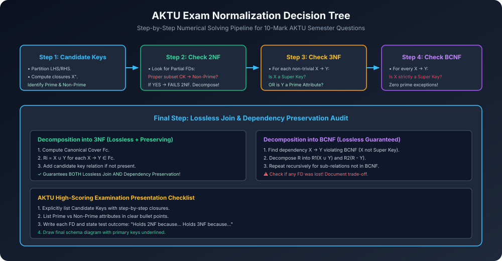

# Module 12: AKTU PYQs & Solved Decompositions (Past 5 Years)

> **Course:** Database Management Systems (AKTU Code: **BCS501**)  
> **Topic Focus:** Previous Years Exam Questions (2019-2024), 7-Mark & 10-Mark Numerical Solutions, Finding Candidate Keys, Determining Highest Normal Form, Lossless 3NF/BCNF Decomposition.

---

## 1. AKTU PYQ 1 (10 Marks — 2022-23 End-Sem)

**Question:**  
Given a relation $R(A, B, C, D, E, F)$ with the following set of functional dependencies:
$$F = \{ A 
ightarrow B, \quad C 
ightarrow DE, \quad AC 
ightarrow F \}$$
1. Find all Candidate Keys of $R$.
2. Identify Prime and Non-Prime attributes.
3. Determine the highest normal form of $R$.
4. Decompose the relation into 3NF ensuring Lossless Join and Dependency Preservation.

### Solution:

#### Step 1: Candidate Keys
- Attributes on RHS: $\{B, D, E, F\}$.
- Attributes **NEVER on RHS**: $\{A, C\}$.
- Essential attribute set = $\{AC\}$.
- Compute closure of $\{AC\}$:
  - $(AC)^+ = \{A, C\}$
  - Using $A 
ightarrow B \implies \{A, C, B\}$
  - Using $C 
ightarrow DE \implies \{A, C, B, D, E\}$
  - Using $AC 
ightarrow F \implies \{A, B, C, D, E, F\} = R$.
- Since $(AC)^+ = R$ and no proper subset of $\{AC\}$ can determine $R$, **$\{AC\}$ is the ONLY Candidate Key**.

#### Step 2: Attribute Classification
- **Prime Attributes:** $\{A, C\}$
- **Non-Prime Attributes:** $\{B, D, E, F\}$

#### Step 3: Highest Normal Form Test
Let us test each FD in $F$:
1. $A 
ightarrow B$:
   - Determinant $A$ is a proper subset of Candidate Key $\{AC\}$.
   - Dependent $B$ is a **Non-Prime Attribute**.
   - This is a **Partial Dependency**!
   - **Verdict:** Violates 2NF!
- **Highest Normal Form = 1NF.**

#### Step 4: Decomposition into 3NF (Using Bernstein Synthesis)
1. **Find Canonical Cover $F_c$:**
   - $F = \{ A 
ightarrow B, C 
ightarrow D, C 
ightarrow E, AC 
ightarrow F \}$.
   - Check extraneous attributes in $AC 
ightarrow F$:
     - $A^+ = \{A, B\}$ (No $F$).
     - $C^+ = \{C, D, E\}$ (No $F$).
     - Neither is extraneous.
   - Check redundant FDs: None.
   - $F_c = \{ A 
ightarrow B, \quad C 
ightarrow D, \quad C 
ightarrow E, \quad AC 
ightarrow F \}$.
2. **Form Relations from $F_c$:**
   - $R_1(\mathbf{A}, B)$ with Key = $A$ (from $A 
ightarrow B$).
   - $R_2(\mathbf{C}, D, E)$ with Key = $C$ (from $C 
ightarrow D, C 
ightarrow E$).
   - $R_3(\mathbf{A, C}, F)$ with Key = $\{AC\}$ (from $AC 
ightarrow F$).
3. **Candidate Key Check:**
   - $R_3$ already contains the candidate key $\{AC\}$!
4. **Final 3NF Relations:**
   - $\mathbf{R_1(A, B)}$, $\mathbf{R_2(C, D, E)}$, $\mathbf{R_3(A, C, F)}$.
   - **Properties:** Lossless Join ($\checkmark$) and Dependency Preservation ($\checkmark$).

---

## 2. AKTU PYQ 2 (7 Marks — 2021-22 End-Sem)

**Question:**  
Relation $R(A, B, C, D)$ has $F = \{ AB 
ightarrow C, \quad C 
ightarrow D, \quad D 
ightarrow A \}$.  
Is this relation in 3NF? Is it in BCNF? Justify your answer.

### Solution:
1. **Candidate Keys:**
   - $(AB)^+ = \{A, B, C, D\} = R \implies \mathbf{AB}$ is CK.
   - $(BC)^+ = \{B, C, D, A\} = R \implies \mathbf{BC}$ is CK.
   - $(BD)^+ = \{B, D, A, C\} = R \implies \mathbf{BD}$ is CK.
   - Prime Attributes = $\{A, B, C, D\}$. Non-Prime = $\emptyset$.
2. **Test 3NF Condition (For every $X 
ightarrow Y$: $X$ is Super Key OR $Y$ is Prime):**
   - $AB 
ightarrow C$: $AB$ is Candidate Key (Super Key). $\checkmark$
   - $C 
ightarrow D$: $C$ is not Super Key, but $D$ is **Prime Attribute** (in $BD$). $\checkmark$
   - $D 
ightarrow A$: $D$ is not Super Key, but $A$ is **Prime Attribute** (in $AB$). $\checkmark$
   - **Relation IS in 3NF!**
3. **Test BCNF Condition (For every $X 
ightarrow Y$: $X$ MUST be Super Key):**
   - In $C 
ightarrow D$: Determinant $C$ is NOT a Super Key ($C^+ = \{A, C, D\} 
e R$).
   - In $D 
ightarrow A$: Determinant $D$ is NOT a Super Key ($D^+ = \{A, D\} 
e R$).
   - **Relation FAILS BCNF!**
4. **Conclusion:** Relation is in **3NF but NOT in BCNF**.

---

## 3. AKTU PYQ 3 (10 Marks — 2020-21 End-Sem)

**Question:**  
Explain Lossless Join Decomposition and Dependency Preservation with suitable examples. State the necessary condition for a binary decomposition to be lossless.

### Solution:
*(Complete formal definitions, the binary condition theorem $(R_1 \cap R_2) 
ightarrow R_1 \lor (R_1 \cap R_2) 
ightarrow R_2$, and tabular counter-example demonstrating spurious tuples as detailed in Module 09).*

---

## 4. Architectural Diagram

