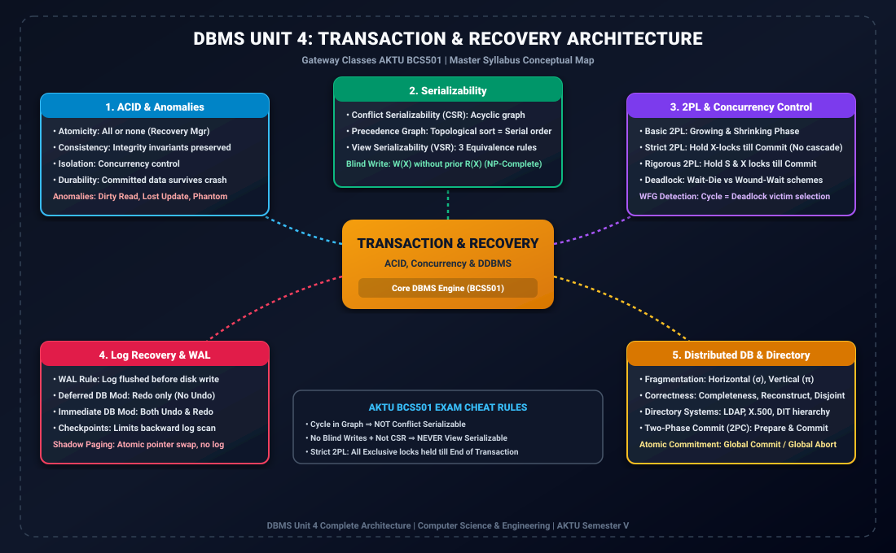

# Module 00: Unit 4 Ultra Quick Revision Short Notes (Exact 3 Pages)

> **Folder:** `DBMS/Unit_4/00_Quick_Revision_Short_Notes/`  
> **Target Exam:** AKTU BCS501 Semester V | Gateway Classes One-Shot Notes Alignment  
> **Compiled Deliverable:** [Unit_4_Quick_Revision_3_Page_Notes.pdf](../Unit_4_Quick_Revision_3_Page_Notes.pdf) (Strictly 3 Pages, 0 whitespace waste)

---

## 1. Quick Revision Mindmap Architecture

---

## 2. 3-Page Ultra High-Yield Syllabus Distribution

### Page 1: Transactions, ACID, Anomalies & Conflict Serializability
- **Transaction Lifecycle & States:** Active $	o$ Partially Committed $	o$ Committed, or Active/Partially Committed $	o$ Failed $	o$ Aborted $	o$ Terminated.
- **ACID Matrix:**
  - **Atomicity:** All-or-nothing (Recovery Manager, Logs).
  - **Consistency:** Database integrity preserved (Application Programmer).
  - **Isolation:** Uncommitted changes hidden (Concurrency Control Manager).
  - **Durability:** Committed changes persist across crashes (Log & Recovery Manager).
- **Concurrency Anomalies:**
  - *Dirty Read (WR):* Reading data updated by an uncommitted transaction that later aborts.
  - *Lost Update (WW):* Two transactions overwrite the same data simultaneously without seeing intermediate values.
  - *Unrepeatable Read (RW):* Rereading the same record yields different values due to intermediate updates.
  - *Phantom Read:* Range query returns different rows due to concurrent insertions/deletions.
- **Conflict Serializability (CSR) Algorithm:**
  1. Identify conflict pairs: $R_i(X)-W_j(X)$, $W_i(X)-R_j(X)$, $W_i(X)-W_j(X)$ where $i 
e j$.
  2. Build Precedence Graph $G = (V, E)$: Edge $T_i 	o T_j$ if conflicting op in $T_i$ precedes op in $T_j$.
  3. Cycle Detection: Acyclic $\iff$ Conflict Serializable. Topological sort yields equivalent serial order.

### Page 2: View Serializability, Recoverability Spectrum & Locking (2PL)
- **View Serializability (VSR):**
  - Equivalence rules: Initial Read, Read-From (Updated Read), Final Write.
  - **Blind Write Criterion:** If a schedule is NOT CSR and has NO blind writes ($W(X)$ without preceding $R(X)$), it can NEVER be VSR.
- **Recoverability Spectrum Hierarchy:**
  $$	ext{Strict Schedules} \subset 	ext{Cascadeless (ACA)} \subset 	ext{Recoverable} \subset 	ext{All Schedules}$$
  - *Recoverable:* If $T_j$ reads $X$ written by $T_i$, then $Commit(T_i) < Commit(T_j)$.
  - *Cascadeless (ACA):* If $T_j$ reads $X$ written by $T_i$, then $Commit(T_i) < Read_j(X)$.
  - *Strict:* If $T_j$ reads or writes $X$ written by $T_i$, then $Commit/Abort(T_i) < Read_j(X) / Write_j(X)$.
- **Two-Phase Locking (2PL) Variants:**
  - *Basic 2PL:* Growing phase (acquire only) $	o$ Lock point $	o$ Shrinking phase (release only). Deadlock possible.
  - *Strict 2PL:* Exclusive locks held until Commit/Abort. Eliminates cascading aborts.
  - *Rigorous 2PL:* Both Shared and Exclusive locks held until Commit/Abort.
  - *Conservative 2PL:* Acquire all locks before start. Deadlock-free.
- **Deadlock Handling:**
  - *Wait-Die (Non-preemptive):* Old waits for Young ($TS(T_i) < TS(T_j)$); Young dies ($TS(T_i) > TS(T_j)$).
  - *Wound-Wait (Preemptive):* Old wounds/rolls back Young ($TS(T_i) < TS(T_j)$); Young waits ($TS(T_i) > TS(T_j)$).

### Page 3: Recovery Systems, Distributed Databases & Exam Problem Solver
- **Storage Hierarchy:** Volatile (RAM), Non-Volatile (Disk), Stable Storage (Mirrored disks, survives failures).
- **Log-Based Recovery & WAL:**
  - **Write-Ahead Logging (WAL):** Log record $\langle T_i, X, V_{old}, V_{new} 
angle$ must reach stable storage before data disk block is written.
  - **Deferred Modification:** Updates buffered until commit. Needs REDO only (NO UNDO).
  - **Immediate Modification:** Disk updated uncommitted. Needs both UNDO and REDO.
- **Checkpoints Algorithm:**
  - Active list at checkpoint: $\langle 	ext{checkpoint } L 
angle$.
  - Scan backwards to checkpoint. Determine `UNDO` list (uncommitted at crash) and `REDO` list (committed after checkpoint).
  - Backward UNDO, Forward REDO.
- **Shadow Paging:** Current vs Shadow page table. Atomic page table pointer swap. No redo/undo logging, but garbage collection required.
- **Distributed Databases (DDBMS):**
  - *Horizontal Fragmentation:* $\sigma_p(R)$, reconstructed by $\cup$.
  - *Vertical Fragmentation:* $\pi_{attrs}(R)$, reconstructed by $owtie$.
  - *Directory Systems:* LDAP, X.500, DIT (Directory Information Tree), DN/RDN hierarchical paths.
  - *Two-Phase Commit (2PC):* Phase 1 (Prepare / Vote Commit/Abort) $	o$ Phase 2 (Global Commit / Global Abort).
- **10-Mark AKTU Problem Solving Blueprint:**
  - Step 1: Draw Precedence Graph for transactions.
  - Step 2: Check for cycles (CSR verification).
  - Step 3: Check for blind writes if cycles exist (VSR testing).
  - Step 4: Verify commit order against read-from dependencies (Recoverability).
  - Step 5: Verify 2PL lock release and acquire rules.

---

## 3. Direct Access
- **Standalone 3-Page Cheat Sheet PDF:** [Unit_4_Quick_Revision_3_Page_Notes.pdf](../Unit_4_Quick_Revision_3_Page_Notes.pdf)
- **Consolidated Master Notes PDF:** [Unit_4_Master_Notes.pdf](../Unit_4_Master_Notes.pdf)
