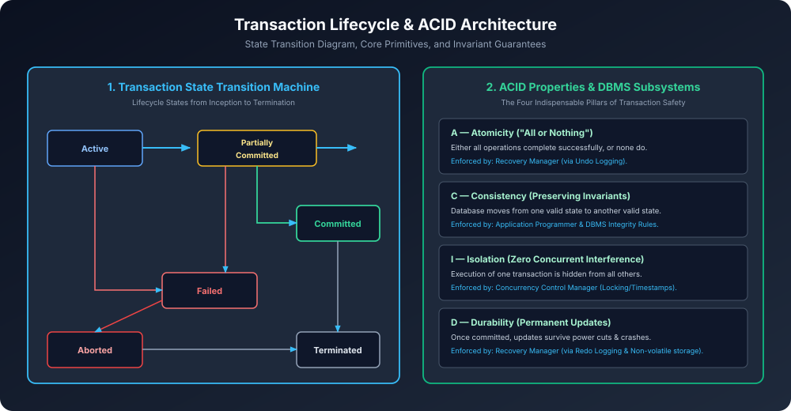

# Module 01: Transaction Concepts and ACID Properties

> **Course:** Database Management Systems (AKTU Code: **BCS501**)  
> **Topic Focus:** Transaction Definition, Atomic Operations (`Read`/`Write`), Transaction State Transition Machine, ACID Properties & Their DBMS Enforcement Subsystems, Failure Types.

---

## 1. What is a Transaction?

Database Management Systems me ek **Transaction** logically related operations ka ek single collection (unit of work) hota hai jo ya toh poora execute hota hai ya bilkul bhi nahi.
- **Formal Definition:** A transaction is a single logical unit of database processing that accesses and possibly updates various data items.
- Real-world example: **Bank Fund Transfer**
  - Account $A$ se Account $B$ me \$500 transfer karna:
    1. `Read(A)`
    2. `A = A - 500`
    3. `Write(A)`
    4. `Read(B)`
    5. `B = B + 500`
    6. `Write(B)`
    7. `Commit`
  - Agar step 3 ke baad power chali jaye ya server crash ho jaye, toh system ko aisi state me nahi chhod sakte jahan $A$ se paise cut gaye par $B$ ko nahi mile!

---

## 2. Fundamental Operations in a Transaction

Har high-level database query physically do primitive operations me translate hoti hai:
1. **`Read(X)`:**
   - Disk/Database se data item $X$ ko fetch karke transaction ke local memory buffer me copy karta hai.
2. **`Write(X)`:**
   - Transaction ke local memory buffer se updated value ko database buffer/disk par write-back karta hai.

---

## 3. Transaction State Transition Machine

Ek transaction apne execution lifecycle ke dauran specified formal states se guzarta hai:

```
                  ┌──────────────────────┐
                  │        Active        │
                  └──────────┬───────────┘
                             │
            ┌────────────────┴────────────────┐
            ▼                                 ▼
┌──────────────────────┐            ┌──────────────────────┐
│ Partially Committed  │            │        Failed        │
└──────────┬───────────┘            └──────────┬───────────┘
           │                                   │
           ▼                                   ▼
┌──────────────────────┐            ┌──────────────────────┐
│      Committed       │            │       Aborted        │
└──────────┬───────────┘            └──────────┬───────────┘
           │                                   │
           └─────────────────┬─────────────────┘
                             ▼
                  ┌──────────────────────┐
                  │      Terminated      │
                  └──────────────────────┘
```

### State Explanations:
1. **Active:** Initial state jahan transaction start hota hai aur operations execute kar raha hota hai.
2. **Partially Committed:** Transaction ka aakhiri instruction execute ho chuka hai, par updates abhi bhi main memory buffers me hain (disk par permanently flush nahi hue).
3. **Committed:** Transaction ke sabhi updates permanently non-volatile storage (disk) par save ho chuke hain. Ab transaction ko rollback nahi kiya ja sakta.
4. **Failed:** Normal execution ke waqt agar hardware crash, logical bug, ya system error aaye toh transaction Failed state me chala jaata hai.
5. **Aborted:** Failed transaction ke saare changes undo (rollback) karke database ko original initial consistent state me restore kiya jaata hai.
6. **Terminated:** Transaction system chhod kar exit kar chuka hai (either successfully committed or cleanly aborted).

---

## 4. ACID Properties & DBMS Enforcement Architecture

Database consistency maintain karne ke liye Jim Gray dwara define kiye gaye **ACID Properties** mandatory hain:

| Property | Core Guarantee | Real-World Scenario | Responsible DBMS Subsystem |
| :--- | :--- | :--- | :--- |
| **Atomicity** | **"All or Nothing"** — Ya toh saare steps execute honge ya ek bhi nahi. | Agar paisa debit hua toh credit zaroor hoga; crash hone par pura debit undo ho jayega. | **Recovery Manager** (Undo logging) |
| **Consistency** | **Preserving Invariants** — Database transaction se pehle aur baad me legal valid rules satisfy karega. | Total sum of money $(A + B)$ transfer ke pehle aur baad exactly same rahegi. | **Application Developer** + **Integrity Subsystem** |
| **Isolation** | **Concurrent Independence** — Do parallel transactions ek doosre ke intermediate states ko dekh nahi sakte. | User $T_1$ ke debit hone ke turant baad par credit se pehle User $T_2$ balance check kare toh use intermediate galat data na dikhe. | **Concurrency Control Manager** (Locks & Timestamps) |
| **Durability** | **Permanence** — Commit message aane ke baad system crash ho jaye toh bhi data kabhi kho nahi sakta. | Flight ticket book ho gayi toh server restart hone par bhi seat booked hi rahegi. | **Recovery Manager** (Redo logging & WAL) |

---

## 5. Architectural Diagram



---

## 6. Solved AKTU Examination Question (10 Marks)

**Question:** Explain the ACID properties of a transaction. What are the various states through which a transaction passes during its lifecycle? Explain with a neat state transition diagram. *(AKTU 2021-22, 2023-24)*

**Model Answer Summary:**
1. State definition of Transaction as single logical unit of work with Bank transfer example.
2. Draw the 6-state transition diagram (Active, Partially Committed, Committed, Failed, Aborted, Terminated).
3. Explain conditions for transitioning between states:
   - Partial Commit $
ightarrow$ Commit: When log records and dirty pages are safely written to non-volatile disk.
   - Active $
ightarrow$ Failed: System error, divide-by-zero, power loss.
   - Failed $
ightarrow$ Aborted: Rollback execution restoring before-images from undo log.
4. Tabulate ACID properties with their respective DBMS manager components.
