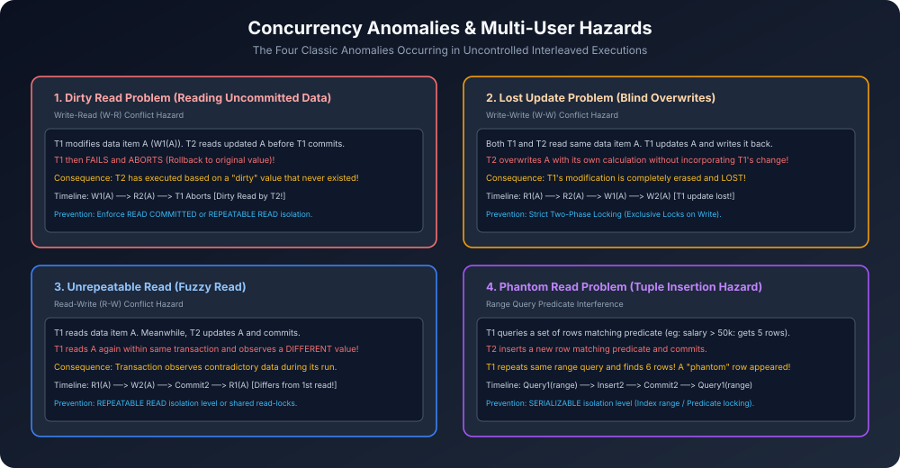

# Module 02: Concurrency Problems and Multi-User Anomalies

> **Course:** Database Management Systems (AKTU Code: **BCS501**)  
> **Topic Focus:** Why Concurrency is Needed, Concurrency Hazards, Dirty Read Problem (WR), Lost Update Problem (WW), Unrepeatable Read Problem (RW), Phantom Read Problem, SQL Isolation Levels.

---

## 1. Why Do We Need Concurrent Transaction Execution?

Single-user database me transactions ek ke baad ek (serially) run hoti hain, jisse koi anomaly nahi hoti. Lekin enterprise DBMS (e.g., IRCTC, Banking, Amazon) me hazaron users ek saath access karte hain.
- **Benefits of Concurrency:**
  1. **Higher Throughput:** Unit time me zyada transactions complete hoti hain.
  2. **Reduced Waiting / Response Time:** Chhote transactions lambe transactions ke peeche block nahi hote.
  3. **High Resource Utilization:** CPU computation aur Disk I/O parallel me overlap ho sakte hain.

Lekin agar concurrency ko bina kisi protocol ke allow kiya jaye, toh database me **4 classical anomalies** paida hoti hain!

---

## 2. The Four Classical Concurrency Anomalies

### 2.1 Dirty Read Problem (Write-Read Conflict)
- **Scenario:** Transaction $T_1$ data item $A$ ko update karta hai ($W_1(A)$). Abhi $T_1$ ne commit nahi kiya hai.
- Us uncommitted data ko transaction $T_2$ read kar leta hai ($R_2(A)$).
- Uske baad kisi error ki wajah se $T_1$ **Abort** ho jaata hai aur rollback kar diya jaata hai!
- **Hazard:** $T_2$ ne ek aisi value par calculation kar li jo physically database me kabhi exist hi nahi karti thi!

```
     T1                   T2
     │                    │
   Read(A)                │
   A = A + 100            │
   Write(A)               │
     │                 Read(A)   <-- DIRTY READ! (Uncommitted data)
     │                 Write(A)
   [ABORT / ROLLBACK]     │
```

---

### 2.2 Lost Update Problem (Write-Write Conflict)
- **Scenario:** Do transactions $T_1$ aur $T_2$ simultaneously data item $A$ ki initial value ko read karti hain ($A = 1000$).
- $T_1$ ne $A = A - 100$ kiya aur write kar diya ($A = 900$).
- Par turant $T_2$ ne $A = A + 200$ calculate kiya aur bina $T_1$ ke update ko consider kiye write kar diya ($A = 1200$).
- **Hazard:** $T_1$ ka subtraction update permanently **Lost** ho gaya! Final balance $1100$ hona chahiye tha, par database me $1200$ reh gaya!

```
     T1                   T2
     │                    │
   Read(A) [1000]         │
     │                 Read(A) [1000]
   A = A - 100            │
   Write(A) [900]         │
     │                 A = A + 200
     │                 Write(A) [1200]  <-- T1's update is LOST!
```

---

### 2.3 Unrepeatable Read Problem (Read-Write Conflict)
- **Scenario:** Transaction $T_1$ data item $A$ ko read karta hai ($A = 500$).
- Tabhi $T_2$ aata hai, $A$ ko modify karta hai ($A = 700$) aur **Commit** kar deta hai.
- Transaction $T_1$ apne execution ke dauran dobara $A$ ko read karta hai.
- **Hazard:** Ek hi transaction ke andar user ko do alag-alag values milti hain! ($500$ and $700$). Is anomaly ko **Fuzzy Read** bhi kehte hain.

---

### 2.4 Phantom Read Problem (Dynamic Range Hazard)
- **Scenario:** $T_1$ ek range query run karta hai: `SELECT * FROM Emp WHERE Salary > 50000` aur use 10 records milte hain.
- Is dauran $T_2$ ek naya employee insert karta hai jiska salary \$60,000 hai aur commit kar deta hai.
- $T_1$ jab dobara wahi query run karta hai, toh use 11 records milte hain!
- **Hazard:** Naya tuple bina kisi update ke "bhoot" (phantom) ki tarah appear ho gaya!

---

## 3. SQL-92 Standard Isolation Levels

ANSI/SQL standard ne concurrency anomalies ko balance karne ke liye 4 isolation levels define kiye hain:

| Isolation Level | Dirty Read Allowed? | Unrepeatable Read Allowed? | Phantom Read Allowed? | Performance Overhead |
| :--- | :---: | :---: | :---: | :--- |
| **Read Uncommitted** | Yes (⚠️) | Yes | Yes | Lowest overhead |
| **Read Committed** | **No ($\checkmark$)** | Yes | Yes | Default in Oracle / PostgreSQL |
| **Repeatable Read** | **No ($\checkmark$)** | **No ($\checkmark$)** | Yes | Default in MySQL InnoDB |
| **Serializable** | **No ($\checkmark$)** | **No ($\checkmark$)** | **No ($\checkmark$)** | Highest isolation / Slowest |

---

## 4. Architectural Diagram



---

## 5. AKTU Semester Numerical & Concept Question

**Question:** What are the various problems that arise due to concurrent execution of transactions? Explain Dirty Read and Lost Update with suitable transaction schedules. *(AKTU 2020-21, 2022-23)*

**Solution Points:**
1. Draw the comparative schedule table showing interleaving of $T_1$ and $T_2$.
2. Write initial values (e.g., $A = 1000$).
3. Trace steps showing how $W_1(A)$ followed by $R_2(A)$ creates dirty read when $T_1$ issues `ABORT`.
4. Trace steps showing how concurrent reads followed by overwriting writes result in lost update.
5. Provide solution: Use Strict 2PL and write-locks.
