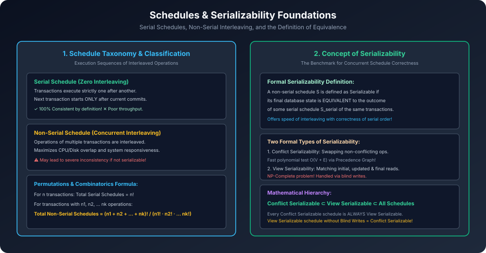

# Module 03: Schedules and Serializability Foundations

> **Course:** Database Management Systems (AKTU Code: **BCS501**)  
> **Topic Focus:** Definition of Schedule, Serial vs Non-Serial Schedules, Combinatorics of Schedules, Serializability as the Benchmark of Correctness, Conflict vs View Serializability Hierarchy.

---

## 1. What is a Schedule?

Jab multiple transactions system me ek saath run hoti hain, toh unke operations (read, write, commit, abort) jis chronological sequence (time order) me CPU par execute hote hain, use **Schedule** (ya History) kehte hain.

- **Formal Definition:** A schedule $S$ of $n$ transactions $\{T_1, T_2, \dots, T_n\}$ is an ordering of the operations of the transactions such that for each transaction $T_i$, the operations of $T_i$ in $S$ appear in the same order as in $T_i$.

---

## 2. Classification of Schedules

### 2.1 Serial Schedule
- Ek transaction ke saare operations ek saath execute hote hain. Doosra transaction tabhi shuru hota hai jab pehla **Commit** ho chuka ho.
- **Example:** $T_1$ executes completely $
ightarrow$ then $T_2$ executes completely ($T_1 
ightarrow T_2$).
- **Properties:**
  - Database hamesha **100% consistent** rehta hai (no concurrency hazards).
  - CPU utilization bohot bekar hoti hai; response time bohot high hota hai (Zero concurrency).

### 2.2 Non-Serial (Interleaved) Schedule
- Transactions ke operations ek doosre ke beech me mix (interleave) hokar run hote hain.
- **Properties:**
  - High system throughput aur fast response time.
  - Lekin agar control na kiya jaye, toh inconsistent database ban sakta hai!

### 2.3 Combinatorics Formula (AKTU Objective & Gate Questions)
Agar relation me $n$ transactions hain:
1. **Total Number of Serial Schedules:**
   $$	ext{Total Serial} = n!$$
2. **Total Possible Concurrent Schedules:**
   Agar transaction $T_1$ me $n_1$ operations hain, $T_2$ me $n_2$ operations hain, ..., $T_k$ me $n_k$ operations hain:
   $$	ext{Total Schedules} = rac{(n_1 + n_2 + \dots + n_k)!}{n_1! 	imes n_2! 	imes \dots 	imes n_k!}$$

---

## 3. The Concept of Serializability

> **Golden Rule of Serializability:**
> Ek concurrent (non-serial) schedule $S$ tabhi **Correct** maana jaata hai jab uska final effect kisi ek **Serial Schedule** ke barabar ho!

Is property ko **Serializability** kehte hain.
- Serial schedule benchmark hota hai.
- Agar non-serial schedule serial schedule ke barabar outcome de raha hai, toh hume concurrency ki **high speed** bhi mil gayi aur serial execution ki **100% consistency** bhi mil gayi!

---

## 4. Types of Serializability

Serializability ko verify karne ke do theoretical approaches hain:

1. **Conflict Serializability:**
   - Non-conflicting adjacent operations ko swap karke serial schedule me convert karna.
   - Tested using **Precedence Graph (Cycle Detection)** in polynomial time $O(V + E)$.
2. **View Serializability:**
   - Har transaction ke initial read, intermediate updated read, aur final write ko serial schedule se match karna.
   - Testing view serializability is **NP-Complete**!

### 4.1 Master Inclusion Hierarchy
$$\mathbf{	ext{Conflict Serializable} \subset 	ext{View Serializable} \subset 	ext{All Valid Schedules}}$$

- Har Conflict Serializable schedule **by default View Serializable hota hai**.
- Ek View Serializable schedule jo conflict serializable nahi hai, usme compulsory roop se **Blind Writes** ($W(A)$ without prior $R(A)$) present honge!

---

## 5. Architectural Diagram

