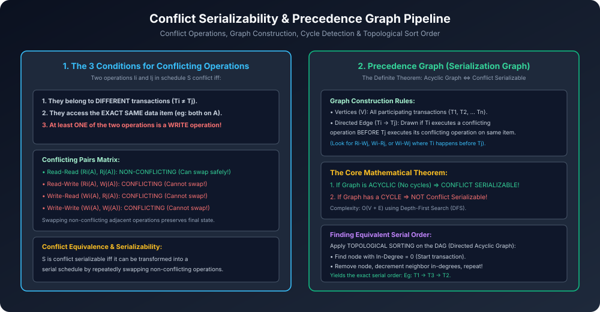

# Module 04: Conflict Serializability and Precedence Graph

> **Course:** Database Management Systems (AKTU Code: **BCS501**)  
> **Topic Focus:** Conflicting Operations Criteria, Conflict Equivalence, Precedence Graph (Serialization Graph) Algorithm, Cycle Detection Theorem, Topological Sorting for Serial Order, Solved Gateway AKTU Numericals.

---

## 1. What are Conflicting Operations?

Schedule ke do operations $I_i$ aur $I_j$ tabhi **Conflicting Operations** kehlate hain jab wo neeche di gayi teeno conditions satisfy karein:
1. Dono operations **alag-alag transactions** ke hon ($T_i 
e T_j$).
2. Dono operations **exact same data item** par execute ho rahe hon (e.g., both on variable $A$).
3. Dono me se **kam se kam ek operation `WRITE`** ho!

### 1.1 Conflicting Operations Matrix
| Operation Pair | Conflict? | Reasoning | Can Swap? |
| :--- | :---: | :--- | :---: |
| $R_i(A)$ and $R_j(A)$ | **NO** | Read operations do not modify data state. | **YES** |
| $R_i(A)$ and $W_j(A)$ | **YES** | Read-Write (RAW) conflict. Changing order changes read value. | **NO** |
| $W_i(A)$ and $R_j(A)$ | **YES** | Write-Read (WAR) conflict. | **NO** |
| $W_i(A)$ and $W_j(A)$ | **YES** | Write-Write (WAW) conflict. Changing order changes final state. | **NO** |
| $R_i(A)$ and $W_j(B)$ | **NO** | Different data items ($A 
e B$). | **YES** |

---

## 2. Conflict Equivalence & Conflict Serializability

- **Conflict Equivalent:** Do schedules $S_1$ aur $S_2$ conflict equivalent tab hote hain jab $S_1$ ko non-conflicting adjacent operations ko swap karke $S_2$ me transform kiya ja sake.
- **Conflict Serializable:** Ek schedule $S$ conflict serializable tab hota hai jab wo kisi ek Serial Schedule ke conflict-equivalent ho!

---

## 3. Precedence Graph (Serialization Graph) Algorithm

Exam me haath se swap karte-karte confuse hone ki jagah, hum **Precedence Graph (Directed Graph $G = (V, E)$)** banate hain:

```
Algorithm: Test_Conflict_Serializability(S)
1. Vertices (V): Schedule me jitni transactions hain, unke nodes banao: {T1, T2, ..., Tn}.
2. Edges (E): For every conflicting pair (Ii, Ij) on data item A:
       If Ii belongs to Ti, Ij belongs to Tj, and Ii occurs BEFORE Ij in schedule S:
           Draw a directed edge Ti → Tj.
3. Cycle Detection:
       Run Cycle Detection Algorithm (DFS / In-degree check).
       - If Graph contains a CYCLE:
             => Schedule is NOT Conflict Serializable!
       - If Graph has NO CYCLES (Acyclic DAG):
             => Schedule IS Conflict Serializable!
```

### 3.1 Topological Sort for Finding Equivalent Serial Schedule
Agar graph acyclic hai, toh equivalent serial order nikalne ke liye:
1. Sabhi vertices ka **In-Degree** (incoming edges count) calculate karo.
2. Jiska In-Degree = $0$ ho, use serial order me pehle likho aur graph se uske outgoing edges hata do.
3. Bachi hui nodes me step repeat karo.
4. Output order will be the **Equivalent Serial Schedule**!

---

## 4. Architectural Diagram



---

## 5. Gateway Classes Solved AKTU Examination Numerical

**Question:** Check whether the given schedule $S$ is conflict serializable or not. If yes, find the equivalent serial schedule:
$$S: R_1(X); \quad R_2(Z); \quad R_1(Z); \quad R_3(X); \quad R_3(Y); \quad W_1(X); \quad W_3(Y); \quad R_2(Y); \quad W_2(Z); \quad W_2(Y)$$

### Step 1: Identify Participating Transactions
Transactions = $\{T_1, T_2, T_3\}$. Draw nodes $T_1$, $T_2$, $T_3$.

### Step 2: Trace Conflicting Operation Pairs in Chronological Order
1. On Item $X$:
   - $R_3(X)$ is followed by $W_1(X) \implies \mathbf{T_3 
ightarrow T_1}$.
2. On Item $Y$:
   - $W_3(Y)$ is followed by $R_2(Y) \implies \mathbf{T_3 
ightarrow T_2}$.
   - $W_3(Y)$ is followed by $W_2(Y) \implies \mathbf{T_3 
ightarrow T_2}$ (Already exists).
   - $R_2(Y)$ is followed by $W_2(Y) \implies$ Same transaction $T_2$ (Ignored).
3. On Item $Z$:
   - $R_1(Z)$ is followed by $W_2(Z) \implies \mathbf{T_1 
ightarrow T_2}$.
   - $R_2(Z)$ is followed by $W_2(Z) \implies$ Same transaction $T_2$ (Ignored).

### Step 3: Draw Directed Edges
The edges in graph $G$ are:
- $T_3 
ightarrow T_1$
- $T_3 
ightarrow T_2$
- $T_1 
ightarrow T_2$

```
      T3 ───────────► T1
       │              │
       │              │
       └────► T2 ◄────┘
```

### Step 4: Check for Cycles
- Paths: $T_3 
ightarrow T_1 
ightarrow T_2$, and $T_3 
ightarrow T_2$.
- Is there any back-edge or loop? **NO! Graph is strictly ACYCLIC.**

### Step 5: Equivalent Serial Order via Topological Sort
- In-degree of $T_3 = 0 \implies$ Starts with $\mathbf{T_3}$.
- Remove $T_3$. Remaining: In-degree of $T_1 = 0 \implies$ Next is $\mathbf{T_1}$.
- Remaining: $\mathbf{T_2}$.
- **Equivalent Serial Schedule:** $$\mathbf{T_3 
ightarrow T_1 
ightarrow T_2}$$
- **Verdict:** Schedule $S$ is **Conflict Serializable**!
