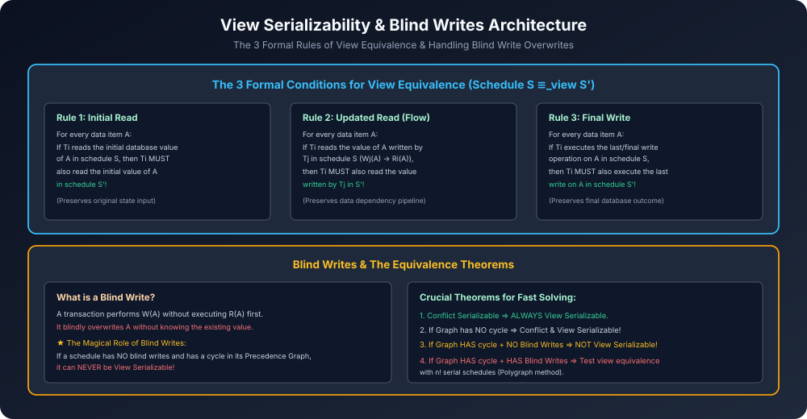

# Module 05: View Serializability and Blind Writes

> **Course:** Database Management Systems (AKTU Code: **BCS501**)  
> **Topic Focus:** View Equivalence Definition (Initial Read, Updated Read, Final Write), View Serializability, The Critical Role of Blind Writes, Shortcut Theorems for AKTU Exams, Solved Numerical.

---

## 1. What is View Equivalence?

Do schedules $S$ aur $S'$ (involving the same transactions) **View Equivalent** tab kehlate hain jab wo neeche di gayi **3 conditions** ko 100% satisfy karein:

### 1.1 The Three Formal Rules of View Equivalence
1. **Initial Read Rule:**
   - Har data item $A$ ke liye, agar schedule $S$ me transaction $T_i$ initial (pehle se stored) value read karta hai, toh schedule $S'$ me bhi $T_i$ ko hi initial value read karni chahiye.
2. **Updated Read (Data Dependency) Rule:**
   - Har data item $A$ ke liye, agar schedule $S$ me transaction $T_i$ wo value read karta hai jo transaction $T_j$ ne write ki thi ($W_j(A) 
ightarrow R_i(A)$), toh schedule $S'$ me bhi $T_i$ ko $T_j$ dwara likhi gayi value hi read karni chahiye.
3. **Final Write Rule:**
   - Har data item $A$ ke liye, agar schedule $S$ me transaction $T_i$ aakhiri (final) write operation perform karta hai, toh schedule $S'$ me bhi $T_i$ hi final write perform karega.

---

## 2. View Serializability Definition

> A non-serial schedule $S$ is **View Serializable** if it is **view equivalent** to some serial schedule of the same transactions.

---

## 3. The Crucial Role of "Blind Writes"

- **Blind Write:** Jab koi transaction kisi variable $A$ par write karta hai bina use pehle read kiye ($W(A)$ without preceding $R(A)$).
- **The Blind Write Shortcut Theorem (AKTU Exam Lifesaver):**
  1. Agar kisi schedule me **koi bhi Blind Write nahi hai**, aur uska Precedence Graph **cyclic** hai:
     $$\mathbf{	ext{No Blind Writes} + 	ext{Cycle in Graph} \implies 	ext{NOT View Serializable!}}$$
     *(Exam me time waste karne ki zaroorat nahi, direct "Not View Serializable" likhein!)*
  2. Agar kisi schedule me Precedence Graph me cycle hai, lekin **Blind Write present hai**, tab wo schedule **View Serializable ho bhi sakta hai aur nahi bhi**! (Polygraph test / manual view check required).

---

## 4. Conflict vs View Serializability Comparison

| Feature | Conflict Serializability | View Serializability |
| :--- | :--- | :--- |
| **Testing Complexity** | Polynomial $O(V + E)$ (Precedence Graph) | **NP-Complete** ($O(n!)$ serial permutations) |
| **Swapping Operations** | Swaps adjacent non-conflicting ops | Matches data read/write views |
| **Condition Strictness** | More Strict | Relaxed (allows blind write overwrites) |
| **Mathematical Relation** | $	ext{Conflict Serializable} \subset 	ext{View Serializable}$ | Every conflict serializable is view serializable |

---

## 5. Architectural Diagram

---

## 6. Gateway Classes Solved AKTU Examination Problem

**Problem:** Test whether the following schedule $S$ is View Serializable:
$$S: R_1(A); \quad W_2(A); \quad W_1(A); \quad W_3(A)$$

### Step 1: Precedence Graph for Conflict Serializability
- $R_1(A)$ followed by $W_2(A) \implies T_1 
ightarrow T_2$.
- $W_2(A)$ followed by $W_1(A) \implies T_2 
ightarrow T_1$.
- Cycle detected: $T_1 
ightleftarrows T_2$!
- **Verdict 1:** Schedule $S$ is **NOT Conflict Serializable**.

### Step 2: Check for Blind Writes
- In $T_2$: It executes $W_2(A)$ without reading $A$ $\implies$ **Blind Write present!**
- In $T_3$: It executes $W_3(A)$ without reading $A$ $\implies$ **Blind Write present!**
- Because blind writes exist, $S$ might still be View Serializable!

### Step 3: Test View Equivalence with Candidate Serial Orders
Transactions are $\{T_1, T_2, T_3\}$.
Possible serial orders where $T_3$ is last (since $T_3$ is the final writer in $S$):
- Candidate 1: $T_2 
ightarrow T_1 
ightarrow T_3$

Let us test rules for Candidate 1 ($T_2 
ightarrow T_1 
ightarrow T_3$):
1. **Initial Read:**
   - In $S$: $T_1$ reads initial $A$.
   - In $T_2 
ightarrow T_1 
ightarrow T_3$: $T_2$ only writes $A$, then $T_1$ reads $A$ (Wait, $T_1$ reads $T_2$'s write, NOT initial!). Fails!
- Candidate 2: Try $T_1 
ightarrow T_2 
ightarrow T_3$:
  1. **Initial Read:** In $S$, $T_1$ reads initial $A$. In Candidate 2, $T_1$ runs first, so $T_1$ reads initial $A$. **(Satisfied!)**
  2. **Updated Read:** In $S$, no transaction reads any updated value. In Candidate 2, no transaction reads any updated value. **(Satisfied!)**
  3. **Final Write:** In $S$, $T_3$ performs final write. In Candidate 2, $T_3$ performs final write. **(Satisfied!)**

### Final Verdict:
Schedule $S$ is view equivalent to the serial schedule $\mathbf{T_1 
ightarrow T_2 
ightarrow T_3}$.  
Therefore, schedule $S$ is **VIEW SERIALIZABLE**!
