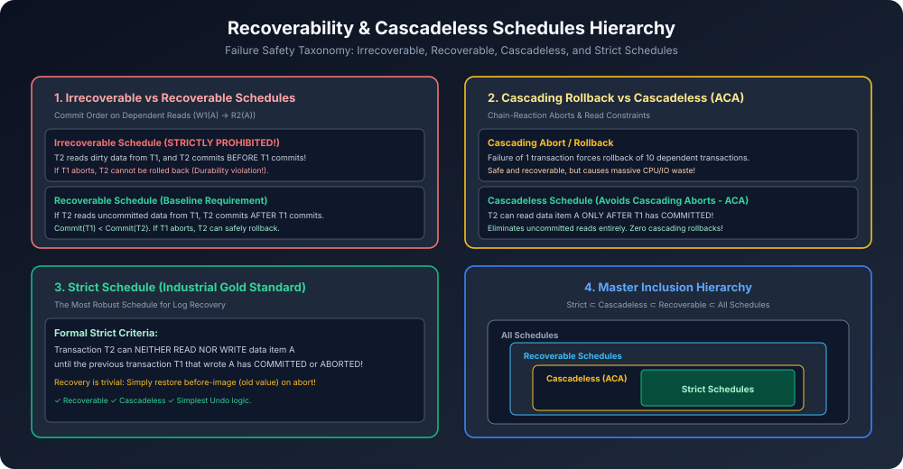

# Module 06: Recoverability and Cascadeless Schedules

> **Course:** Database Management Systems (AKTU Code: **BCS501**)  
> **Topic Focus:** Irrecoverable Schedules (Hazard), Recoverable Schedules, Cascading Rollback vs Cascadeless (ACA), Strict Schedules, Master Inclusion Hierarchy, Solved Schedule Testing.

---

## 1. Why Do We Need Recoverable Schedules?

Serializability yeh ensure karti hai ki concurrent schedule ka outcome kisi serial execution ke barabar ho. Lekin Serializability **Failures (Aborts)** ko consider nahi karti!
- Real-world database me transactions network drop, disk error, ya divide-by-zero ki wajah se **Abort** hoti hain.
- Agar ek abort hui transaction ka data kisi doosri transaction ne read kar liya ho aur wo commit ho chuki ho, toh system aisi state me phans jaata hai jahan se **database ko recover karna mathematically impossible ho jaata hai**!

Isliye relational DBMS me **Recoverability** serializability se bhi zyada critical property hoti hai!

---

## 2. Classification of Schedules Based on Recovery

### 2.1 Irrecoverable Schedule (Strictly Prohibited!)
- **Definition:** Jab transaction $T_2$ data item $A$ ko read karta hai jise $T_1$ ne update kiya tha ($W_1(A) 
ightarrow R_2(A)$), aur **$T_2$ pehle COMMIT ho jaata hai jabki $T_1$ abhi active tha**.
- Uske baad $T_1$ fail hokar **Abort** ho jaata hai!
- **Hazard:** ACID properties ke Durability rule ke according hum committed transaction $T_2$ ko rollback nahi kar sakte, aur Atomicity ke according hum $T_1$ ke uncommitted data ko database me chhod nahi sakte!
- **Verdict:** Irrecoverable schedules database corrupt karte hain aur kisi bhi RDBMS me allow nahi hote.

```
     T1                     T2
     │                      │
   Write(A)                 │
     │                   Read(A)      <-- Reads uncommitted A
     │                   Commit       <-- T2 COMMITS!
   [ABORT / CRASH]          │         <-- T1 aborts! T2 cannot rollback!
```

---

### 2.2 Recoverable Schedule (Baseline Requirement)
- **Definition:** Agar transaction $T_2$ uncommitted data item $A$ read karta hai jo $T_1$ ne likha tha, toh $T_2$ ka commit operation compulsory roop se **$T_1$ ke commit hone ke BAAD hona chahiye**:
  $$\mathbf{	ext{Commit}(T_1) < 	ext{Commit}(T_2)}$$
- Agar $T_1$ abort hota hai, toh $T_2$ abhi commit nahi hua hai, isliye $T_2$ ko bhi safe tarike se rollback kiya ja sakta hai!

---

### 2.3 Cascading Rollback / Cascading Abort
- Ek recoverable schedule me agar transaction $T_1$ fail ho jaye, toh un sabhi transactions ($T_2, T_3, \dots, T_k$) ko bhi abort aur rollback karna padta hai jinhone $T_1$ ka uncommitted data padha tha!
- Yeh chain reaction bohot saara CPU aur I/O time waste karti hai.

---

### 2.4 Cascadeless Schedule (Avoids Cascading Aborts - ACA)
- **Rule:** Transaction $T_2$ kisi data item $A$ ko **tabhi read kar sakta hai jab use likhne wala transaction $T_1$ already COMMIT ho chuka ho**!
- Dirty reads physically allow hi nahi hote!
- Agar $T_1$ abort hota hai, toh kisi aur transaction ko rollback karne ki zaroorat nahi padti (Zero cascading rollbacks).

---

### 2.5 Strict Schedule (Industrial Standard)
- **Rule:** Transaction $T_2$ kisi data item $A$ ko **na toh READ kar sakta hai aur na hi WRITE kar sakta hai** jab tak use pehle likhne wala transaction $T_1$ commit ya abort na ho jaye!
- **Huge Advantage in Crash Recovery:** Agar koi transaction abort hoti hai, toh database recovery manager ko koi complex calculation nahi karni padti; wo seedha log file se **Before-Image (Purani value)** uthakar cell me paste kar deta hai!

---

## 3. Master Inclusion Hierarchy

$$\mathbf{	ext{Strict} \subset 	ext{Cascadeless (ACA)} \subset 	ext{Recoverable} \subset 	ext{All Schedules}}$$

- Har Strict schedule by default Cascadeless hota hai.
- Har Cascadeless schedule by default Recoverable hota hai.
- Lekin har Recoverable schedule Cascadeless nahi hota!

---

## 4. Architectural Diagram



---

## 5. Gateway Classes Solved AKTU Examination Problem

**Question:** Test whether the following schedule $S$ is Recoverable, Cascadeless, or Strict:
$$S: R_1(X); \quad R_2(Z); \quad W_1(X); \quad R_2(Y); \quad W_3(Y); \quad R_2(X); \quad W_2(Z); \quad W_2(Y); \quad C_1; \quad C_2; \quad C_3$$

### Step-by-Step Analysis:
1. **Find all Dirty Reads ($W_i 
ightarrow R_j$):**
   - $W_1(X)$ happens, followed by $R_2(X)$ before $T_1$ commits!
   - This is a Dirty Read from $T_1$ to $T_2$.
2. **Check Commit Order:**
   - $T_1$ commits at step $C_1$.
   - $T_2$ commits at step $C_2$.
   - Here $C_1 < C_2$ ($T_1$ commits before $T_2$).
   - Therefore, the schedule is **RECOVERABLE**!
3. **Check Cascadeless:**
   - In Cascadeless, a transaction can only read AFTER commit.
   - But $T_2$ read $X$ at $R_2(X)$ while $T_1$ was uncommitted!
   - Therefore, schedule $S$ is **NOT Cascadeless**!
4. **Check Strict:**
   - Since it is not cascadeless, it can **NEVER be Strict**!

**Conclusion:** Schedule $S$ is **Recoverable with Cascading Rollback**, but **NOT Cascadeless and NOT Strict**!
