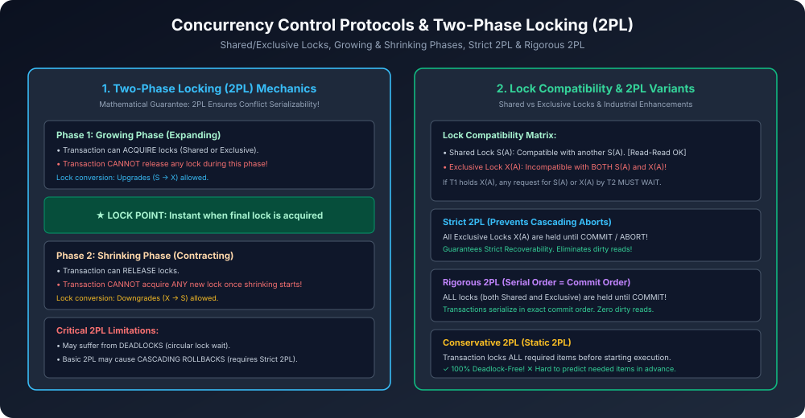

# Module 07: Concurrency Control Protocols & Two-Phase Locking (2PL)

> **Course:** Database Management Systems (AKTU Code: **BCS501**)  
> **Topic Focus:** Concurrency Control Need, Shared & Exclusive Locks, Basic Two-Phase Locking (2PL), Growing vs Shrinking Phases, Lock Point, Strict 2PL, Rigorous 2PL, Conservative 2PL, Thomas' Write Rule.

---

## 1. Why Do We Need Locking Protocols?

Precedence Graph runtime par dynamic concurrent systems ke andar har query ke liye graph draw karke cycles check nahi kar sakta (too high computational overhead).
- Isliye DBMS **Locking Protocols** use karta hai jisme data items access karne se pehle transactions ko **Lock** lena padta hai aur kaam khatam hone par **Unlock** karna padta hai.

---

## 2. Lock Modes & Compatibility

| Mode | Symbol | Meaning | Compatibility |
| :--- | :---: | :--- | :--- |
| **Shared Lock** | $S$ | **Read Lock:** Sirf data ko read karne ke liye liya jaata hai. | Multiple transactions simultaneously $S$ lock le sakti hain ($S-S$ compatible). |
| **Exclusive Lock** | $X$ | **Write Lock:** Data ko read aur update dono karne ke liye liya jaata hai. | Koi doosri transaction na $S$ le sakti hai na $X$ ($X-S$ and $X-X$ incompatible). |

---

## 3. Two-Phase Locking (2PL) Protocol

2PL protocol ensure karta hai ki schedule **Conflict Serializable** ho. Isme transaction do strict phases me divide hoti hai:

```
Number of
Locks Held
   ▲                     Lock Point
   │                         ▲
   │                       ╱───╲
   │                     ╱       ╲
   │                   ╱           ╲
   │                 ╱               ╲
   │   Growing Phase                   Shrinking Phase
   │ (Only Locks Acquired)           (Only Locks Released)
   └──────────────────────────────────────────────────────► Time
```

1. **Growing Phase (Expanding Phase):**
   - Transaction naye locks acquire kar sakti hai.
   - Transaction koi bhi lock release **nahi** kar sakti!
2. **Lock Point:**
   - Wo specific instant of time jab transaction ne apna aakhiri lock acquire kiya.
3. **Shrinking Phase (Contracting Phase):**
   - Transaction purane locks release kar sakti hai.
   - Transaction koi bhi naya lock acquire **nahi** kar sakti!

> [!IMPORTANT]
> **Fundamental Theorem of 2PL:**
> Agar koi schedule 2PL protocol follow karta hai, toh wo **guaranteed Conflict Serializable hoga**!

---

## 4. Variations of 2PL (AKTU Exam Comparison)

| 2PL Variant | Lock Release Rule | Guarantees Serializability? | Prevents Cascading Aborts? | Prevents Deadlocks? |
| :--- | :--- | :---: | :---: | :---: |
| **Basic 2PL** | Locks can be released in shrinking phase anytime | $\checkmark$ | $	imes$ | $	imes$ |
| **Strict 2PL** | Exclusive locks ($X$) held until Commit/Abort | $\checkmark$ | **$\checkmark$ (Strict)** | $	imes$ |
| **Rigorous 2PL** | **ALL** locks ($S$ and $X$) held until Commit/Abort | $\checkmark$ | **$\checkmark$ (Rigorous)** | $	imes$ |
| **Conservative 2PL**| Acquires all locks upfront before start | $\checkmark$ | $	imes$ | **$\checkmark$ (Deadlock Free!)** |

---

## 5. Architectural Diagram



---

## 6. Solved AKTU Examination Question (10 Marks)

**Question:** What is Two-Phase Locking (2PL)? Differentiate between Strict 2PL and Rigorous 2PL. Does basic 2PL ensure freedom from deadlocks? Justify. *(AKTU 2019-20, 2022-23)*

**Solution Summary:**
1. Definition of Growing and Shrinking phases with the Lock Point graph.
2. Proof that 2PL guarantees conflict serializability (by contradiction: cycles in serialization graph require a transaction to acquire a lock after releasing one, violating 2PL).
3. Contrast Strict 2PL vs Rigorous 2PL (Strict releases Shared locks early; Rigorous holds ALL locks until commit).
4. Freedom from deadlocks: **NO**, Basic 2PL does NOT prevent deadlocks! Provide counter-example ($T_1$ holds lock on $A$ and requests $B$; $T_2$ holds lock on $B$ and requests $A$, creating a cyclic wait).
