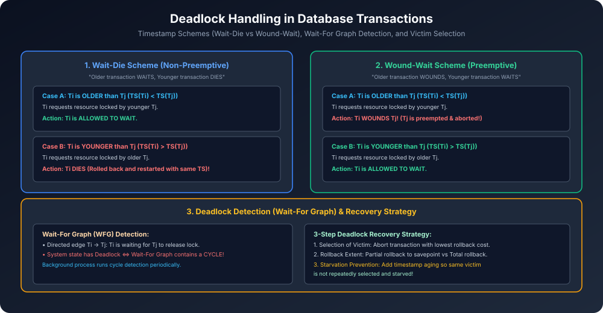

# Module 08: Deadlock Handling in Database Transactions

> **Course:** Database Management Systems (AKTU Code: **BCS501**)  
> **Topic Focus:** Deadlock Definition, Timestamp-Based Prevention (Wait-Die vs Wound-Wait), Wait-For Graph (WFG) Detection, Recovery from Deadlocks (Victim Selection, Rollback, Starvation Prevention).

---

## 1. What is a Deadlock in Database Systems?

Jab do ya do se zyada transactions ek doosre ke dwara hold kiye gaye locks ke release hone ka circular wait karti hain, toh system ek frozen state me chala jaata hai jahan koi bhi transaction aage proceed nahi kar sakti. Is condition ko **Deadlock** kehte hain.
- Example:
  - $T_1$ holds exclusive lock on $A$, requests lock on $B$.
  - $T_2$ holds exclusive lock on $B$, requests lock on $A$.
  - Neither can proceed $\implies$ Deadlock!

---

## 2. Deadlock Prevention: Timestamp Schemes

Deadlock hone se pehle hi prevent karne ke liye DBMS transactions ko monotonic timestamps assign karta hai ($TS(T_i)$). Chhota timestamp matlab **Older (Senior)** transaction!

Suppose transaction $T_i$ requests a lock held by transaction $T_j$:

### 2.1 Wait-Die Scheme (Non-Preemptive)
- **Rule:**
  - Agar $T_i$ **Older** hai ($TS(T_i) < TS(T_j)$) $\implies T_i$ is allowed to **WAIT**.
  - Agar $T_i$ **Younger** hai ($TS(T_i) > TS(T_j)$) $\implies T_i$ **DIES** (rolled back and restarted with same timestamp).
- **Mnemonic:** *"Older waits, younger dies"*.

### 2.2 Wound-Wait Scheme (Preemptive)
- **Rule:**
  - Agar $T_i$ **Older** hai ($TS(T_i) < TS(T_j)$) $\implies T_i$ **WOUNDS** $T_j$ ($T_j$ is aborted and forced to release lock).
  - Agar $T_i$ **Younger** hai ($TS(T_i) > TS(T_j)$) $\implies T_i$ is allowed to **WAIT**.
- **Mnemonic:** *"Older wounds, younger waits"*.

### 2.3 Wait-Die vs Wound-Wait Comparison (AKTU Exam Favorite)
| Parameter | Wait-Die Scheme | Wound-Wait Scheme |
| :--- | :--- | :--- |
| **Preemption** | Non-preemptive (Locks never taken away) | **Preemptive** (Older transaction preempts younger) |
| **Number of Rollbacks** | High (Younger transaction repeatedly aborts) | **Much Lower** (Younger waits quietly) |
| **Lock Holding** | Resources remain held longer | Quick release upon wound |
| **Restart Policy** | Restarts with original timestamp to prevent starvation | Restarts with original timestamp |

---

## 3. Deadlock Detection: Wait-For Graph (WFG)

Agar prevention use nahi kiya jaata, toh DBMS transactions ko freely lock lene deta hai aur periodic background thread chala kar deadlock detect karta hai:
- **Wait-For Graph $G = (V, E)$:**
  - Vertices $V$: All active transactions.
  - Directed edge $T_i 
ightarrow T_j$: $T_i$ is waiting for a lock held by $T_j$.
- **Theorem:** Deadlock exists in the system **if and only if the Wait-For Graph contains a Directed Cycle**!

---

## 4. Deadlock Recovery Strategy

Jab Wait-For Graph me cycle detect hoti hai, toh system ko deadlock break karne ke liye 3 steps lene padte hain:
1. **Selection of Victim:**
   - Kisi ek transaction ko abort karke locks release karwana.
   - Victim chunne ke criteria: Jisme sabse kam operations execute hue hon, jiska rollback cost minimum ho, jo kam resources hold kar rahi ho.
2. **Rollback Extent:**
   - **Total Rollback:** Transaction ko start se abort karna.
   - **Partial Rollback (Savepoints):** Transaction ko sirf us point tak undo karna jahan tak deadlock break ho jaye.
3. **Starvation Prevention:**
   - Agar ek hi transaction baar-baar victim ban kar abort hoti rahegi, toh wo kabhi finish nahi ho payegi (**Starvation**).
   - **Solution:** Har baar abort hone par transaction ka priority weight badha diya jaata hai (Aging) taaki wo dobara victim na chuni jaye.

---

## 5. Architectural Diagram

