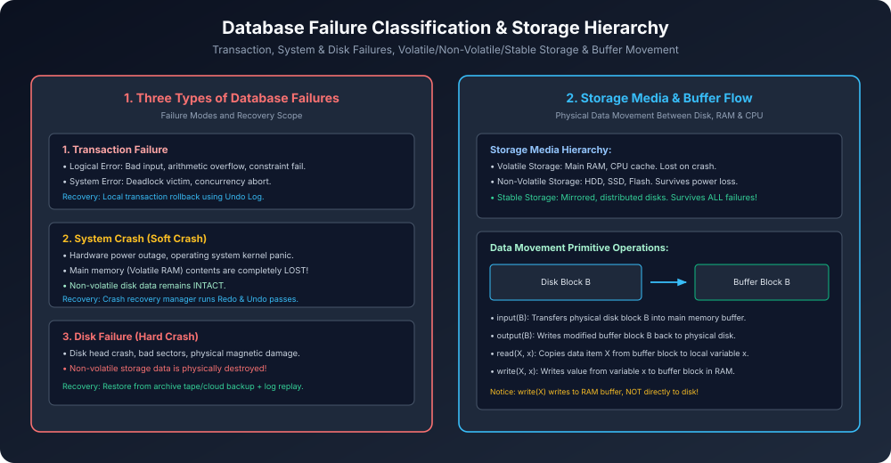

# Module 09: Database Failure Types and Storage Structures

> **Course:** Database Management Systems (AKTU Code: **BCS501**)  
> **Topic Focus:** Failure Classification (Transaction, System Crash, Disk Failure), Storage Media Hierarchy (Volatile, Non-Volatile, Stable Storage), Buffer Management and Primitive Data Movement Operations (`input`, `output`, `read`, `write`).

---

## 1. Classification of Database Failures

Database system me failures ko unke scope aur loss ke according 3 categories me divide kiya jaata hai:

### 1.1 Transaction Failure
- **Logical Error:** Transaction business logic ya application error ki wajah se aage nahi badh sakti (e.g., negative balance check, divide-by-zero, foreign key violation).
- **System Error:** Concurrency control manager deadlock break karne ke liye transaction ko victim select karke abort kar deta hai.
- **Recovery:** Local transaction rollback through undo log.

### 1.2 System Crash (Soft Failure)
- **Cause:** Power failure, OS kernel panic, hardware motherboard crash.
- **Consequence:** Main memory (RAM) ka poora volatile content destroy ho jaata hai. Disk par store data safe rehta hai.
- **Assumption (Fail-Stop Model):** Hardware crash hone par database hardware turant halt ho jaata hai bina disk data ko corrupt kiye.

### 1.3 Disk Failure (Hard Failure)
- **Cause:** Disk read/write head crash, magnetic degradation, bad disk blocks.
- **Consequence:** Non-volatile storage permanently damage ho jaata hai.
- **Recovery:** Periodic archival database backups (Dump) aur stable log copies se full restore.

---

## 2. Storage Media Hierarchy

1. **Volatile Storage:**
   - RAM, cache memory. Extremely fast ($O(1)$ ns access). Lost during power cuts.
2. **Non-Volatile Storage:**
   - Magnetic hard disks, solid-state drives (SSD), flash memory. Retains data across crashes.
3. **Stable Storage:**
   - Theoretical ideal storage jo **kisi bhi failure me kabhi corrupt nahi hota**.
   - Physically implemented using **RAID 1 / Mirroring** across independent disk controllers aur geographically remote backup sites.

---

## 3. Data Movement and Buffer Management Architecture

Database disk par block size me store hota hai (e.g., 4KB blocks). Transaction CPU registers me execute hoti hai. Inke beech data ka flow 4 fundamental primitive operations se hota hai:

```
[ Physical Disk ] 
       ▲  │
output │  │ input
       │  ▼
[ Main Memory Buffer ] 
       ▲  │
 write │  │ read
       │  ▼
[ Transaction Local Registers ]
```

- **`input(B)`:** Disk block $B$ ko read karke memory buffer block me laata hai.
- **`read(X, x)`:** Buffer block se item $X$ ko transaction ke local variable $x$ me copy karta hai.
- **`write(X, x)`:** Local variable $x$ ki value ko RAM ke buffer block me likhta hai. *(Caution: Yeh abhi disk par nahi gaya hai!)*
- **`output(B)`:** RAM ke dirty buffer block $B$ ko disk par permanently flush karta hai.

---

## 4. Architectural Diagram


