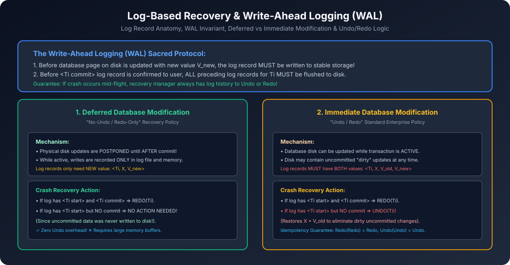

# Module 10: Log-Based Recovery & Write-Ahead Logging (WAL) Protocol

> **Course:** Database Management Systems (AKTU Code: **BCS501**)  
> **Topic Focus:** Log Record Architecture, Write-Ahead Logging (WAL) Protocol, Deferred Database Modification vs Immediate Database Modification, Undo and Redo Algorithms, Idempotency.

---

## 1. What is a Database Log?

Database **Log** stable storage par likha gaya ek append-only audit trail hota hai jisme transaction execution ke har operation ka chronological record rehta hai.
- Har log record ka structure:
  - $\langle T_i 	ext{ start} 
angle$: Transaction $T_i$ shuru hua.
  - $\langle T_i, X, V_{old}, V_{new} 
angle$: $T_i$ ne data item $X$ ko purani value $V_{old}$ (before-image) se badal kar nayi value $V_{new}$ (after-image) kar diya.
  - $\langle T_i 	ext{ commit} 
angle$: $T_i$ successfully commit hua.
  - $\langle T_i 	ext{ abort} 
angle$: $T_i$ abort hua aur rollback complete hua.

---

## 2. Write-Ahead Logging (WAL) Protocol

Crash recovery ki durability aur atomicity ensure karne ke liye WAL protocol follow karna compulsory hai:

> **WAL Rule 1:** Disk par data page ko new value se overwrite karne se pehle, us update ka log record non-volatile stable storage par flush ho chuka hona chahiye!  
> **WAL Rule 2:** User ko commit acknowledgment bhejne se pehle, us transaction ke saare log records stable storage par physically written hone chahiye!

---

## 3. Deferred vs Immediate Database Modification

| Parameter | Deferred Modification (NO UNDO) | Immediate Modification (UNDO & REDO) |
| :--- | :--- | :--- |
| **When are Disk Pages Updated?** | **Only AFTER commit** | **Immediately while active** |
| **Log Record Contents** | Only new value: $\langle T_i, X, V_{new} 
angle$ | Both old & new: $\langle T_i, X, V_{old}, V_{new} 
angle$ |
| **Crash Action for Active Uncommitted** | **No action!** (Disk was never touched) | **UNDO** (Restore $X = V_{old}$) |
| **Crash Action for Committed** | **REDO** ($X = V_{new}$) | **REDO** ($X = V_{new}$) |
| **Memory Buffer Pressure** | High (must hold all updates in RAM) | Low (can flush dirty pages anytime) |
| **Industry Adoption** | Rarely used in high-volume systems | **Standard in Oracle, MySQL, SQL Server** |

---

## 4. Undo and Redo Operation Primitives

- **$	ext{Undo}(T_i)$:** Log ko backward scan karke har update record $\langle T_i, X, V_{old}, V_{new} 
angle$ ke liye data item $X$ ko uski purani value $V_{old}$ set karta hai.
- **$	ext{Redo}(T_i)$:** Log ko forward scan karke har update record $\langle T_i, X, V_{old}, V_{new} 
angle$ ke liye data item $X$ ko uski nayi value $V_{new}$ set karta hai.
- **Idempotence Property:** Agar recovery process ke dauran dubara system crash ho jaye, toh Undo aur Redo ko kitni bhi baar repeat run kiya ja sakta hai bina koi galat outcome generate kiye!
  $$	ext{Redo}(	ext{Redo}(T_i)) = 	ext{Redo}(T_i)$$

---

## 5. Architectural Diagram

