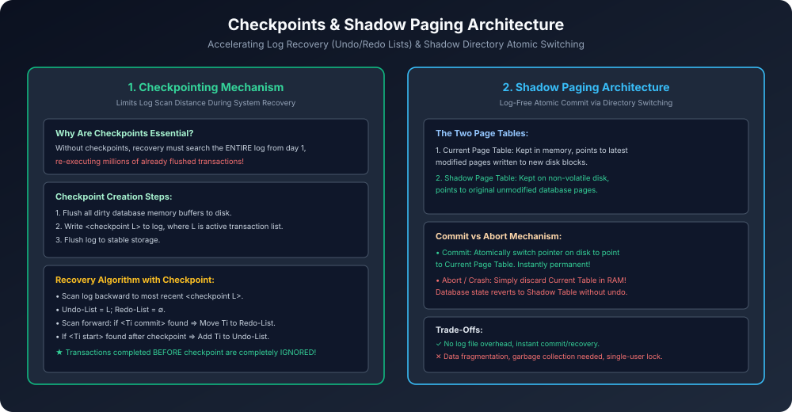

# Module 11: Checkpoints and Shadow Paging

> **Course:** Database Management Systems (AKTU Code: **BCS501**)  
> **Topic Focus:** Checkpoint Mechanics, Resolving Active Transactions (Undo-List & Redo-List), Shadow Paging Technique, Current vs Shadow Directory, Trade-offs.

---

## 1. Why Do We Need Checkpoints?

Normal Log-based recovery me agar system crash hota hai, toh recovery manager ko log file ke shuru se aakhiri tak poora scan karna padta hai.
- Ek enterprise server jo 6 mahine se chal raha hai, usme millions of transactions honge.
- Un sabhi ko scan karke re-execute karna ghanto (hours) ka time lega!
- **Checkpoint** database me ek periodic milestone hota hai jahan tak ke saare changes disk par physically sync ho chuke hote hain.
- **Benefit:** Recovery manager ko checkpoint se pehle commit ho chuki transactions ko dubara chhoone ki koi zaroorat nahi hoti!

---

## 2. Checkpoint Creation Lifecycle

```
1. Temporary Freeze: New transaction start operations are queued.
2. Buffer Flush: RAM ke sabhi modified (dirty) pages ko disk par write kiya jaata hai.
3. Checkpoint Record: Log me record likha jaata hai:
      <checkpoint {T_active_1, T_active_2, ...}>
4. Log Flush: Log file ko stable storage par flush kiya jaata hai.
5. Resume: Normal execution continues.
```

---

## 3. Recovery Algorithm with Checkpoints (AKTU Solved Pattern)

Jab crash hota hai, recovery manager log ko end se scan karte hue peeche aata hai:
1. Sabse recent checkpoint record dhundo: $\langle 	ext{checkpoint } L 
angle$.
2. Do empty sets banao:
   - **Undo-List** $= L$ (Sabhi transactions jo checkpoint ke waqt chal rahi thi).
   - **Redo-List** $= \emptyset$.
3. Checkpoint se aage (forward) scan karo:
   - Agar kisi transaction ka $\langle T_i 	ext{ commit} 
angle$ record milta hai $\implies T_i$ ko Undo-List se nikaal kar **Redo-List** me daal do!
   - Agar checkpoint ke baad kisi transaction ka $\langle T_j 	ext{ start} 
angle$ milta hai $\implies T_j$ ko **Undo-List** me add kar do!
4. **Action:**
   - Redo-List ki sabhi transactions ko **REDO** karo (forward replay).
   - Undo-List ki sabhi transactions ko **UNDO** karo (backward rollback).

---

## 4. Shadow Paging Technique

Shadow paging ek **Log-Free Recovery** architecture hai jo RDBMS me transaction recovery simplify karta hai:

```
[ In-Memory Current Page Table ] ──────► Points to Newly Written Disk Blocks
[ On-Disk Shadow Page Table ]   ──────► Points to Original Clean Disk Blocks
```

1. **Working:**
   - Transaction start hote waqt Shadow Page Table ko copy karke Current Page Table banaya jaata hai.
   - Har write operation ek naye disk block par hota hai, aur Current Page Table us naye block ko point karta hai.
   - Shadow Page Table disk par unmodified rehti hai.
2. **Commit:**
   - Current Page Table ka pointer disk ke root pointer par atomically swap kar diya jaata hai.
   - Current table ab nayi Shadow Table ban jaati hai!
3. **Crash / Abort:**
   - RAM ki Current Page Table ko discard kar do!
   - Disk par Shadow Page Table pehle se intact hai, isliye zero undo operations me system recover ho jaata hai!

---

## 5. Architectural Diagram


