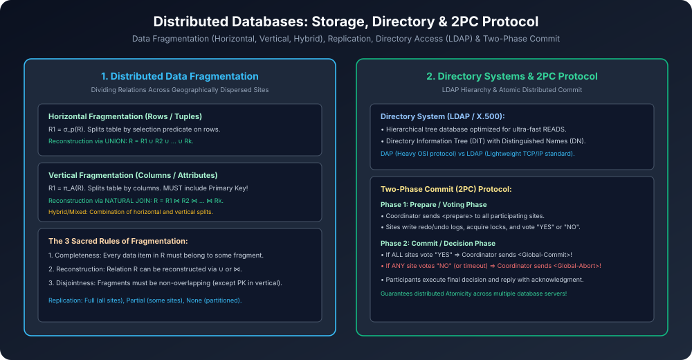

# Module 12: Distributed Databases: Storage, Directory Systems & 2PC

> **Course:** Database Management Systems (AKTU Code: **BCS501**)  
> **Topic Focus:** Distributed DBMS Architecture, Data Fragmentation (Horizontal, Vertical, Hybrid), Rules of Fragmentation, Data Replication, Directory Systems (LDAP, X.500, DIT), Two-Phase Commit (2PC) Protocol.

---

## 1. What is a Distributed Database (DDBMS)?

Distributed Database multiple interconnected physical sites (nodes) ka collection hota hai jo network ke through communicate karte hain aur user ko single coherent database ki tarah appear hote hain (**Distribution Transparency**).
- **Homogeneous DDBMS:** Sabhi sites par same database software (e.g., all Oracle) aur same data models hote hain.
- **Heterogeneous DDBMS:** Alag-alag sites par alag DBMS hote hain (e.g., Site 1 on PostgreSQL, Site 2 on MySQL).

---

## 2. Distributed Data Storage Techniques

### 2.1 Data Fragmentation
Ek relation $R$ ko multiple logical sub-parts me divide karna:
1. **Horizontal Fragmentation:**
   - Relation ko rows (tuples) me divide karta hai using Selection operator $\sigma_p(R)$.
   - Reconstruction: **Union ($\cup$)** operation.
   - Example: $R_{	ext{Delhi}} = \sigma_{	ext{City='Delhi'}}(	ext{EMPLOYEE})$ and $R_{	ext{Mumbai}} = \sigma_{	ext{City='Mumbai'}}(	ext{EMPLOYEE})$.
2. **Vertical Fragmentation:**
   - Relation ko columns (attributes) me divide karta hai using Projection operator $\pi_A(R)$.
   - **Crucial Rule:** Primary Key attribute har fragment me present hona **mandatory** hai!
   - Reconstruction: **Natural Join ($owtie$)** operation.
3. **Hybrid / Mixed Fragmentation:**
   - Horizontal aur Vertical fragmentation ka combination.

### 2.2 The Three Sacred Rules of Fragmentation
1. **Completeness:** Original table ka har single data item kisi na kisi fragment me zaroor appear hona chahiye.
2. **Reconstruction:** Fragments ko combine karke original relation bina data loss ke wapas banayi ja sake ($\cup$ for horizontal, $owtie$ for vertical).
3. **Disjointness:** Fragments non-overlapping hone chahiye (vertical me sirf Primary Key duplicate hoti hai).

### 2.3 Data Replication
- **Full Replication:** Relation ki identical copy har single network site par store ki jaati hai (Maximum read availability, expensive updates).
- **Partial Replication:** Copies sirf un sites par rakhi jaati hain jahan query frequency high ho.
- **No Replication:** Har fragment sirf ek single site par rehta hai.

---

## 3. Directory Systems (LDAP & X.500)

- **Directory Service:** Ek specialized hierarchical database jo **high-frequency READS** aur low-frequency writes ke liye optimize hota hai (e.g., user authentication, phone books, DNS).
- **Directory Information Tree (DIT):** Tree structure jisme nodes **Distinguished Names (DN)** se uniquely identify hoti hain (e.g., `cn=Shivam,ou=Engineering,dc=example,dc=com`).
- **DAP vs LDAP:**
  - **DAP (Directory Access Protocol):** Heavyweight OSI protocol stack.
  - **LDAP (Lightweight DAP):** Modern lightweight standard jo directly TCP/IP par run hota hai.

---

## 4. Two-Phase Commit (2PC) Protocol

Distributed system me sabhi sites par atomicity maintain karne ke liye **Two-Phase Commit Protocol** use hota hai:

```
Coordinator                          Participants (Sites 1..N)
    │                                           │
    ├─────────── Prepare? ────────────────────►│  (Phase 1: Voting)
    │◄────────── Vote YES / NO ────────────────┤  (Locks held & Logged)
    │                                           │
    ├────── Global-Commit / Global-Abort ──────►│  (Phase 2: Decision)
    │◄────────── Acknowledgment ───────────────┤
```

1. **Phase 1: Prepare / Voting Phase:**
   - Coordinator sabhi participants ko `Prepare` message bhejta hai.
   - Participants apne local changes log me write karte hain aur `VOTE_COMMIT` ya `VOTE_ABORT` reply karte hain.
2. **Phase 2: Commit / Decision Phase:**
   - Agar **SABHI** participants ne `YES` vote kiya $\implies$ Coordinator `GLOBAL_COMMIT` bhejta hai.
   - Agar kisi **EK** participant ne bhi `NO` vote kiya ya timeout hua $\implies$ Coordinator `GLOBAL_ABORT` bhejta hai!
   - Sabhi sites decision apply karke acknowledgment return karti hain.

---

## 5. Architectural Diagram


