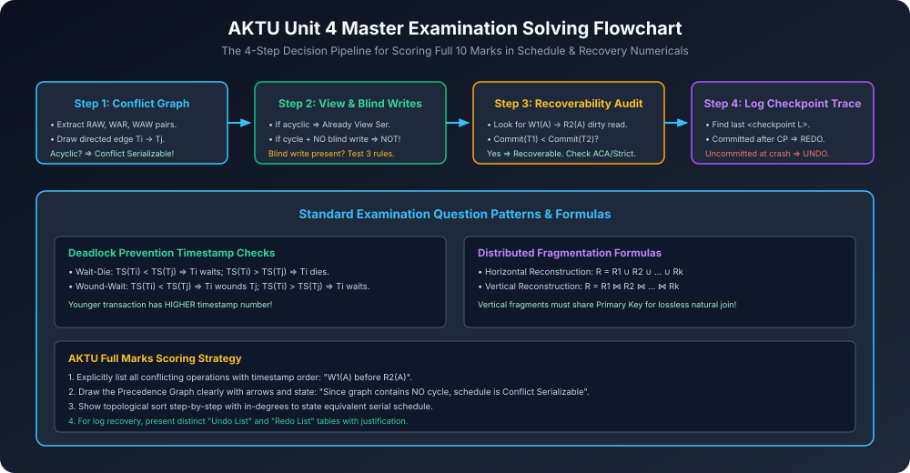

# Module 13: AKTU PYQs & Solved Schedules (Past 5 Years)

> **Course:** Database Management Systems (AKTU Code: **BCS501**)  
> **Topic Focus:** Previous 5 Years University Exam Questions (2019-2024), 10-Mark Schedule Serializability Solutions, Log Recovery Trace Problems, Deadlock Prevention Scenarios.

---

## 1. AKTU PYQ 1 (10 Marks — 2022-23 End-Sem)

**Question:**  
Consider the following schedule $S$ involving transactions $T_1$, $T_2$, and $T_3$:
$$S: R_1(X); \quad R_2(Z); \quad R_1(Z); \quad R_3(X); \quad R_3(Y); \quad W_1(X); \quad W_3(Y); \quad R_2(Y); \quad W_2(Z); \quad W_2(Y); \quad C_1; \quad C_2; \quad C_3$$
1. Test whether schedule $S$ is Conflict Serializable. If yes, find the equivalent serial schedule.
2. Test whether schedule $S$ is Recoverable.
3. Test whether schedule $S$ is Cascadeless.

### Solution:

#### 1. Conflict Serializability Test
- Conflicting pairs in $S$:
  - On $X$: $R_3(X)$ is followed by $W_1(X) \implies \mathbf{T_3 
ightarrow T_1}$.
  - On $Y$: $W_3(Y)$ is followed by $R_2(Y) \implies \mathbf{T_3 
ightarrow T_2}$.
  - On $Y$: $W_3(Y)$ is followed by $W_2(Y) \implies \mathbf{T_3 
ightarrow T_2}$ (Already present).
  - On $Z$: $R_1(Z)$ is followed by $W_2(Z) \implies \mathbf{T_1 
ightarrow T_2}$.
- Precedence Graph Edges:
  $$T_3 
ightarrow T_1, \quad T_3 
ightarrow T_2, \quad T_1 
ightarrow T_2$$
- **Cycle Check:** No cycles exist in the graph (strictly Acyclic Directed Graph).
- **Topological Sorting:**
  - In-degree of $T_3 = 0 \implies \mathbf{T_3}$ is first.
  - In-degree of $T_1 = 0$ (after removing $T_3$) $\implies \mathbf{T_1}$ is second.
  - Remaining: $\mathbf{T_2}$ is third.
- **Equivalent Serial Schedule:** $\mathbf{T_3 
ightarrow T_1 
ightarrow T_2}$.
- **Verdict 1:** Schedule $S$ is **Conflict Serializable**!

#### 2. Recoverability Test
- Look for Dirty Reads ($W_i 
ightarrow R_j$):
  - $W_3(Y)$ is followed by $R_2(Y)$ while $T_3$ is uncommitted.
  - So $T_2$ reads uncommitted data from $T_3$.
- Check commit orders:
  - $T_2$ commits at step $C_2$.
  - $T_3$ commits at step $C_3$.
  - Notice: $C_2 < C_3$! That means **$T_2$ COMMITS BEFORE $T_3$ COMMITS**!
- If $T_3$ were to abort, $T_2$ cannot be rolled back!
- **Verdict 2:** Schedule $S$ is **IRRECOVERABLE**!

#### 3. Cascadeless Test
- In a cascadeless schedule, no transaction can read uncommitted data.
- Since $T_2$ reads $Y$ from $T_3$ before $T_3$ commits, dirty read exists.
- **Verdict 3:** Schedule $S$ is **NOT Cascadeless**!

---

## 2. AKTU PYQ 2 (10 Marks — 2021-22 End-Sem)

**Question:**  
Explain Log-Based Recovery with Immediate Database Modification. Suppose a system crashes with the following log contents:
```
<T1 start>
<T1, A, 50, 100>
<T2 start>
<T2, B, 200, 250>
<checkpoint {T1, T2}>
<T3 start>
<T1 commit>
<T2, C, 300, 350>
<T3, D, 400, 450>
<T2 commit>
<CRASH>
```
What actions will the recovery manager take during crash recovery? State the Undo-List and Redo-List.

### Solution:
1. **Locate Checkpoint:**
   - Checkpoint is $\langle 	ext{checkpoint } \{T_1, T_2\} 
angle$.
   - Active transactions at checkpoint: $\{T_1, T_2\}$.
2. **Initialize Lists:**
   - $	ext{Undo-List} = \{T_1, T_2\}$
   - $	ext{Redo-List} = \emptyset$
3. **Forward Scan from Checkpoint to Crash:**
   - $\langle T_3 	ext{ start} 
angle \implies$ Add $T_3$ to Undo-List: $	ext{Undo-List} = \{T_1, T_2, T_3\}$.
   - $\langle T_1 	ext{ commit} 
angle \implies$ Move $T_1$ to Redo-List: $	ext{Redo-List} = \{T_1\}$, $	ext{Undo-List} = \{T_2, T_3\}$.
   - $\langle T_2 	ext{ commit} 
angle \implies$ Move $T_2$ to Redo-List: $	ext{Redo-List} = \{T_1, T_2\}$, $	ext{Undo-List} = \{T_3\}$.
4. **Final Lists at Crash Point:**
   - $\mathbf{	ext{Redo-List} = \{T_1, T_2\}}$ (Both started and committed).
   - $\mathbf{	ext{Undo-List} = \{T_3\}}$ (Started, updated $D$, but never committed before crash).
5. **Recovery Actions Performed:**
   - **Undo Phase:** Rollback $T_3$: Restore data item $D = 400$ (its old value), write $\langle T_3 	ext{ abort} 
angle$.
   - **Redo Phase:** Replay $T_1$ and $T_2$: Set $A = 100$, $B = 250$, $C = 350$.

---

## 3. Architectural Diagram


