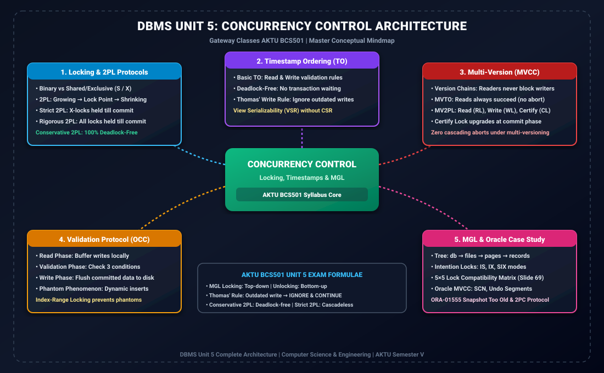

# Module 00: Unit 5 Ultra Quick Revision Short Notes (Exact 3 Pages)

> **Folder:** `DBMS/Unit_5/00_Quick_Revision_Short_Notes/`  
> **Target Exam:** AKTU BCS501 Semester V | Gateway Classes One-Shot Notes Alignment  
> **Compiled Deliverable:** [Unit_5_Quick_Revision_3_Page_Notes.pdf](../Unit_5_Quick_Revision_3_Page_Notes.pdf) (Strictly 3 Pages, 0 whitespace waste)

---

## 1. Quick Revision Mindmap Architecture

---

## 2. 3-Page Ultra High-Yield Syllabus Distribution

### Page 1: Locking Techniques & Two-Phase Locking (2PL) Variants
- **Concurrency Control Motivation:** Eliminating Dirty Reads (WR), Lost Updates (WW), Unrepeatable Reads (RW), and Phantom Reads.
- **Locking Foundations:**
  - *Binary Locks (0/1):* Too restrictive; only 1 transaction allowed.
  - *Shared Locks ($S$):* Multiple concurrent readers permitted (`no_of_reads(X)`).
  - *Exclusive Locks ($X$):* Mutual exclusion for writers.
  - *Lock Compatibility Matrix:* $S-S$ Compatible; $S-X, X-S, X-X$ Conflict.
- **Two-Phase Locking (2PL) Theorem:**
  - *Growing Phase:* Acquire locks; no unlock allowed. Lock upgrading ($S 	o X$) allowed.
  - *Lock Point:* Exact time when last lock is acquired. Determines equivalent serial order.
  - *Shrinking Phase:* Release locks; no new lock allowed. Lock downgrading ($X 	o S$) allowed.
- **2PL Variants Comparison Matrix:**
  - *Basic 2PL:* Serializability guaranteed; deadlocks and cascading rollbacks possible.
  - *Conservative 2PL:* Pre-locks all items at start. **100% Deadlock-Free**!
  - *Strict 2PL:* Exclusive locks held until Commit/Abort. **Cascadeless & Strict recovery**.
  - *Rigorous 2PL:* All locks (Shared & Exclusive) held until Commit/Abort. Serial order = Commit order.

### Page 2: Timestamps, Thomas' Rule, MVCC, OCC & Phantoms
- **Timestamp Ordering (TO) Protocol:**
  - Monotonically increasing $TS(T)$ at start. Item timestamps: $read\_TS(X)$ and $write\_TS(X)$.
  - *read(X):* $TS(T) < write\_TS(X) \implies$ Abort $T$. Else grant and update $read\_TS$.
  - *write(X):* $TS(T) < read\_TS(X)$ or $TS(T) < write\_TS(X) \implies$ Abort $T$.
  - **100% Deadlock-Free** (No waiting queues).
- **Thomas' Write Rule (View Serializability):**
  - If $TS(T) < write\_TS(X) \implies$ **IGNORE (Discard) write and CONTINUE processing**!
  - Generates schedules $\in VSR - CSR$ using blind writes.
- **Multi-Version Concurrency Control (MVCC & MVTO):**
  - Appends new versions $X_k$ instead of overwriting. **Readers never block writers; writers never block readers**.
  - *MVTO:* Readers always succeed (never abort).
  - *MV2PL:* 3 Lock Modes: Read Lock ($RL$), Write Lock ($WL$), Certify Lock ($CL$). $CL$ upgrades at commit phase.
- **Validation-Based Protocol (OCC):**
  - Read Phase (local buffers) $	o$ Validation Phase (Validation conditions) $	o$ Write Phase (flush to disk).
- **Phantom Phenomena:** New rows inserted matching range queries. Solved by **Index-Range Locking**.

### Page 3: Multiple Granularity Locking, Recovery, 2PC & Oracle Case Study
- **Granularity of Data Items:** Fine (records - high concurrency, high overhead) vs Coarse (files - low concurrency, low overhead).
- **Hierarchy Tree:** $db 	o 	ext{files} (f) 	o 	ext{pages} (p) 	o 	ext{records} (r)$.
- **Intention Locks:** $IS$ (Intention-Shared), $IX$ (Intention-Exclusive), $SIX$ (Shared-Intention-Exclusive).
- **Master 5x5 Lock Compatibility Matrix (Slide 69):**
  - $IS$ compatible with everything except $X$.
  - $X$ incompatible with everything.
  - $IX$ compatible only with $IS$ and $IX$.
  - $SIX$ compatible only with $IS$.
- **The 6 Rules of MGL Protocol (Slide 70):**
  - Lock root first (Top-Down).
  - $S/IS$ requires $IS/IX$ on parent.
  - $X/IX/SIX$ requires $IX/SIX$ on parent.
  - 2PL enforcement (no locks after first unlock).
  - Unlock bottom-up (children before parent).
- **Two-Phase Commit (2PC):** Phase 1 (Prepare & Vote) $	o$ Phase 2 (Global Commit / Abort).
- **Oracle Case Study:** Multi-Version Read Consistency, System Change Number (SCN), Undo Segments, `ORA-01555` Snapshot Too Old error, Zero Lock Escalation.

---

## 3. Direct Access
- **Standalone 3-Page Cheat Sheet PDF:** [Unit_5_Quick_Revision_3_Page_Notes.pdf](../Unit_5_Quick_Revision_3_Page_Notes.pdf)
- **Consolidated Master Notes PDF:** [Unit_5_Master_Notes.pdf](../Unit_5_Master_Notes.pdf)
