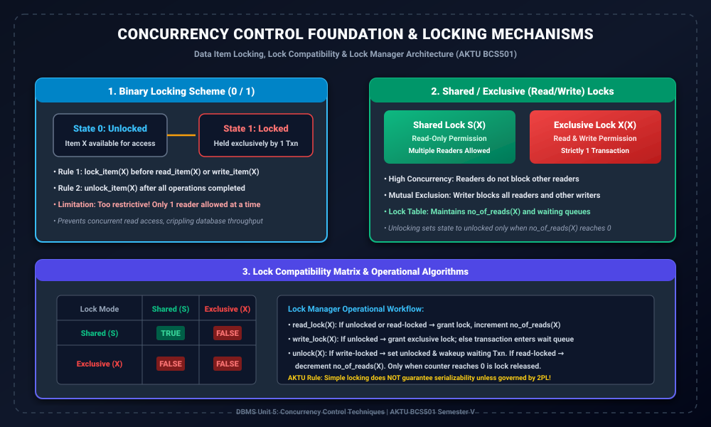

# Module 01: Concurrency Control Foundations and Locking Basics

> **Folder:** `DBMS/Unit_5/01_Concurrency_Control_Foundations_and_Locking_Basics/`  
> **Target Exam:** AKTU BCS501 Semester V | Gateway Classes One-Shot Unit 5  
> **Key Concepts:** Concurrency Control Motivation, Data Item Locks, Binary Locks, Shared/Exclusive Locks, Lock Table Data Structures, Compatibility Matrix

---

## 1. Concurrency Control Foundation Architecture



---

## 2. Concurrency Control ki Zarurat Kyun Hoti Hai?

Jab multiple transactions ek shared database par simultaneously execute hote hain, toh agar unke interleaved read aur write operations ko properly coordinate na kiya jaye, toh database me catastrophic anomalies create ho jati hain:
1. **Dirty Read (Temporary Update Anomaly):** Reading uncommitted data that later rolls back.
2. **Lost Update Anomaly:** Two transactions overwrite the same data without awareness of intermediate updates.
3. **Unrepeatable Read (Inconsistent Analysis):** A transaction reads the same value twice and observes differing values due to concurrent modifications.
4. **Phantom Read:** Range query count alterations caused by concurrent inserts.

**Concurrency Control Manager** DBMS ka wo dedicated subsystem hai jo concurrent transactions ke execution order ko serialize karta hai, ensuring **Isolation** and **Consistency** (ACID properties).

---

## 3. Lock Concept & Data Item Locking

> **Formal Definition:**  
> A **Lock** is a variable associated with a data item that describes the current status of that item with respect to possible operations (read, write) that can be applied to it by concurrent transactions.

Database me har named data item $X$ ke sath ek lock associate hota hai. Lock manager memory me ek **Lock Table** maintain karta hai jo track karta hai:
- Item $X$ par currently kaunsa lock applied hai.
- Kaunse transactions ne lock hold kar rakha hai.
- Kaunse transactions item $X$ ke unlock hone ka wait kar rahe hain (Wait Queue).

---

## 4. Binary Locking Scheme (0 / 1)

Binary lock scheme me lock variable ki sirf do possible states hoti hain:
- **0 (Unlocked):** Data item $X$ freely available hai.
- **1 (Locked):** Data item $X$ kisi transaction dwara exclusively hold kiya gaya hai.

### 4.1 Binary Locking ke Rules
1. Kisi bhi transaction $T$ ko $X$ par `read_item(X)` ya `write_item(X)` perform karne se pehle `lock_item(X)` issue karna padta hai.
2. Sabhi operations complete hone ke baad $T$ ko `unlock_item(X)` issue karna hota hai.
3. Transaction tabhi `lock_item(X)` issue kar sakta hai jab wo pehle se lock na hold kar raha ho.
4. Transaction tabhi `unlock_item(X)` issue kar sakta hai jab wo currently item $X$ ka lock hold kar raha ho.

### 4.2 Limitation of Binary Locks
Binary locking bohot zyada restrictive hoti hai:
- Agar 10 transactions sirf account balance check (read-only) karna chahte hain, tab bhi Binary lock unhe ek sath allow nahi karta.
- Har reader ko baaki readers ke khatam hone ka wait karna padta hai, jisse system ka **throughput severely drop** ho jata hai.

---

## 5. Shared / Exclusive (Read / Write) Locks

Binary locking ki limitation ko overcome karne ke liye modern DBMS **Two-Mode Locks** implement karte hain:

### 5.1 Shared Lock: $S(X)$ (Read Lock)
- Jab transaction sirf data read karna chahta hai bina modify kiye.
- **Multiple transactions** ek hi item $X$ par concurrent Shared Locks hold kar sakte hain ($S-S$ compatible).
- Lock Manager internal counter maintain karta hai: `no_of_reads(X)`.

### 5.2 Exclusive Lock: $X(X)$ (Write Lock)
- Jab transaction data item $X$ ko modify (write/update/delete) karna chahta hai.
- Ek time par sirf aur sirf **1 Transaction** Exclusive lock hold kar sakta hai.
- Agar kisi item par Exclusive lock held hai, toh koi doosra transaction na toh Shared lock le sakta hai aur na hi Exclusive lock ($X-S$ and $X-X$ incompatible).

---

## 6. Lock Compatibility Matrix

| Requested \ Held | Shared ($S$) | Exclusive ($X$) |
| :---: | :---: | :---: |
| **Shared ($S$)** | **TRUE (Granted)** | **FALSE (Wait)** |
| **Exclusive ($X$)** | **FALSE (Wait)** | **FALSE (Wait)** |

- **Compatibility Condition:** Agar Transaction $T_1$ ne item $X$ par mode $A$ ka lock hold kiya hua hai, aur $T_2$ mode $B$ ka lock request karta hai, toh lock tabhi grant hoga jab matrix cell $(A, B)$ `TRUE` ho.
- Agar `FALSE` ho, toh $T_2$ ko wait queue me daal diya jata hai jab tak $T_1$ lock release na kar de.

---

## 7. Lock Operations Pseudocode (Slide Alignment)

### 7.1 Read Lock Algorithm: `read_lock(X)`
```pascal
B: if LOCK(X) = "unlocked" then begin
       LOCK(X) <- "read-locked";
       no_of_reads(X) <- 1;
   end
   else if LOCK(X) = "read-locked" then begin
       no_of_reads(X) <- no_of_reads(X) + 1;
   end
   else begin
       wait (until LOCK(X) = "unlocked" and lock manager wakes up transaction);
       go to B;
   end;
```

### 7.2 Write Lock Algorithm: `write_lock(X)`
```pascal
B: if LOCK(X) = "unlocked" then begin
       LOCK(X) <- "write-locked";
   end
   else begin
       wait (until LOCK(X) = "unlocked" and lock manager wakes up transaction);
       go to B;
   end;
```

### 7.3 Unlock Algorithm: `unlock(X)`
```pascal
if LOCK(X) = "write-locked" then begin
    LOCK(X) <- "unlocked";
    wakeup one of the waiting transactions, if any;
end
else if LOCK(X) = "read-locked" then begin
    no_of_reads(X) <- no_of_reads(X) - 1;
    if no_of_reads(X) = 0 then begin
        LOCK(X) <- "unlocked";
        wakeup one of the waiting transactions, if any;
    end;
end;
```

---

## 8. AKTU Exam Warning: Why Locking Alone is NOT Sufficient!

> [!WARNING]
> Sirf `read_lock`, `write_lock` aur `unlock` operations use karne se **Serializability Guarantee NAHI hoti**!  
> Agar transaction data access karne ke turant baad unlock kar deta hai aur baad me kisi doosre data item ko lock karta hai, toh interleaved execution serializability violate kar sakti hai.  
> Isiliye locks ke acquisition aur release ko govern karne ke liye **Two-Phase Locking (2PL)** protocol compulsory hota hai (Module 02).
