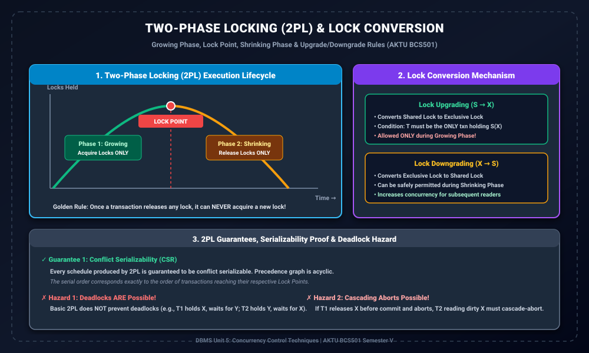

# Module 02: Two-Phase Locking (2PL) Protocol and Lock Conversion

> **Folder:** `DBMS/Unit_5/02_Two_Phase_Locking_Protocol_and_Lock_Conversion/`  
> **Target Exam:** AKTU BCS501 Semester V | Gateway Classes One-Shot Unit 5  
> **Key Concepts:** 2PL Definition, Growing Phase, Shrinking Phase, Lock Point, Lock Conversion (Upgrade/Downgrade), Serializability Proof, Non-2PL Schedule Comparison

---

## 1. Two-Phase Locking Architecture & Curves

---

## 2. Two-Phase Locking (2PL) Protocol Kya Hai?

> **Fundamental Principle of 2PL:**  
> A transaction is said to follow the **Two-Phase Locking (2PL)** protocol if all locking operations (read_lock, write_lock) precede the first unlock operation.

Iska seedha matlab hai ki transaction ki execution do distinct phases me divide hoti hai:

### Phase 1: Growing Phase (Expansion Phase)
- Transaction naye locks **acquire** kar sakta hai.
- Lekin ek baar growing phase shuru ho gaya, transaction koi bhi lock **release nahi kar sakta**.
- Lock Upgrades ($S 	o X$) isi phase me allowed hote hain.

### 🌟 Lock Point (Peak Phase)
- The exact point in time when a transaction acquires its **last and final lock**.
- Lock point par transaction ke paas un sabhi data items ke locks hote hain jinhe execute karne ki zarurat hai.
- **Topological serializability order:** Equivalent serial schedule ka order transaction ke **Lock Points** ke chronological order ke barabar hota hai!

### Phase 2: Shrinking Phase (Contraction Phase)
- Transaction held locks ko **release** kar sakta hai.
- Lekin jaise hi pehla lock release hua, transaction **koi naya lock acquire NAHI kar sakta**!
- Lock Downgrades ($X 	o S$) shrinking phase me safely permit kiye ja sakte hain.

---

## 3. Lock Conversion (Upgrading and Downgrading)

Standard 2PL me concurrency ko maximize karne ke liye locks ko convert karne ki permission di ja sakti hai:

### 3.1 Lock Upgrading ($S(X) 	o X(X)$)
- Agar transaction $T$ ke paas item $X$ par Shared (Read) lock hai aur use aage chalkar $X$ par write karna hai, toh wo lock ko upgrade karne ki request bhej sakta hai.
- **Condition:** Lock tabhi upgrade hoga jab $T$ item $X$ par Shared lock hold karne wala **akela transaction** ho. Agar koi doosra transaction bhi $S(X)$ hold kar raha hai, toh $T$ ko wait karna padega jab tak wo release na karde.
- **Constraint:** Lock upgrading **sirf Growing Phase** me allowed hai.

### 3.2 Lock Downgrading ($X(X) 	o S(X)$)
- Agar transaction $T$ ne item $X$ par write operation complete kar liya hai aur ab sirf read karna chahta hai ya doosron ko read allow karna chahta hai, toh wo Exclusive lock ko Shared lock me downgrade kar sakta hai.
- **Advantage:** Isse doosre waiting reader transactions turant $X$ ko access kar pate hain, increasing throughput.
- **Constraint:** Lock downgrading **Shrinking Phase** me allow kiya ja sakta hai kyunki ye locks ko relax karta hai, acquire nahi karta.

---

## 4. AKTU Solved Example: 2PL vs Non-2PL Schedule Analysis

Dekhte hain ki 2PL serializability kaise guarantee karta hai aur Non-2PL schedule kaise fail hota hai (Gateway Classes Slide 14-16 alignment):

### Schedule A (Violates 2PL):
Consider transactions $T_1$ and $T_2$ operating on $X=20, Y=30$:

| Step | Transaction $T_1$ | Transaction $T_2$ | State & Observations |
| :---: | :--- | :--- | :--- |
| 1 | `read_lock(Y)` | | $T_1$ locks $Y$ |
| 2 | `read_item(Y)` | | $T_1$ reads $Y=30$ |
| 3 | `unlock(Y)` | | **$T_1$ unlocks $Y$ (Growing phase ended!)** |
| 4 | | `read_lock(X)` | $T_2$ locks $X$ |
| 5 | | `read_item(X)` | $T_2$ reads $X=20$ |
| 6 | | `unlock(X)` | **$T_2$ unlocks $X$** |
| 7 | | `write_lock(Y)` | $T_2$ locks $Y$ (**VIOLATION: Lock after unlock!**) |
| 8 | | `read_item(Y)` | $T_2$ reads $Y=30$ |
| 9 | | `Y := X + Y` (50) | $T_2$ updates $Y=50$ |
| 10 | | `write_item(Y)` | Writes $Y=50$ |
| 11 | | `unlock(Y)` | Releases $Y$ |
| 12 | `write_lock(X)` | | $T_1$ locks $X$ (**VIOLATION: Lock after unlock!**) |
| 13 | `read_item(X)` | | $T_1$ reads $X=20$ |
| 14 | `X := X + Y` (70) | | Uses outdated $Y$ |
| 15 | `write_item(X)` | | Writes $X=70$ |
| 16 | `unlock(X)` | | Done |

**Result:** $X=70, Y=50$.  
- Serial Schedule $T_1 	o T_2$: $X=50, Y=80$.  
- Serial Schedule $T_2 	o T_1$: $X=70, Y=50$.  
Yahan outcome kisi serial schedule se match ho gaya lekin interleaved values me inconsistency aati hai kyunki $T_1$ ne `unlock(Y)` ke baad `write_lock(X)` kiya, jo **2PL rule ko violate** karta hai!

---

## 5. 2PL ke Guarantees aur Trade-offs

1. **Serializability Guarantee:**  
   Har 2PL schedule **Conflict Serializable** hota hai ($G(S)$ is strictly Acyclic).
2. **Deadlock Hazard:**  
   Basic 2PL deadlocks ko prevent nahi karta!  
   *Example:* Agar $T_1$ holds $X$ and requests $Y$, jabki $T_2$ holds $Y$ and requests $X$, dono transactions infinite wait me fas jayenge.
3. **Cascading Abort Hazard:**  
   Basic 2PL me agar transaction uncommitted data par se lock shrinking phase me release kar de aur baad me abort ho jaye, toh uncommitted read karne wale transactions ko bhi abort hona padega.
