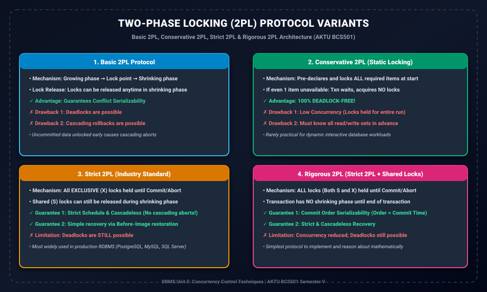

# Module 03: Two-Phase Locking Variants (Strict, Rigorous, Conservative)

> **Folder:** `DBMS/Unit_5/03_Two_Phase_Locking_Variants_Strict_Rigorous_Conservative/`  
> **Target Exam:** AKTU BCS501 Semester V | Gateway Classes One-Shot Unit 5  
> **Key Concepts:** Basic 2PL, Conservative 2PL (Static), Strict 2PL, Rigorous 2PL, Deadlock vs Cascading Abort Trade-offs, Comparative Matrix

---

## 1. 2PL Variants Architecture & Taxonomy

---

## 2. 2PL Variants ki Zarurat Kyun Padi?

Module 02 me humne dekha ki **Basic 2PL** Conflict Serializability toh guarantee karta hai, lekin usme do bohot badi kamiyan (limitations) hoti hain:
1. **Deadlocks:** Transactions circular wait me fas sakte hain.
2. **Cascading Aborts:** Uncommitted updates par se locks early release hone ki wajah se agar writer transaction abort ho jaye, toh uncommitted read karne wale baaki transactions ko bhi cascade abort hona padta hai.

In limitations ko solve karne ke liye 2PL ke 3 major variations design kiye gaye:

---

## 3. Detailed Variants Analysis

### 3.1 Basic 2PL
- **Rules:** Transaction 2 phases follow karta hai: Growing phase (locks acquire karo) aur Shrinking phase (locks release karo).
- **Serializability:** Guaranteed.
- **Deadlock:** Possible.
- **Cascading Rollback:** Possible.

### 3.2 Conservative 2PL (Static 2PL)
- **Rules:** Transaction execute hona shuru karne se pehle apne sabhi required data items ko **pre-declare** karta hai aur sabhi locks ek sath acquire karta hai. Agar ek bhi item unavailable ho, toh transaction kisi bhi item ko lock nahi karta aur wait karta hai.
- **Serializability:** Guaranteed.
- **Deadlock:** **100% DEADLOCK-FREE!** Kyunki circular wait ki condition break ho jati hai.
- **Drawback:** Concurrency bohot low hoti hai aur runtime par dynamic data access predict karna modern applications me almost impossible hota hai.

### 3.3 Strict 2PL (The Industry Standard)
- **Rules:** Transaction apne sabhi **Exclusive (Write) locks ko commit ya abort hone tak hold** karke rakhta hai. Shared (Read) locks shrinking phase me pehle release kiye ja sakte hain.
- **Serializability:** Guaranteed.
- **Cascading Rollback:** **ELIMINATED!** Cascadeless aur Strict schedule guarantee hota hai kyunki koi bhi transaction uncommitted written data ko read ya overwrite nahi kar sakta.
- **Recovery:** Easiest! Sirf uncommitted updates ka Before-Image restore karke instant rollback ho jata hai.
- **Deadlock:** Deadlock abhi bhi possible hai.

### 3.4 Rigorous 2PL
- **Rules:** Transaction apne **SABHI locks (Shared aur Exclusive dono) ko commit ya abort hone tak hold** karke rakhta hai. Iska shrinking phase tabhi hota hai jab transaction commit ya abort ho chuka ho.
- **Serializability:** Guaranteed.
- **Commit Order Serializability:** Equivalent serial order transactions ke commit order ke strictly identical hota hai ($T_i 	o T_j \iff Commit(T_i) < Commit(T_j)$).
- **Cascading Rollback:** Eliminated.
- **Drawback:** Readers Shared locks hold karke rakhte hain, reducing concurrency compared to Strict 2PL.

---

## 4. Master Comparison Matrix (AKTU 10-Mark Question)

| Feature / Variant | Basic 2PL | Conservative 2PL | Strict 2PL | Rigorous 2PL |
| :--- | :---: | :---: | :---: | :---: |
| **Lock Acquisition** | Growing phase | Pre-locking all items at start | Growing phase | Growing phase |
| **Exclusive Locks Released** | Shrinking phase | End / Shrinking | **At Commit / Abort** | **At Commit / Abort** |
| **Shared Locks Released** | Shrinking phase | End / Shrinking | Shrinking phase | **At Commit / Abort** |
| **Conflict Serializability** | Yes | Yes | Yes | Yes |
| **Deadlock-Free?** | No | **YES (Guaranteed)** | No | No |
| **Cascadeless (No Cascade Abort)?** | No | No | **YES (Guaranteed)** | **YES (Guaranteed)** |
| **Strict Recovery?** | No | No | **YES (Guaranteed)** | **YES (Guaranteed)** |
| **Concurrency Level** | Moderate | Low | **High (Optimal)** | Moderate-Low |
| **Real-world Adoption** | Rare | Embedded systems | **MySQL, PostgreSQL, Oracle** | Specialized Financial Engines |
