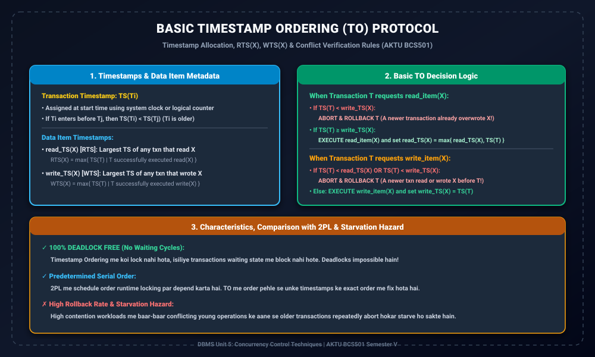

# Module 04: Timestamp Ordering Protocols

> **Folder:** `DBMS/Unit_5/04_Timestamp_Ordering_Protocols/`  
> **Target Exam:** AKTU BCS501 Semester V | Gateway Classes One-Shot Unit 5  
> **Key Concepts:** Timestamp Allocation, Read Timestamp $read\_TS(X)$, Write Timestamp $write\_TS(X)$, Basic TO Algorithm, Read/Write Conflict Rules, 2PL vs TO Comparison

---

## 1. Timestamp Ordering Architecture & Workflow

---

## 2. Timestamp Ordering (TO) Protocol Concept

Locking protocols (jaise 2PL) me transactions conflicts ko avoid karne ke liye resources ko **lock** karte hain aur wait karte hain. Iske contrast me:
> **Timestamp Ordering Philosophy:**  
> Har transaction ko shuru hote hi ek unique **Timestamp** assign kiya jata hai. TO algorithm ensures karta hai ki unke conflicting operations ka execution order strictly unke **timestamps ke chronological order** ke mutabiq hi ho.

### 2.1 Timestamps kaise generate hote hain?
1. **System Clock:** Transaction jab start hota hai, us waqt ki system clock reading.
2. **Logical Counter:** Ek monotonically increasing global integer counter jo har naye transaction par increment hota hai ($1, 2, 3, \dots$).

Agar $T_1$ pehle shuru hua aur $T_2$ baad me, toh:
$$TS(T_1) < TS(T_2) \implies T_1 	ext{ is Older}, T_2 	ext{ is Younger}$$
Equivalent serial schedule ka order strictly $T_1 	o T_2$ hona chahiye.

---

## 3. Data Item Timestamps ($RTS$ aur $WTS$)

Database me har data item $X$ ke sath do timestamps associate hote hain:
1. **$read\_TS(X)$ [Read Timestamp]:**  
   Wo largest timestamp kisi transaction ka jisne item $X$ ko successfully read kiya hai:
   $$read\_TS(X) = \max \{ TS(T) \mid T 	ext{ has successfully executed } read\_item(X) \}$$
2. **$write\_TS(X)$ [Write Timestamp]:**  
   Wo largest timestamp kisi transaction ka jisne item $X$ ko successfully write kiya hai:
   $$write\_TS(X) = \max \{ TS(T) \mid T 	ext{ has successfully executed } write\_item(X) \}$$

---

## 4. Basic Timestamp Ordering Algorithm (Rules)

Jab bhi koi transaction $T$ kisi data item $X$ par operation execute karne ki request bhejta hai, DBMS niche diye gaye rules check karta hai:

### 4.1 Read Operation: `read_item(X)`
Jab $T$ item $X$ ko read karna chahta hai:
1. **Check:** Agar $TS(T) < write\_TS(X)$:
   - Iska matlab kisi younger transaction ne already $X$ ko overwrite kar diya hai!
   - Agar $T$ ko ab padhne diya jaye toh wo future ka written data padh lega, violating timestamp order.
   - **Action:** $T$ ko **ABORT aur ROLLBACK** kiya jata hai aur uski operation reject ho jati hai.
2. **Else (Agar $TS(T) \ge write\_TS(X)$):**
   - Operation allow ki jati hai.
   - $read\_TS(X)$ ko update kiya jata hai:
     $$read\_TS(X) = \max(read\_TS(X), TS(T))$$

### 4.2 Write Operation: `write_item(X)`
Jab $T$ item $X$ par write karna chahta hai:
1. **Check 1:** Agar $TS(T) < read\_TS(X)$:
   - Kisi younger transaction ne already $X$ ki purani value ko read kar liya hai jo $T$ ke write se pehle honi chahiye thi!
   - **Action:** $T$ ko **ABORT aur ROLLBACK** kiya jata hai.
2. **Check 2:** Agar $TS(T) < write\_TS(X)$:
   - Kisi younger transaction ne already $X$ ko overwrite kar diya hai.
   - **Action:** $T$ ko **ABORT aur ROLLBACK** kiya jata hai.
3. **Else:**
   - Operation successfully execute hoti hai.
   - $write\_TS(X)$ ko update kiya jata hai:
     $$write\_TS(X) = TS(T)$$

---

## 5. Basic TO vs Two-Phase Locking (2PL)

| Property | Two-Phase Locking (2PL) | Basic Timestamp Ordering (TO) |
| :--- | :--- | :--- |
| **Concurrency Mechanism** | Locks and Waiting queues | Timestamps and Rollbacks |
| **Serial Order Determination** | Dynamically at runtime (Lock Points) | Pre-determined at transaction start ($TS$) |
| **Deadlocks** | Possible (Requires WFG or Timestamps) | **100% DEADLOCK FREE (No waiting!)** |
| **Transaction Restarts** | Low (transactions wait) | **High (Frequent aborts under conflict)** |
| **Starvation Risk** | Low | Higher (Older transactions can repeatedly abort) |
| **Recoverability** | Depends on variant (Strict 2PL = ACA) | **Not naturally recoverable** (Needs commit delay) |
