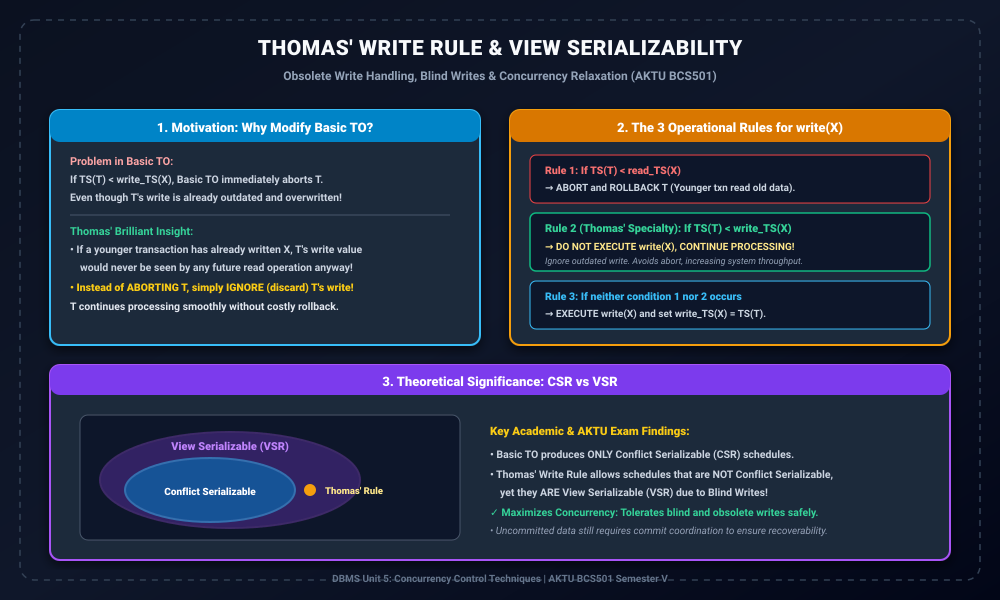

# Module 05: Thomas' Write Rule and View Serializability

> **Folder:** `DBMS/Unit_5/05_Thomas_Write_Rule_and_View_Serializability/`  
> **Target Exam:** AKTU BCS501 Semester V | Gateway Classes One-Shot Unit 5 (Slide 32-35)  
> **Key Concepts:** Obsolete Writes, Blind Writes, Thomas's Write Rule (3 Conditions), View Serializability vs Conflict Serializability, Solved Exam Schedules

---

## 1. Thomas' Write Rule Architecture & Theoretical Scope

---

## 2. Thomas' Write Rule ki Motivation

Basic Timestamp Ordering (TO) protocol me rule hota hai:
$$	ext{If } TS(T) < write\_TS(X) \implies 	ext{Abort & Rollback } T$$
Lekin socho: Agar transaction $T_1$ ne subah 10:00 baje account balance $X$ ko write karne ki koshish ki, jabki kisi younger transaction $T_2$ (10:05 baje) ne already $X$ ko overwrite kar diya hai...  
Toh $T_1$ ka wo update waise bhi **purana (obsolete)** ho chuka hai! Future ka koi bhi transaction $T_1$ ke written data ko kabhi read nahi karne wala tha kyunki latest committed data $T_2$ ka hai.

Is scenario me $T_1$ ko abort karke system resources waste karna bevakoofi hai!  
**Robert Thomas** ne is problem ko solve karne ke liye **Thomas' Write Rule** propose kiya:
> **The Core Idea:**  
> Jab kisi purane transaction ka write operation obsolete ho chuka ho, toh use **abort karne ke bajay ignore (discard) kar do**, aur transaction ko aage continue karne do!

---

## 3. The 3 Rules of Thomas' Write Rule

Jab Transaction $T$ kisi item $X$ par `write_item(X)` operation request karta hai:

### Rule 1: Younger Reader Conflict (Abort)
$$	ext{If } TS(T) < read\_TS(X)$$
- Iska matlab kisi younger transaction ne already $X$ ki value ko read kar liya hai jo $T$ ke update ke baad honi chahiye thi.
- **Action:** $T$ ko **Abort aur Rollback** karo (Consistency violation).

### Rule 2: Thomas' Special Obsolete Write Rule (Ignore & Continue)
$$	ext{If } TS(T) < write\_TS(X)$$
- Iska matlab kisi younger transaction ($TS > TS(T)$) ne already $X$ par apna write execute kar diya hai.
- $T$ ka write ab completely outdated hai.
- **Action:** $T$ ke `write_item(X)` ko **IGNORE (Suppress)** kar do! $T$ ko abort mat karo, use agle operation par badhne do. $write\_TS(X)$ ko bhi update karne ki zarurat nahi hai.

### Rule 3: Normal Valid Write (Execute & Update)
$$	ext{If neither Rule 1 nor Rule 2 occurs}$$
- **Action:** $T$ ke `write_item(X)` ko normal tarike se database me execute karo.
- $write\_TS(X)$ ko update karke $TS(T)$ set karo:
  $$write\_TS(X) = TS(T)$$

---

## 4. Conflict Serializability (CSR) vs View Serializability (VSR)

Ye AKTU exam ka favorite theoretical question hai:

| Property | Basic Timestamp Ordering | Thomas' Write Rule |
| :--- | :--- | :--- |
| **Protocol Class** | Conflict Serializability (CSR) | **View Serializability (VSR)** |
| **Condition on $TS(T) < write\_TS(X)$** | Abort and rollback | **Ignore write, continue** |
| **Blind Writes Handling** | Aborts blind writes if out-of-order | **Permits blind writes efficiently** |
| **Set Invariant** | Produces schedules $\in CSR$ | Produces schedules $\in VSR - CSR$ |
| **Throughput & Abort Rate** | Higher abort rate | **Lower abort rate, higher throughput** |

> [!NOTE]
> Thomas' Write Rule ek aisa practical protocol hai jo **View Serializable** schedules generate karta hai jo Conflict Serializable nahi hote ($CSR \subset VSR$). Ye proof karta hai ki Blind Writes concurrency ko expand karne me kitne powerful hote hain!
