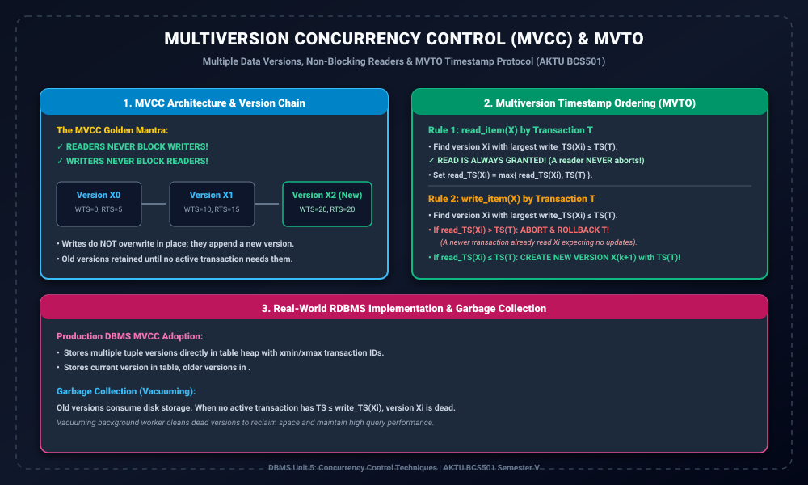

# Module 06: Multiversion Concurrency Control (MVCC) and MVTO

> **Folder:** `DBMS/Unit_5/06_Multiversion_Concurrency_Control_MVCC_and_MVTO/`  
> **Target Exam:** AKTU BCS501 Semester V | Gateway Classes One-Shot Unit 5 (Slide 36-41)  
> **Key Concepts:** MVCC Motivation, Data Item Versions $Q_k$, Version Metadata, Multiversion Timestamp Ordering (MVTO) Algorithm, Garbage Collection

---

## 1. MVCC Architecture & Version Chains

---

## 2. Multi-Version Concurrency Control (MVCC) ki Zarurat

Traditional single-version databases me jab koi transaction kisi data item $X$ ko write kar raha hota hai, toh concurrency control manager baaki sabhi transactions ko $X$ read karne se block kar deta hai. Isse analytical queries (reporting) aur transactional queries me massive bottleneck create hota hai.

> **MVCC ka Fundamental Principle:**  
> Jab bhi koi transaction kisi item $X$ ko modify karta hai, toh wo purani value ko overwrite nahi karta! Balki system $X$ ka ek **naya version ($X_{new}$)** create kar deta hai.

Iska sabse bada advantage:
- **Readers never block Writers!**
- **Writers never block Readers!**
Agar koi transaction purani state read karna chahta hai, toh use purana snapshot provide kar diya jata hai bina writer ko wait karwaye.

---

## 3. Data Item Version Record Structure

Har named data item $X$ ke multiple versions $X_0, X_1, X_2, \dots, X_n$ maintain hote hain. Har version $X_k$ ke sath 3 attributes store hote hain:
1. **Value:** Actual data content.
2. **$write\_TS(X_k)$:** Wo timestamp jis transaction ne is version ko create/write kiya.
3. **$read\_TS(X_k)$:** Wo largest timestamp kisi transaction ka jisne is version ko successfully read kiya.

---

## 4. Multiversion Timestamp Ordering (MVTO) Algorithm

### 4.1 Read Operation: `read_item(X)` by Transaction $T$
Jab Transaction $T$ item $X$ ko read karna chahta hai:
1. System $X$ ke sabhi versions me se wo version $X_i$ dhundhta hai jiska:
   $$write\_TS(X_i) \le TS(T) \quad (	ext{aur } write\_TS(X_i) 	ext{ maximum ho})$$
2. **Key Guarantee:** **Read operation hamesha SUCCESSFUL hota hai!** A reader NEVER aborts in MVTO!
3. Version $X_i$ ka read timestamp update hota hai:
   $$read\_TS(X_i) = \max(read\_TS(X_i), TS(T))$$

### 4.2 Write Operation: `write_item(X)` by Transaction $T$
Jab Transaction $T$ item $X$ ko write karna chahta hai:
1. System wo version $X_i$ dhundhta hai jiska $write\_TS(X_i) \le TS(T)$ maximal ho.
2. **Conflict Check:**
   - Agar $read\_TS(X_i) > TS(T)$:  
     Iska matlab kisi younger transaction ne already $X_i$ ko read kar liya hai aur assume kiya hai ki $T$ ka write exist nahi karta. Agar $T$ ab naya version likhega toh serialization order violate ho jayega.  
     **Action:** $T$ ko **Abort aur Rollback** karo!
   - Agar $read\_TS(X_i) \le TS(T)$:  
     **Action:** Ek bilkul naya version $X_{k+1}$ create karo jiska:
     $$write\_TS(X_{k+1}) = TS(T), \quad read\_TS(X_{k+1}) = TS(T)$$

---

## 5. Garbage Collection & Storage Overhead

Kyunki har write naya version create karta hai, disk storage rapidly expand hone lagti hai:
- Jab koi bhi active transaction aisa na bache jiska timestamp kisi purane version $X_i$ ko access kar sakta ho, toh wo version **Dead Tuple** ban jata hai.
- DBMS background **Vacuum Cleaner / Garbage Collector** run karta hai jo dead versions ko purge karke disk space reclaim karta hai (PostgreSQL VACUUM / Oracle UNDO retention).
