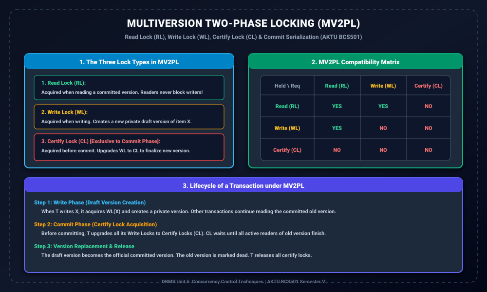

# Module 07: Multiversion Two-Phase Locking (MV2PL) and Certify Locks

> **Folder:** `DBMS/Unit_5/07_Multiversion_Two_Phase_Locking_MV2PL_and_Certify_Locks/`  
> **Target Exam:** AKTU BCS501 Semester V | Gateway Classes One-Shot Unit 5 (Slide 42-45)  
> **Key Concepts:** MV2PL Mechanism, Read Lock (RL), Write Lock (WL), Certify Lock (CL), 3x3 Compatibility Matrix, Commit Phase Certification, Cascading Abort Avoidance

---

## 1. MV2PL Architecture & Compatibility

---

## 2. Multiversion Two-Phase Locking (MV2PL) Kya Hai?

Standard Two-Phase Locking (2PL) me Shared locks aur Exclusive locks ek doosre ke sath mutually exclusive hote hain, jisse readers aur writers ek doosre ko block karte hain.  
**MV2PL** multiversioning aur 2PL ko combine karta hai by introducing **3 distinct lock modes**:

1. **Read Lock (RL):**  
   Jab koi transaction committed version ko read karta hai. Ye writer transactions ke Write Lock ($WL$) ke sath **compatible** hota hai!
2. **Write Lock (WL):**  
   Jab koi transaction item $X$ par naya data likhta hai, wo $WL$ acquire karta hai aur ek private draft version create karta hai. Ye existing readers ($RL$) ko block nahi karta!
3. **Certify Lock (CL):**  
   Ye special lock transaction ke **Commit Phase** me acquire hota hai. Jab transaction commit hone ko ready hota hai, toh wo apne $WL$ ko $CL$ me **upgrade** karta hai.

---

## 3. MV2PL Lock Compatibility Matrix

| Held \ Requested | Read Lock ($RL$) | Write Lock ($WL$) | Certify Lock ($CL$) |
| :---: | :---: | :---: | :---: |
| **Read Lock ($RL$)** | **YES** | **YES** | **NO** |
| **Write Lock ($WL$)** | **YES** | **NO** | **NO** |
| **Certify Lock ($CL$)** | **NO** | **NO** | **NO** |

### Notice the Magic of Cell $(RL, WL)$:
- $RL$ aur $WL$ aapas me **YES (Compatible)** hain!
- Iska matlab jab ek transaction write kar raha hota hai, toh doosre transactions bina kisi delay ke parallel me read kar sakte hain!
- Lekin $CL$ kisi ke sath bhi compatible nahi hai ($RL, WL, CL$ sabke sath **NO**). Isse commit time par strict serializability ensure hoti hai.

---

## 4. MV2PL Execution Lifecycle (Step-by-Step)

### Step 1: Write Operation
Jab transaction $T$ kisi item $X$ ko update karna chahta hai:
- $T$ item $X$ par **Write Lock ($WL$)** acquire karta hai.
- Ek naya draft version $X_{new}$ create hota hai.
- Doosre transactions purane committed version $X_{old}$ ko **Read Lock ($RL$)** lekar read karte rehte hain (Zero waiting).

### Step 2: Commit Phase (Certification)
Jab $T$ apne sabhi operations complete karke commit hone jata hai:
- $T$ apne sabhi $WL$ locks ko **Certify Lock ($CL$)** me upgrade karta hai.
- Agar kisi purane version $X_{old}$ par abhi bhi koi reader active hai, toh $CL$ request wait karegi jab tak active readers finish na ho jayein.

### Step 3: Version Replacement & Unlock
- Jaise hi $CL$ grant hota hai, $X_{new}$ officially committed ban jata hai aur $X_{old}$ ko discard kar diya jata hai.
- Transaction $T$ commit ho jata hai aur sabhi Certify Locks release kar deta hai.

---

## 5. MV2PL ke Advantages

1. **Concurrent Reads and Writes:** Readers writers ko block nahi karte, aur writers readers ko block nahi karte.
2. **Cascading Aborts Eliminated:** Kyunki reader transactions hamesha purana committed data read karte hain, isiliye kisi writer ke abort hone par readers par koi effect nahi padta!
