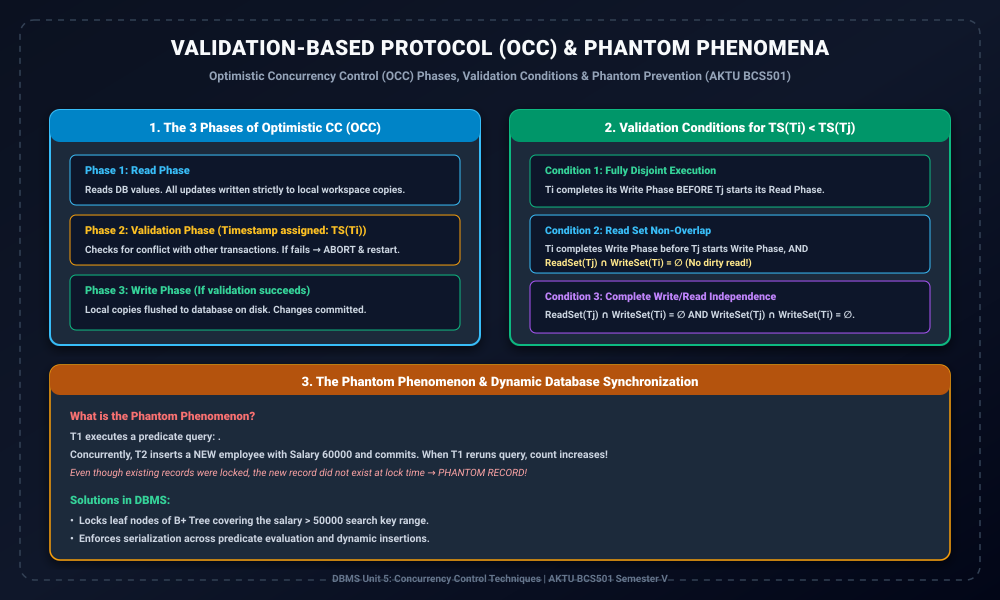

# Module 08: Validation-Based Protocol (OCC) and Phantom Phenomena

> **Folder:** `DBMS/Unit_5/08_Validation_Based_Protocol_Optimistic_Concurrency_Control/`  
> **Target Exam:** AKTU BCS501 Semester V | Gateway Classes One-Shot Unit 5 (Slide 46-53)  
> **Key Concepts:** Optimistic Concurrency Control (OCC), Read Phase, Validation Phase, Write Phase, Validation Test Conditions, Phantom Record Anomaly, Index-Range Locking

---

## 1. Validation-Based Protocol (OCC) Architecture

---

## 2. Optimistic Concurrency Control (OCC) Philosophy

Locking protocols ko **Pessimistic** kaha jata hai kyunki wo assume karte hain ki conflicts hamesha honge, isiliye execution se pehle hi resources lock kar lete hain.  
Iske opposite, **Optimistic Concurrency Control (Validation-Based Protocol)** assume karta hai ki:
> Conflicts bohot **rare (infrequent)** hote hain, khas karke read-heavy databases me.  
> Isiliye transactions ko bina kisi locking overhead ke freely execute hone do, aur sirf **commit time par validate** karo ki koi conflict hua ya nahi!

---

## 3. The 3 Phases of OCC Execution

Har transaction $T_i$ teen phases se hokar gujarta hai:

### 1. Read Phase
- Transaction database se data items ko freely read karta hai.
- Agar transaction koi update/write perform karta hai, toh wo actual database me write nahi karta!
- Sabhi updates transaction ke **local private workspace** me buffer kiye jate hain.
- Is phase me koi locks acquire nahi hote.

### 2. Validation Phase
- Jab transaction execution complete kar leta hai, toh wo Validation Phase me enter karta hai.
- **Timestamp Allocation:** Transaction ko uska official Timestamp $TS(T_i)$ **Validation Phase ke start me assign** kiya jata hai (na ki transaction start hone par).
- System check karta hai ki kya $T_i$ ke local updates kisi doosre concurrent transaction ke sath serializability violate kar rahe hain.
- **Outcome:**  
  - Agar Validation **Pass** hota hai $\implies$ Transaction Write Phase me enter karta hai.
  - Agar Validation **Fail** hota hai $\implies$ Transaction ko turant **ABORT** karke rollback kar diya jata hai aur local copies discard ho jati hain.

### 3. Write Phase
- Agar transaction validation test pass kar leta hai, toh uske local workspace ke modified values ko permanently **database disk par flush** kar diya jata hai.
- Changes commit ho jate hain.

---

## 4. Formal Validation Test Conditions

Consider do transactions $T_i$ aur $T_j$ jahan $TS(T_i) < TS(T_j)$ ($T_i$ validation me pehle enter hua).  
Serializability ensure karne ke liye niche di gayi teen conditions me se **kam se kam ek condition hold honi chahiye**:

### Condition 1: Sequential Execution (No Overlap)
$$WritePhase(T_i) 	ext{ finishes before } ReadPhase(T_j) 	ext{ starts}$$
Dono transactions time me fully disjoint hain, so zero conflict.

### Condition 2: Read Set Non-Overlap
$$WritePhase(T_i) 	ext{ finishes before } WritePhase(T_j) 	ext{ starts}$$
$$	ext{AND} \quad ReadSet(T_j) \cap WriteSet(T_i) = \emptyset$$
Iska matlab $T_j$ ne koi bhi aisa item read nahi kiya jise $T_i$ ne modify kiya tha. So no Dirty Read!

### Condition 3: Independent Operations
$$ReadSet(T_j) \cap WriteSet(T_i) = \emptyset \quad 	ext{AND} \quad WriteSet(T_j) \cap WriteSet(T_i) = \emptyset$$
Dono transactions ke read aur write sets aapas me completely independent hain.

---

## 5. Phantom Phenomenon (Dynamic Databases)

> **Definition:**  
> Jab koi transaction kisi condition ke base par database query run karta hai (e.g., `SELECT COUNT(*) FROM Student WHERE Marks > 75`), aur concurrent transaction ek naya record insert karta hai jo condition satisfy karta hai, toh rereading par records ki sankhya badal jati hai. Is naye invisible record ko **Phantom Record** kehte hain.

### Phantom Problem Locking se Solve Kyun Nahi Hota?
Traditional row-level locking sirf **existing records** par lock lagata hai. Kyunki naya tuple database me pehle se exist hi nahi karta tha, isiliye uspar pehle se koi lock nahi ho sakta tha!

### Solutions to Phantom Phenomenon:
1. **Index-Range Locking (B+ Tree Leaf Locking):**  
   Index leaf nodes par range locks lagana (e.g., locking key range $(75, \infty)$) jisse naya tuple insert hone par lock manager use block kar sake.
2. **Predicate Locking:**  
   Specific rows lock karne ke bajay WHERE clause ke predicate ko lock karna.
3. **Timestamp Ordering:**  
   Dynamic insertion timestamps ke base par conflicts detect karke transaction serialize karna.
