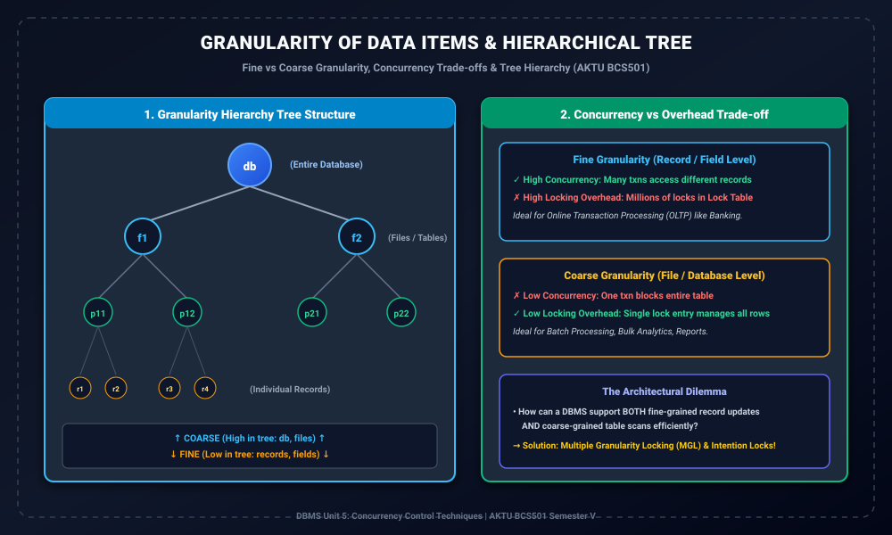

# Module 09: Granularity of Data Items and Hierarchy

> **Folder:** `DBMS/Unit_5/09_Granularity_of_Data_Items_and_Hierarchy/`  
> **Target Exam:** AKTU BCS501 Semester V | Gateway Classes One-Shot Unit 5 (Slide 64-68)  
> **Key Concepts:** Data Item Granularity, Fine vs Coarse Granularity, Concurrency vs Overhead Trade-off, Granularity Tree Hierarchy ($db 	o 	ext{file} 	o 	ext{page} 	o 	ext{record}$)

---

## 1. Data Item Granularity & Tree Hierarchy

---

## 2. Data Item Granularity Kya Hoti Hai?

> **Formal Definition:**  
> The **size of the data item** chosen as the basic unit of locking in a database is called **Data Item Granularity**.

Database me hum lock kis level par lagate hain?
1. **A whole database (Sabse bada unit)**
2. **A file / table**
3. **A disk block / page**
4. **A record / tuple (row)**
5. **A field value of a record (Sabse chhota unit)**

---

## 3. Fine vs Coarse Granularity Trade-off

Granularity ka size choose karna direct trade-off create karta hai **Concurrency** aur **Locking Overhead** ke beech (Slide 64-67):

### 3.1 Fine Granularity (Record / Field Level)
- **Advantages:**
  - **High Concurrency:** Agar Transaction $T_1$ customer A ka record update kar raha hai aur $T_2$ customer B ka record, toh dono parallel chal sakte hain kyunki sirf unke specific records locked hain.
- **Disadvantages:**
  - **High Overhead:** Agar ek table me 10 lakh rows hain aur transaction sabhi rows read karna chahta hai, toh Lock Manager ko 10 lakh alag-alag locks manage karne padenge. Lock Table memory explode ho sakti hai!
- **Use Case:** Online Transaction Processing (OLTP), Banking ATM transactions.

### 3.2 Coarse Granularity (File / Database Level)
- **Advantages:**
  - **Low Overhead:** Sirf ek single lock entry se poori table ya poora database protect ho jata hai. Lock table chhota aur fast rehta hai.
- **Disadvantages:**
  - **Low Concurrency:** Agar Transaction $T_1$ table ka ek record modify kar raha hai aur table level lock le leta hai, toh baaki sabhi transactions (jo doosre alag records access karna chahte the) block ho jayenge.
- **Use Case:** Batch processing, large analytical reports, table schema alterations (DDL).

---

## 4. The Granularity Tree Hierarchy

Multiple Granularity Locking (MGL) me database data items ko ek rooted tree ke roop me model karta hai (Slide 68):
- **Level 0 (Root):** Entire Database ($db$).
- **Level 1 (Children of root):** Files / Relations ($f_1, f_2, \dots$).
- **Level 2 (Children of files):** Disk Blocks / Pages ($p_{11}, p_{12}, \dots$).
- **Level 3 (Leaves):** Individual Records / Tuples ($r_{111}, r_{112}, \dots$).

> **Core Rule of Hierarchy:**  
> Kisi bhi node $N$ par lock lagane ka matlab hai ki uske **sabhi descendants (children, grandchildren, etc.) automatically usi mode me locked ho jate hain!**
