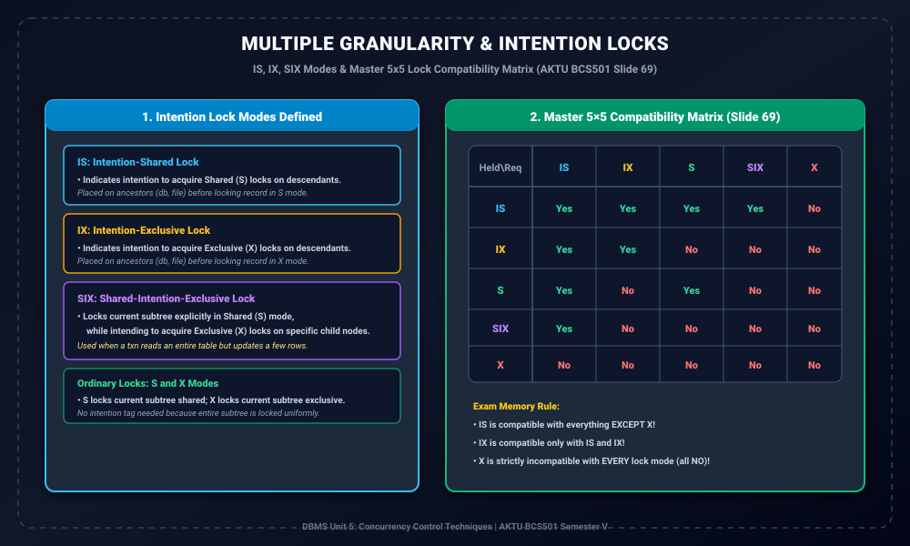

# Module 10: Multiple Granularity Locking and Intention Locks

> **Folder:** `DBMS/Unit_5/10_Multiple_Granularity_Locking_and_Intention_Locks/`  
> **Target Exam:** AKTU BCS501 Semester V | Gateway Classes One-Shot Unit 5 (Slide 69)  
> **Key Concepts:** Intention Locks Need, IS, IX, SIX Lock Modes, Master 5x5 Compatibility Matrix, Upward Lock Propagation

---

## 1. Multiple Granularity & Intention Locks Architecture

---

## 2. Intention Locks ki Zarurat Kyun Padi?

Socho ki Transaction $T_1$ table ke andar kisi ek record $r_5$ ko Exclusive lock ($X$) lagana chahta hai.  
Ab agar Transaction $T_2$ aakar poori table par hi Exclusive lock ($X$) mang le, toh Lock Manager ko ye pata karne ke liye ki kya is table ka koi child record already locked hai:
- Table ke sabhi hazaron records ko traverse karna padega!
- Har page aur record ka lock status check karna bohot expensive hoga.

Is tree traversal overhead ko khatam karne ke liye **Intention Locks** introduce kiye gaye:
> **The Intention Lock Principle:**  
> Kisi bhi leaf record ko lock karne se pehle transaction ko uske **sabhi ancestors (parents, grandparent, root) par ek "Intention" lock** lagana padta hai!  
> Ye intention lock ancestors par ek flag laga deta hai jo doosre transactions ko alert kar deta hai ki neeche ke kisi node par locking chal rahi hai!

---

## 3. The Three Intention Lock Modes

Slide 69 ke according, 3 types ke Intention Locks hote hain:

### 1. Intention-Shared (IS)
- Ye lock kisi ancestor node (e.g. database ya file) par lagaya jata hai ye batane ke liye ki transaction neeche kisi descendant node par **Shared Lock ($S$)** lene wala hai.

### 2. Intention-Exclusive (IX)
- Ye lock kisi ancestor node par lagaya jata hai ye batane ke liye ki transaction neeche kisi descendant node par **Exclusive Lock ($X$)** lene wala hai.

### 3. Shared-Intention-Exclusive (SIX)
- Ye hybrid lock hai:
  - Current node (aur uske poore subtree) ko **Shared Mode ($S$)** me lock karta hai (taaki transaction poora subtree read kar sake).
  - Aur sath me ye intention show karta hai ki neeche specific child nodes par **Exclusive Lock ($X$)** lagaya jayega.
- *Real-world example:* Ek query jo poori `Employee` table read karti hai aur sirf un employees ki salary update karti hai jinka performance rating 5 hai.

---

## 4. Master 5x5 Lock Compatibility Matrix (Slide 69)

Ye table AKTU university exam me directly 10 marks me draw karne ko aati hai:

| Held \ Requested | IS | IX | S | SIX | X |
| :---: | :---: | :---: | :---: | :---: | :---: |
| **IS** | **Yes** | **Yes** | **Yes** | **Yes** | **No** |
| **IX** | **Yes** | **Yes** | **No** | **No** | **No** |
| **S** | **Yes** | **No** | **Yes** | **No** | **No** |
| **SIX** | **Yes** | **No** | **No** | **No** | **No** |
| **X** | **No** | **No** | **No** | **No** | **No** |

---

## 5. Exam Memory Tricks for the 5x5 Matrix

1. **Row IS (Intention-Shared):**  
   Sirf Exclusive ($X$) ke sath **No** hai, baaki sabhi modes ($IS, IX, S, SIX$) ke sath **Yes** hai!
2. **Row X (Exclusive):**  
   Kisi ke sath compatible nahi hai — **SABHI cells No** hain!
3. **Row IX (Intention-Exclusive):**  
   Sirf $IS$ aur $IX$ ke sath **Yes** hai, baaki sabhi ($S, SIX, X$) ke sath **No** hai.
4. **Row SIX (Shared-Intention-Exclusive):**  
   Sirf $IS$ ke sath **Yes** hai, baaki sabhi ke sath **No** hai!
