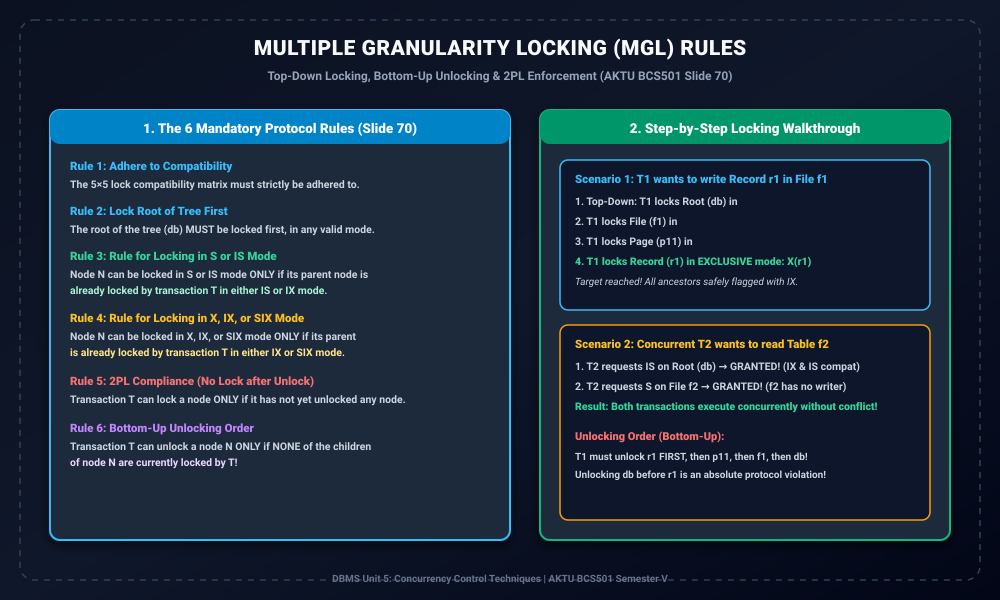

# Module 11: Multiple Granularity Locking Protocol Rules

> **Folder:** `DBMS/Unit_5/11_Multiple_Granularity_Locking_Protocol_Rules/`  
> **Target Exam:** AKTU BCS501 Semester V | Gateway Classes One-Shot Unit 5 (Slide 70)  
> **Key Concepts:** The 6 Rules of MGL Protocol, Top-Down Locking Direction, Bottom-Up Unlocking Direction, 2PL Compliance, Solved Locking Scenarios

---

## 1. Multiple Granularity Locking Rules & Execution

---

## 2. The 6 Mandatory Protocol Rules (Slide 70)

Multiple Granularity Locking (MGL) protocol ensure karta hai ki tree hierarchy me fine aur coarse grained locks aapas me conflict kiye bina strictly serializable execution de sakein. Iske **6 core rules** hain:

1. **Rule 1 (Lock Compatibility):**  
   Sabhi locking requests ko 5x5 Lock Compatibility Matrix ke mutabiq grant kiya jayega.
2. **Rule 2 (Lock Root First):**  
   Tree ke **Root node ($db$) ko sabse pehle lock** kiya jana chahiye, kisi bhi valid mode ($IS, IX, S, SIX, X$) me.
3. **Rule 3 (Locking in S or IS Mode):**  
   Kisi bhi node $N$ ko $S$ ya $IS$ mode me tabhi lock kiya ja sakta hai jab uske **parent node ko transaction ne pehle se $IS$ ya $IX$ mode me lock** kar rakha ho.
4. **Rule 4 (Locking in X, IX, or SIX Mode):**  
   Kisi bhi node $N$ ko $X, IX,$ ya $SIX$ mode me tabhi lock kiya ja sakta hai jab uske **parent node ko transaction ne pehle se $IX$ ya $SIX$ mode me lock** kar rakha ho.
5. **Rule 5 (2PL Protocol Enforcement):**  
   Transaction kisi bhi node ko tabhi lock kar sakta hai jab usne abhi tak **koi bhi node unlock na kiya ho** (Growing phase constraint).
6. **Rule 6 (Bottom-Up Unlocking Order):**  
   Transaction kisi node $N$ ko tabhi unlock kar sakta hai jab us node ke **kisi bhi child node par currently us transaction ka koi lock na ho**! (Unlocking hamesha bottom-up leaves se root ki taraf hoti hai).

---

## 3. Direction of Operations (Exam Golden Key)

- **Locking Direction:** Strictly **TOP-DOWN** (Root $	o$ File $	o$ Page $	o$ Record).
- **Unlocking Direction:** Strictly **BOTTOM-UP** (Record $	o$ Page $	o$ File $	o$ Root).

---

## 4. Step-by-Step Locking Trace Walkthrough

### Scenario 1: Transaction $T_1$ wants to write Record $r_1$ in File $f_1$
1. $T_1$ locks root $db$ in **$IX$ mode**.
2. $T_1$ locks file $f_1$ in **$IX$ mode** (Parent $db$ has $IX$).
3. $T_1$ locks page $p_{11}$ in **$IX$ mode** (Parent $f_1$ has $IX$).
4. $T_1$ locks target record $r_1$ in **Exclusive ($X$) mode** (Parent $p_{11}$ has $IX$).
5. $T_1$ updates $r_1$.

### Scenario 2: Concurrent Transaction $T_2$ wants to read entire File $f_2$
1. $T_2$ requests **$IS$ mode** on root $db$.
   - Root already has $IX$ from $T_1$.
   - Check matrix cell: $(IX, IS) \implies$ **YES (Compatible)**! Lock granted.
2. $T_2$ requests **Shared ($S$) mode** on file $f_2$.
   - File $f_2$ par koi lock nahi hai. Lock granted!
3. **Result:** $T_1$ file $f_1$ ke record par write kar raha hai jabki $T_2$ file $f_2$ ko parallel read kar raha hai — **Zero blocking, 100% throughput!**

### Unlocking Sequence:
Jab $T_1$ finish karta hai:
1. First: Unlock $r_1$ (Leaf).
2. Second: Unlock $p_{11}$.
3. Third: Unlock $f_1$.
4. Finally: Unlock $db$ (Root).
