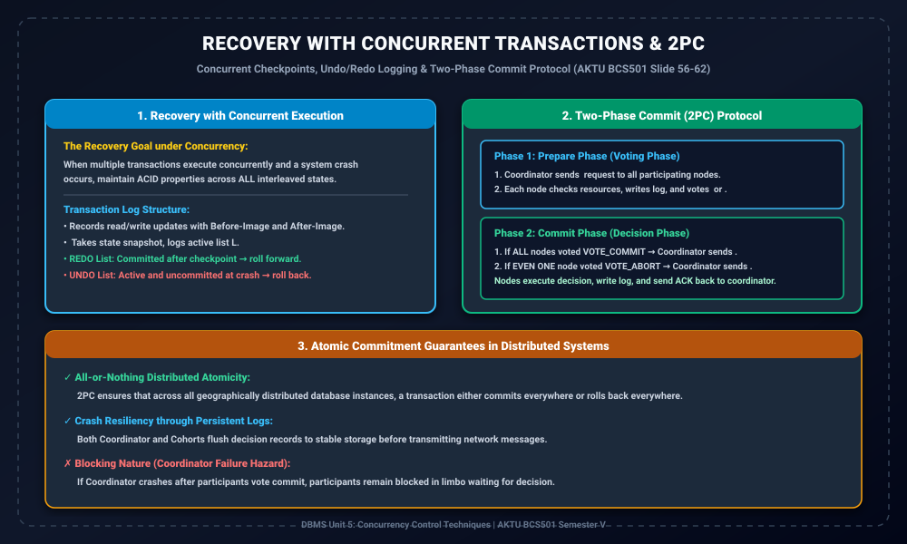

# Module 12: Recovery with Concurrent Transactions and 2PC

> **Folder:** `DBMS/Unit_5/12_Recovery_with_Concurrent_Transactions_and_2PC/`  
> **Target Exam:** AKTU BCS501 Semester V | Gateway Classes One-Shot Unit 5 (Slide 56-62)  
> **Key Concepts:** Crash Recovery under Concurrency, Transaction Logs, Checkpointing with Active Lists, Two-Phase Commit (2PC) Protocol, Distributed Atomicity

---

## 1. Concurrent Recovery & 2PC Protocol Architecture

---

## 2. Recovery from Concurrent Transactions (Slide 56)

Jab multiple transactions concurrently execute ho rahe hote hain aur system crash ho jata hai, toh database recovery manager ke samne do challenges hote hain:
1. **Committed Transactions:** Jin transactions ne crash se pehle commit kiya tha, unke updates permanently database me reflect hone chahiye (**Durability**).
2. **Uncommitted Transactions:** Jo transactions crash ke waqt active the aur commit nahi hue the, unke partial updates ko database se completely undo karna padega (**Atomicity**).

### 2.1 Transaction Logs & Checkpoints
- **Transaction Log:** Har read, write, commit aur abort operation ka sequence stable storage me record hota hai.
- **Checkpoint:** Recovery time ko reduce karne ke liye periodic checkpoints liye jate hain jo active transactions ki list $L$ ko log me record karte hain.
- **UNDO List:** Jo transactions checkpoint se pehle ya baad me shuru hue the aur crash ke waqt unka koi `commit` record nahi hai $\implies$ Unhe backward scan karke rollback (undo) kiya jata hai.
- **REDO List:** Jo transactions checkpoint ke baad `commit` ho chuke the $\implies$ Unhe forward scan karke redo kiya jata hai.

---

## 3. Two-Phase Commit (2PC) Protocol (Slide 60-62)

Distributed databases me jab ek transaction multiple sites/nodes par divide hokar execute hota hai, toh **Atomic Commitment** guarantee karne ke liye **Two-Phase Commit (2PC)** protocol use kiya jata hai:

### Role Definitions:
- **Coordinator Node:** Master node jo distributed transaction ko control aur coordinate karta hai.
- **Cohort Nodes (Participants):** Distributed sites jahan transaction ke actual operations execute hote hain.

---

## 4. The Two Phases of 2PC

### Phase 1: Prepare Phase (Voting Phase)
1. Coordinator sabhi participating nodes ko network par ek `PREPARE` request bhejta hai: *"Kya tum commit karne ko ready ho?"*
2. Har participant node check karta hai ki kya koi resource conflict ya failure hai.
3. Agar node safely commit kar sakta hai:
   - Apne local log me `READY` record write karta hai.
   - Coordinator ko `VOTE_COMMIT` message bhejta hai.
4. Agar node kisi failure ki wajah se commit nahi kar sakta:
   - Apne local log me `ABORT` record write karta hai.
   - Coordinator ko `VOTE_ABORT` message bhejta hai.

### Phase 2: Commit Phase (Decision Phase)
1. **Global Commit Decision:**  
   Agar **SABHI participants ne `VOTE_COMMIT`** kiya hai:
   - Coordinator apne log me `GLOBAL_COMMIT` record likhta hai aur sabhi nodes ko `GLOBAL_COMMIT` message bhejta hai.
   - Har participant updates ko commit karta hai, log me `COMMITTED` likhta hai aur coordinator ko `ACK` bhejta hai.
2. **Global Abort Decision:**  
   Agar **EK BHI participant ne `VOTE_ABORT`** kiya (ya timeout ho gaya):
   - Coordinator apne log me `GLOBAL_ABORT` likhta hai aur sabhi nodes ko `GLOBAL_ABORT` message bhejta hai.
   - Sabhi nodes local changes ko undo karke rollback kar dete hain.

---

## 5. 2PC Limitation: The Blocking Problem

Agar Phase 1 me participants ne `VOTE_COMMIT` vote kar diya aur uske baad **Coordinator crash ho jaye** Phase 2 ka decision bhejne se pehle:
- Participants "Limbo" state me fas jate hain! Wo na toh khud commit kar sakte hain aur na hi abort.
- Isiliye 2PC ko **Blocking Protocol** kaha jata hai. (Non-blocking recovery ke liye 3PC - Three-Phase Commit use hota hai).
