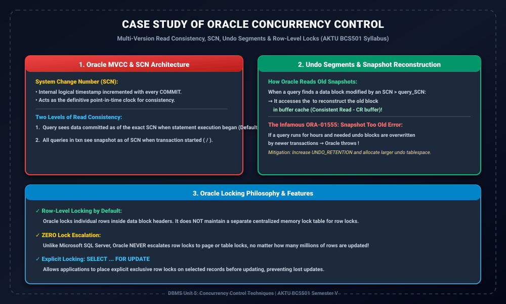

# Module 13: Case Study of Oracle Concurrency Control

> **Folder:** `DBMS/Unit_5/13_Case_Study_of_Oracle_Concurrency_Control/`  
> **Target Exam:** AKTU BCS501 Semester V | Gateway Classes One-Shot Unit 5 Syllabus Topic  
> **Key Concepts:** Oracle Multi-Version Read Consistency, System Change Number (SCN), Undo Segments, Snapshot Too Old (ORA-01555), Row-Level Locking, No Lock Escalation

---

## 1. Oracle Concurrency Control Architecture



---

## 2. Oracle Concurrency Philosophy

Oracle database world ka sabse widely used commercial RDBMS hai, aur iska concurrency model purely **Multi-Version Read Consistency (MVCC)** par based hai.  
Oracle ka motto hai:
> **"Readers never block writers, and writers never block readers!"**

Jab transaction $T_1$ data modify karta hai, toh readers ko block karne ke bajay Oracle unhe **Undo Segments** ke through purana committed version reconstruct karke dikhata hai.

---

## 3. System Change Number (SCN)

Oracle me timestamp clock ke bajay **System Change Number (SCN)** use hota hai:
- SCN ek monotonically increasing 48-bit logical counter hai.
- Har bar jab koi transaction **COMMIT** karta hai, Oracle global SCN ko increment kar deta hai.
- SCN database ke har data block header me record hota hai. Isse Oracle ko instantly pata chal jata hai ki block last time kab modify hua tha.

---

## 4. Two Levels of Read Consistency

### 4.1 Statement-Level Read Consistency (Default)
- Har SQL query (e.g. `SELECT`) jis SCN par start hoti hai, query ko poora database strictly us SCN ke exact snapshot me dikhta hai.
- Agar query ke execute hone ke dauran koi doosra transaction commit kar deta hai, toh query un naye changes ko ignore kar deti hai.

### 4.2 Transaction-Level Read Consistency
- Agar transaction me multiple queries execute ho rahi hain aur aap chahte hain ki sabhi queries ek hi consistent time-point ka data dekhein:
  ```sql
  SET TRANSACTION READ ONLY;
  -- or
  SET TRANSACTION ISOLATION LEVEL SERIALIZABLE;
  ```
- Poora transaction start hone ke SCN snapshot par freeze ho jata hai.

---

## 5. Undo Segments & ORA-01555 (Snapshot Too Old)

### 5.1 Snapshot Reconstruction
Jab koi query kisi block ko read karti hai aur dekhti hai ki block ka SCN query ke start SCN se **bada** hai (matlab query ke start hone ke baad kisi ne use update kar diya):
- Query us block ke header me diye gaye **Undo Pointer** ko follow karti hai.
- Undo segment me se purana **Before-Image** read karke memory buffer cache me ek temporary **Consistent Read (CR) block** reconstruct kar leti hai!

### 5.2 ORA-01555: Snapshot Too Old Error
- Agar koi analytical reporting query 4 ghante tak run karti hai...
- Aur is dauran hazaron transactions ne undo space ko recycle karke purane undo records ko overwrite kar diya...
- Toh jab query purane snapshot ko reconstruct karne jayegi, use undo data nahi milega!
- **Error:** `ORA-01555: snapshot too old: rollback segment number with name too small`.
- **Solution:** DBA ko `UNDO_RETENTION` parameter increase karna chahiye aur Undo Tablespace ka size badhana chahiye.

---

## 6. Oracle Locking Features

1. **Row-Level Locking by Default:**  
   Oracle me lock lagane ke liye koi separate memory table nahi hoti. Lock information seedhe data block header ke ITL (Interested Transaction List) me store hoti hai.
2. **Zero Lock Escalation:**  
   Agar transaction 10 lakh rows update karta hai, toh SQL Server jaisi databases row locks ko table lock me convert ("escalate") kar deti hain. **Oracle me Lock Escalation KABHI NAHI HOTA!**
3. **Explicit Row Locking:**  
   ```sql
   SELECT * FROM Account WHERE AccNo = 101 FOR UPDATE;
   ```
   Ye statement target row par Exclusive Lock lagata hai taaki application concurrent overwrite se safe rahe.
