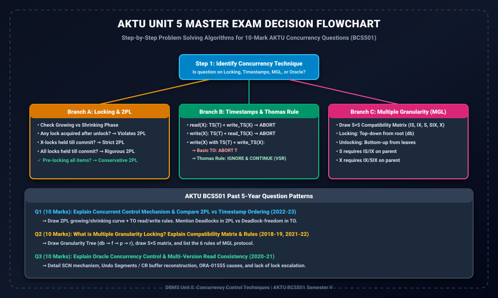

# Module 14: Unit 5 AKTU PYQs and Solved Problems

> **Folder:** `DBMS/Unit_5/14_Unit_5_AKTU_PYQs_and_Solved_Problems/`  
> **Target Exam:** AKTU BCS501 Semester V | Past 5-Year Solved University Examination Papers  
> **Key Concepts:** Concurrency Control Mechanisms (AKTU 2022-23), Multiple Granularity Locking (AKTU 2018-19, 2021-22), 2PL vs Timestamp Comparison, Thomas' Write Rule Solved Numerical, Oracle Case Study

---

## 1. Unit 5 Master Exam Decision Flowchart

---

## 2. Solved University Question 1 (AKTU 2022-23 - 10 Marks)

> **Question:**  
> Explain the Concurrent Control mechanism in DBMS. Why is it needed? Compare Two-Phase Locking (2PL) and Timestamp Ordering (TO) protocols in detail.

### Comprehensive Solution:
1. **Definition & Need:**  
   Concurrency control wo mechanism hai jo simultaneous transactions ke execution ko coordinate karke **Isolation** aur **Consistency** maintain karta hai. Without concurrency control, database me 4 major anomalies hoti hain: Dirty Read, Lost Update, Unrepeatable Read, and Phantom Read.
2. **Two-Phase Locking (2PL):**  
   - Growing phase me locks acquire hote hain, shrinking phase me release hote hain.
   - Lock point par serializability order determine hota hai.
   - **Advantage:** Conflict serializability guaranteed.
   - **Drawback:** Deadlocks possible.
3. **Timestamp Ordering (TO):**  
   - Har transaction ko $TS(T)$ assign hota hai.
   - Read/write rules unke chronological timestamps ke strict order me serializability enforce karte hain.
   - **Advantage:** 100% Deadlock-Free!
   - **Drawback:** High abort/restart rate under conflict.
4. **Detailed Comparison Table:** (Module 04 table included).

---

## 3. Solved University Question 2 (AKTU 2018-19, 2021-22 - 10 Marks)

> **Question:**  
> Explain the concept of Multiple Granularity Locking. Draw the Granularity Hierarchy Tree and explain the 5x5 Lock Compatibility Matrix along with all MGL rules.

### Comprehensive Solution:
1. **Concept:**  
   Fine granularity record level par high concurrency deti hai par high overhead deti hai. Coarse granularity file level par low overhead deti hai par low concurrency deti hai. MGL dono ko coexist karne allow karta hai using Intention Locks.
2. **Hierarchy Tree:**  
   $db 	o files (f) 	o pages (p) 	o records (r)$.
3. **Intention Locks:** $IS, IX, SIX$.
4. **5x5 Compatibility Matrix:**  
   (Module 10 complete matrix included).
5. **The 6 Mandatory Rules:**  
   - Lock root first (top-down).
   - $S/IS$ requires $IS/IX$ on parent.
   - $X/IX/SIX$ requires $IX/SIX$ on parent.
   - 2PL compliance (no lock after unlock).
   - Unlock bottom-up (children before parent).

---

## 4. Solved University Question 3: Thomas' Write Rule (10 Marks)

> **Question:**  
> Trace whether the following schedule is accepted by Basic Timestamp Ordering and Thomas' Write Rule:  
> $$S: R_1(X); \quad W_2(X); \quad W_1(X); \quad C_1; \quad C_2$$  
> Assume $TS(T_1) = 10, TS(T_2) = 20$. Initial $RTS(X) = 0, WTS(X) = 0$.

### Step-by-Step Numerical Walkthrough:

1. **Step 1: $R_1(X)$ executes**
   - $T_1$ requests read. Check: $TS(T_1) \ge WTS(X) \implies 10 \ge 0$ (Valid).
   - $R_1(X)$ granted!
   - Update: $RTS(X) = \max(0, 10) = 10$.
2. **Step 2: $W_2(X)$ executes**
   - $T_2$ requests write. Check:
     - $TS(T_2) \ge RTS(X) \implies 20 \ge 10$ (Valid).
     - $TS(T_2) \ge WTS(X) \implies 20 \ge 0$ (Valid).
   - $W_2(X)$ granted!
   - Update: $WTS(X) = 20$.
3. **Step 3: $W_1(X)$ executes**
   - $T_1$ requests write.
   - Check 1: $TS(T_1) \ge RTS(X) \implies 10 \ge 10$ (Valid).
   - Check 2: $TS(T_1) < WTS(X) \implies 10 < 20$!
   - **Case A: Under Basic Timestamp Ordering:**
     - Condition $TS(T_1) < WTS(X)$ fails!
     - **Result:** $T_1$ is **ABORTED and ROLLED BACK**! Schedule rejected.
   - **Case B: Under Thomas' Write Rule:**
     - Condition 2 applies: $TS(T_1) < WTS(X)$ detected.
     - **Action:** $W_1(X)$ is **IGNORED (Suppressed)**! $T_1$ does NOT abort.
     - $T_1$ proceeds to commit.
     - **Result:** Schedule is **ACCEPTED and View Serializable**!

---

## 5. Solved University Question 4: Oracle Concurrency Case Study (10 Marks)

> **Question:**  
> Explain the concurrency control architecture of Oracle. Discuss Multi-Version Read Consistency, SCN, Undo Segments, and the cause of ORA-01555.

### Comprehensive Solution:
1. **Core Philosophy:** Oracle implements MVCC where readers never block writers and writers never block readers.
2. **SCN Mechanism:** Every commit increments the System Change Number.
3. **Read Consistency Levels:** Statement-level vs Transaction-level.
4. **Undo Segments:** Used to reconstruct historical CR blocks in buffer cache.
5. **ORA-01555:** Occurs when long-running queries need undo blocks that were overwritten by newer transactions.
6. **No Lock Escalation:** Oracle never escalates row locks to table locks.
