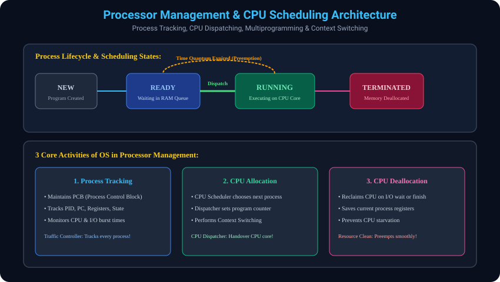

# 10. Processor Management & CPU Scheduling

> **Interview Memory Hook:**
> Program disk par rakhi ek kitaab hai jo band hai. Lekin jab aap us kitaab ko khol kar padhna shuru karte hain, toh woh ban jati hai **Process**! OS ka Processor Manager woh master teacher hai jo decide karta hai ki kaun sa student (Process) kitni der blackboard (CPU) use karega.

---

## 10.1 Process Definition & Process vs Program
- **Program (Passive Entity):** Hard disk ya SSD par store ki gayi binary file ya executable code (e.g. `chrome.exe` on disk). Yeh CPU resources consume nahi karta.
- **Process (Active Entity):** "Program in Execution". Jab koi program RAM mein load hokar CPU instructions execute karna shuru karta hai, uske paas Program Counter, Stack, Heap aur Registers hote hain.
- **PCB (Process Control Block):** Har process ka ek ID card hota hai jisme PID, Process State, CPU Registers, Memory Allocation aur Open Files ka record rehta hai.

---

## 10.2 Multiprogramming & CPU Scheduling ki Zaroorat
- **Problem:** CPU bohot fast hota hai aur I/O operations (keyboard, disk read) bohot slow hote hain. Agar Process A disk se file read karne ke liye ruk jaye, toh bina multiprogramming ke CPU khali baitha rahega (Starvation).
- **Solution (Multiprogramming):** OS RAM mein ek sath multiple processes rakhta hai. Jaise hi Process A I/O ke liye wait karta hai, OS turant CPU ko Process B par switch kar deta hai. Isse CPU utilization 100% ke kareeb rehta hai!
- **CPU Scheduling:** Yeh decide karna ki ready processes mein se kis process ko CPU core allot kiya jaye.

---

## 10.3 OS ki 3 Core Activities in Processor Management
Operating System processor management ke dauran 3 essential kaam karta hai:

- **1. Process Tracking (Traffic Controller Role):**
  - OS har process ke status (New, Ready, Running, Waiting, Terminated) ko continuously track karta hai.
  - CPU usage aur execution history ko PCB mein record karta hai.
- **2. CPU Allocation (Dispatcher Role):**
  - CPU Scheduler jab kisi process ko select kar leta hai, toh **Dispatcher** us process ko CPU hardware sonpta hai.
  - Yeh Program Counter set karta hai aur **Context Switching** perform karta hai.
- **3. CPU Deallocation (Resource Reclamation Role):**
  - Jab process apna execution khatam kar le (Terminated) ya uska allotted time slice (Quantum) khatam ho jaye, OS usse CPU core se preempt karke CPU ko deallocate kar leta hai.

---

## 10.4 Numerical / Interview Thought Process: Context Switch Latency Trace

### Scenario:
Multitasking environment mein CPU Process $P_1$ (Game) chala raha hai. Timer interrupt trigger hota hai aur OS ko CPU switch karke Process $P_2$ (Music Player) ko dena hai.

### Step-by-Step Thought Process:
- **Step 1 - Hardware Interrupt Received ($t = 0	ext{ \mu s}$):**
  - Hardware timer interrupt generate karta hai. CPU execution pause hota hai aur Kernel Mode mein transition hota hai.
- **Step 2 - Save State of $P_1$ ($t = 1	ext{ \mu s}$):**
  - OS $P_1$ ke current Program Counter, CPU Registers, Stack Pointer ko $	ext{PCB}_1$ ke andar safely save karta hai.
- **Step 3 - Scheduler Selection ($t = 2	ext{ \mu s}$):**
  - Scheduling algorithm (e.g. Round Robin) Ready Queue se agla Process $P_2$ choose karta hai.
- **Step 4 - Restore State of $P_2$ ($t = 3	ext{ \mu s}$):**
  - OS $	ext{PCB}_2$ se $P_2$ ke saved registers aur memory translation tables (MMU Page tables) ko CPU registers mein load karta hai.
- **Step 5 - Dispatch & Return to User Mode ($t = 4	ext{ \mu s}$):**
  - CPU Mode Bit ko wapas `1` (User Mode) par switch kiya jata hai aur $P_2$ ke Program Counter par jump hota hai.

> **Interview Golden Takeaway:**
> Context Switching ke dauran CPU koi real user work nahi karta. Yeh total 4 microsecond OS ka **pure overhead** hota hai. Isliye OS design mein context switch ko ultra-lightweight aur fast banaya jata hai!

---

## 10.5 Visual Diagram: Process Lifecycle & CPU Allocation

---
*Next Module: [11. Device and File System Management](../11_Device_and_File_Management/README.md)*
