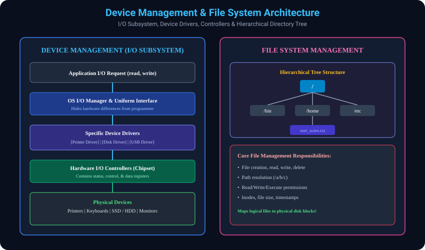

# 11. Device Management & File System Management

> **Interview Memory Hook:**
> Hardware market mein hazaaron alag-alag companies ke printers, mice aur SSDs aate hain. Agar har software developer ko har brand ke hardware ke liye alag code likhna padta, toh software development impossible ho jata. OS ka **Device Management** sabko ek standard plug deta hai, aur **File System** storage ke raw 0s aur 1s ko sundar folders aur files mein badalta hai!

---

## 11.1 Device Management (I/O Subsystem)
- **Role of Device Drivers:**
  - Har physical peripheral ke liye ek specialized software component hota hai jise **Device Driver** kehte hain. Driver device-specific hardware commands ko samajhta hai.
- **Uniform Interface Abstraction:**
  - OS developer ko ek generic standard interface deta hai (jaise `read()`, `write()`). Developer ko isse koi farak nahi padta ki data HP printer par ja raha hai ya Samsung SSD par; underlying translation device driver karta hai.

### OS ki 5 Core Activities in Device Management:
1. **Device Tracking:** System se jude sabhi devices ka record rakhna.
2. **I/O Controller Designation:** Har device ke hardware controller ke liye dedicated driver associate karna.
3. **Access Scheduling:** Deciding which process gets access to which device and for how long.
4. **Effective Device Allocation:** Device ko safely process ko assign karna bina race conditions ke.
5. **Deallocation:** Kaam poora hone par device ko free karna taaki doosra process usse use kar sake.

---

## 11.2 File System Management
- **Logical Abstraction of Storage:**
  - Physical storage drive (SSD/HDD) par sirf blocks aur sectors hote hain. File System is raw physical blocks ko ek logical structure deta hai jise hum **Files aur Directories** kehte hain.
- **Hierarchical Directory Tree:**
  - Root directory (`/` on Linux, `C:\` on Windows) se shuru hokar nested subdirectories aur files ka tree banta hai.

### Core File Operations (CRUD & Access Control):
- **Create:** Nayi file banana aur storage allocation entry karna.
- **Read:** File ke data blocks ko disk se RAM mein lana.
- **Write / Update:** File ke andar naya data append ya overwrite karna.
- **Delete:** File ke disk blocks ko free list mein daal kar directory entry hatana.
- **Metadata & Inodes Tracking:** File name, file size, timestamps (creation/modification), owner, aur permissions (Read, Write, Execute).

---

## 11.3 Step-by-Step Thought Process: File Read Journey (`open("notes.txt", "r")`)

### Scenario:
Aap apne C ya Python program mein likhte hain:
```c
FILE *fp = fopen("/home/shivam/notes.txt", "r");
```

### Execution Journey Behind the Scenes:
- **Step 1 - System Call to Kernel:**
  - Application User Mode se Kernel Mode mein transition karti hai via `sys_open`.
- **Step 2 - Path Resolution & Directory Traversal:**
  - File system root directory `/` se shuru karke `/home`, phir `/shivam` directory traverse karta hai aur `notes.txt` ka entry search karta hai.
- **Step 3 - Inode / Metadata & Permission Verification:**
  - OS file ka Inode fetch karta hai. Check karta hai: "Kya iss user ke paas Read permission (`r`) hai?" Agar permission nahi hai, toh instantly `Permission Denied` error return hota hai.
- **Step 4 - Disk Block Translation:**
  - Inode ke block pointers se physical storage disk ke block numbers (e.g. Block #4120, #4121) pata chalte hain.
- **Step 5 - Device Driver & Hardware Controller Read:**
  - OS Disk Controller ko command bhejta hai. Storage disk se data memory buffer mein copy hota hai.
- **Step 6 - File Descriptor Return:**
  - Process ke File Descriptor table mein ek entry add hoti hai (e.g. `fd = 3`), aur control user code ko wapas de diya jata hai!

---

## 11.4 Visual Diagram: Device Driver Subsystem & File Tree


---
*Back to [Operating System Master Index](../README.md)*
