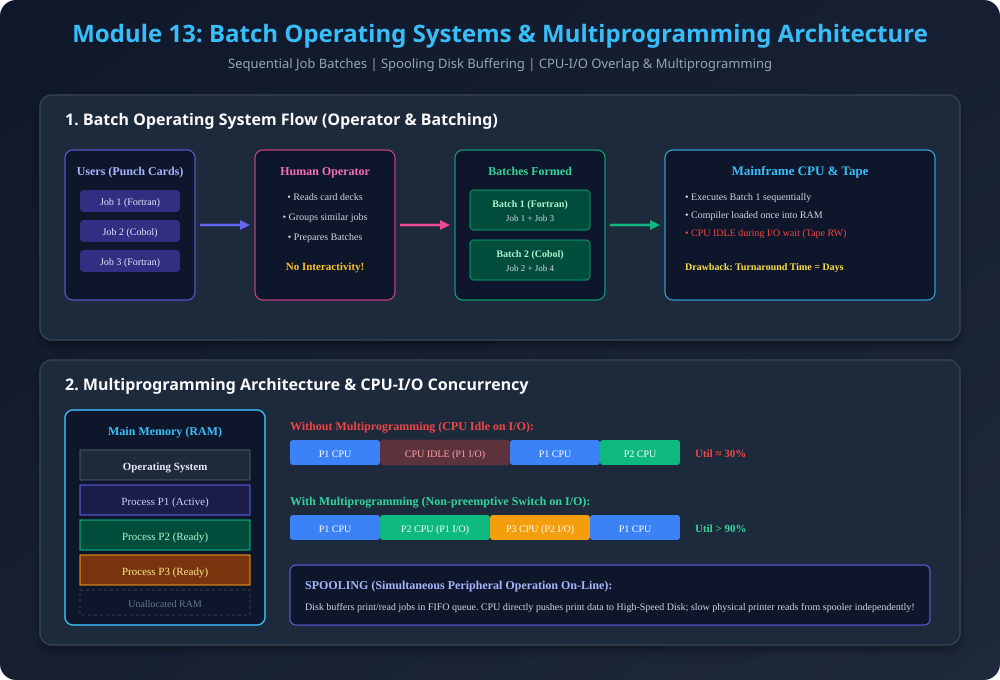

# Module 13: Batch Operating Systems & Multiprogramming Systems

> **Reference Note:** Yeh module [Module 10: Processor Management & Scheduling](../10_Processor_Management_and_Scheduling/README.md) ke context switching aur CPU utilization concepts ko foundational background deta hai.

---

## 1. Evolution & Classification of Operating Systems

Computers ke early days (1950s-1960s) mein programmers direct console par baithe rehte the. Punch cards par code likha jata tha aur ek program execute hone ke baad agla program manually load karna padta tha. Is bottleneck ko solve karne ke liye pehla automated OS architecture aaya: **Batch Operating System**.

---

## 2. Batch Operating System

### 2.1 Core Definition & Structure
- **Definition:** Ek aisa operating system jahan user jobs ko direct CPU par submit nahi karta, balki similar jobs ko group (batch) karke sequentially execute kiya jata hai **without any manual intervention**.
- **Job Structure:**
  $$\text{Job} = \text{Program Code} + \text{Input Data} + \text{Control Instructions}$$
- **Role of the Human Operator:**
  1. Users apne punch cards ya magnetic tapes operator ko submit karte hain.
  2. Operator jobs ko unki requirements ke according categorize karta hai (e.g., Saare FORTRAN jobs ka ek Batch $B_1$, COBOL jobs ka Batch $B_2$).
  3. Operator batch system mein feed karta hai.

### 2.2 Key Advantages
- **Reduced Setup Time:** FORTRAN compiler ek baar load hone par saare FORTRAN programs execute kar deta hai, bar-bar compiler swap karne ki zaroorat nahi padti.
- **Automated Flow:** Ek job finish hone par OS monitor automatically agla job load karta hai.

### 2.3 Critical Limitations (Drawbacks)
- **No User Interaction:** Execution ke dauran programmer running code se interact nahi kar sakta. Agar runtime bug ya infinite loop aa gaya to user tabhi dekh sakta hai jab poora batch execute ho kar print out aaye (Turnaround time hours ya days mein hota tha).
- **CPU Starvation on I/O:** Agar koi job tape read/write (I/O) kar raha hai, to CPU completely idle baitha rehta tha kyunki memory mein sirf wahi ek job loaded hota tha.

---

## 3. Spooling (Simultaneous Peripheral Operation On-Line)

### 3.1 Spooling ka Concept
- **Full Form:** Simultaneous Peripheral Operation On-Line.
- **Problem Statement:** Slow electromechanical devices (card readers, magnetic tapes, paper printers) CPU ki high speed ($10^6$ ops/sec) ke muqable bohot slow hote hain ($10^2$ ops/sec).
- **Working Mechanism:**
  - OS hard disk par ek dedicated buffer/queue maintain karta hai jise **Spool** kehte hain.
  - Jab program `print()` call karta hai, to data directly physical printer par nahi jata, balki high-speed hard disk par spool ho jata hai.
  - Printer independently disk se data FIFO (First In, First Out) order mein fetch karta rehta hai.
- **Difference between Spooling & Buffering:**
  - **Buffering:** Small memory area (RAM) jo single device aur CPU ke beech speed mismatch ko temporarily absorb karta hai.
  - **Spooling:** Disk-based secondary storage jo multiple concurrent processes ke I/O jobs ko queue karta hai aur I/O ko compute ke saath overlap karta hai.

---

## 4. Multiprogramming Operating System

### 4.1 Concept & Working
- **Core Principle:** Main Memory (RAM) mein simultaneously **multiple processes** load karke rakhna taaki CPU kabhi idle na baithe.
- **Execution Flow (Non-preemptive Switch):**
  1. CPU currently Process $P_1$ execute kar raha hai.
  2. $P_1$ ko disk read ya user input (I/O) ki zaroorat padi, to $P_1$ I/O wait state mein chala jata hai.
  3. OS instantly CPU ko interrupt karta hai aur RAM mein already present Ready Process $P_2$ ko dispatch kar deta hai.
  4. Jab $P_1$ ka I/O complete hota hai, wo wapas Ready Queue mein join kar leta hai.

### 4.2 Degree of Multiprogramming
- RAM mein simultaneously load hone wale maximum processes ki ginti ko **Degree of Multiprogramming** kehte hain.

### 4.3 Mathematical Thought Process: CPU Utilization Model
Agar system mein $n$ independent processes loaded hain aur har process apna $p$ fraction of time I/O wait mein spend karta hai:
- Saare $n$ processes ke simultaneously I/O mein hone ki probability:
  $$P(\text{All processes in I/O}) = p^n$$
- **CPU Utilization Formula:**
  $$\text{CPU Utilization} = 1 - p^n$$

#### Numerical Example:
Maan lo har process $70\%$ ($p = 0.70$) time I/O wait karta hai:
- **Uniprogramming ($n = 1$):**
  $$\text{CPU Util} = 1 - 0.70^1 = 0.30 = \mathbf{30\%}$$
- **Multiprogramming with 4 jobs ($n = 4$):**
  $$\text{CPU Util} = 1 - 0.70^4 = 1 - 0.2401 = \mathbf{75.99\%}$$
- **Multiprogramming with 8 jobs ($n = 8$):**
  $$\text{CPU Util} = 1 - 0.70^8 = 1 - 0.0576 = \mathbf{94.24\%}$$
> **Insight:** Multiprogramming se CPU idle time drastically drop ho jata hai aur throughput multi-fold increase ho jati hai.

---

## 5. Architectural Diagram

---

## 6. Comparison: Batch OS vs Multiprogrammed OS

| Parameter | Batch Operating System | Multiprogrammed OS |
| :--- | :--- | :--- |
| **Number of Jobs in RAM** | Single job at any moment | Multiple jobs loaded in RAM |
| **CPU Utilization** | Extremely low (idle during I/O) | Very high (switches on I/O wait) |
| **Turnaround Time** | High (hours to days) | Significantly lower |
| **I/O Handling** | Sequential, blocking | Concurrent via Spooling & Overlap |
| **User Interactivity** | None | Limited (still primarily non-preemptive) |

---

## 7. PDF Notes
📄 **[Download Module 13 Notes (PDF)](./13_Types_of_Operating_Systems_Batch_and_Multiprogrammed.pdf)**
