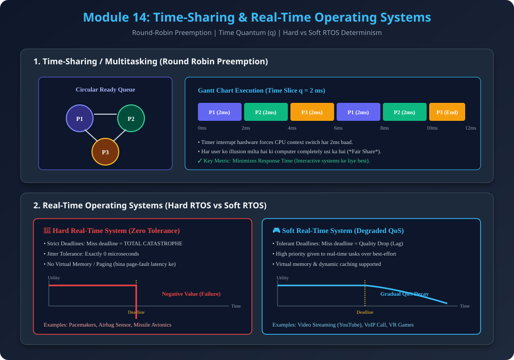

# Module 14: Time-Sharing & Real-Time Operating Systems

> **Reference Note:** Yeh module [Module 10: Processor Management & Scheduling](../10_Processor_Management_and_Scheduling/README.md) aur [Module 13: Batch & Multiprogrammed OS](../13_Types_of_Operating_Systems_Batch_and_Multiprogrammed/README.md) ke context switching principles par build karta hai.

---

## 1. Time-Sharing (Multitasking / Fair Share) Operating Systems

### 1.1 Core Concept
- **Definition:** Time-Sharing ek logical extension hai multiprogramming ka, jahan CPU multiple jobs ke beech itni tezi se switch hota hai (*frequency in milliseconds*) ki har user ko system interactively responsive lagta hai.
- **Fair Share Principle:** CPU kisi bhi single process ko indefinitely monopolize karne nahi deta. Ek hardware timer ke through time ko fixed slices mein divide kiya jata hai.

### 1.2 Time Quantum (Time Slice $q$)
- Har ready process ko execution ke liye fixed time allot hota hai jise **Time Quantum ($q$)** kehte hain.
- **Preemption Rule:**
  - Agar Process $P_1$ time $q$ khatam hone se pehle apna CPU burst complete kar le ya I/O request kare $\rightarrow$ CPU voluntarily release ho jata hai.
  - Agar $P_1$ time $q$ tak execute hota rahe aur complete na ho $\rightarrow$ Hardware timer interrupt trigger hota hai, OS $P_1$ ko **preempt** karke Ready Queue ke tail par daal deta hai, aur agla process dispatch karta hai.

### 1.3 Mathematical Thought Process: Time Quantum Sizing Trade-off
Maan lo context switch karne mein $\delta$ time lagta hai:
- **Case 1: Quantum $q$ bohot bada ho ($q \to \infty$):**
  - System First-Come-First-Serve (FCFS) jaisa behave karega.
  - Interactive users ke liye response time exponentially kharab ho jayega (*Convoy Effect*).
- **Case 2: Quantum $q$ bohot chhota ho ($q \to 0$):**
  - CPU ka majority time sirf context switching overhead mein waste hoga:
    $$\text{Overhead Fraction} = \frac{\delta}{q + \delta}$$
  - Agar $q = 1\text{ ms}$ aur $\delta = 0.2\text{ ms}$, to $16.7\%$ CPU cycles sirf switching mein burn ho jayenge!
- **Golden Rule of Thumb:** Time Quantum $q$ aisa select kiya jata hai ki **80% of CPU bursts** $q$ se chhote hon, aur context switch overhead $1\%$ se kam ho.

---

## 2. Real-Time Operating Systems (RTOS)

### 2.1 Definition & Determinism
- **Definition:** Ek aisa operating system jahan system ki correctness sirf logical output par depend nahi karti, balki **kis time par output deliver hua** uspar bhi depend karti hai.
- **Key Property - Determinism & Bounded Jitter:** 
  $$\text{Correctness} = (\text{Correct Computation Result}) \land (\text{Completion Time} \le \text{Deadline } D)$$
- General purpose OS (Windows/Linux) **Throughput** maximize karte hain, jabki RTOS **Worst-Case Execution Time (WCET)** aur **Predictability** guarantee karte hain.

---

## 3. Hard Real-Time vs Soft Real-Time Systems

### 3.1 Hard Real-Time System (Zero Tolerance)
- **Deadline Rule:** Ek bhi deadline miss hona system ka **TOTAL FATAL FAILURE** mana jata hai.
- **Architectural Constraints:**
  - **No Virtual Memory / Paging:** Secondary disk se page fault aane par variable millisecond delay (jitter) ho sakta hai, isliye paging completely disabled hoti hai.
  - Minimalistic deterministic kernel (e.g., VxWorks, QNX Neutrino, RTEMS).
- **Real-World Examples:**
  - Cardiac Pacemaker (Heart rate regulation).
  - Automotive Airbag Deployment (within 15-30 milliseconds of impact).
  - Rocket Propulsion & Missile Guidance Systems.

### 3.2 Soft Real-Time System (Graceful Degradation)
- **Deadline Rule:** Agar deadline miss ho jaye, to system crash nahi hota, balki output ki **Quality of Service (QoS)** degrade ho jati hai (*utility diminishes*).
- **Architectural Freedom:** Virtual memory, dynamic caching, aur complex multimedia decoders allowed hote hain.
- **Real-World Examples:**
  - Live Video Streaming (YouTube, Twitch): Deadline miss hone par frame drop ya buffering aati hai.
  - Online Multiplayer Gaming (CS:GO, Valorant): Packet latency increase hone par ping lag aata hai.
  - Digital Audio Processing.

---

## 4. Architectural Diagram

---

## 5. Comprehensive Comparison Matrix (AKTU 10-Marks Target)

| Parameter | Multiprogramming OS | Time-Sharing OS | Real-Time OS (RTOS) |
| :--- | :--- | :--- | :--- |
| **Primary Goal** | Maximize CPU Utilization | Minimize Response Time | Guarantee Strict Deadlines |
| **Preemption** | Usually Non-preemptive (on I/O) | Preemptive (Timer Interrupt $q$) | Preemptive based on Task Priority |
| **User Interaction** | Low to Medium | Very High (Multiple interactive terminals) | Minimal to None (Autonomous sensor events) |
| **Scheduling Algorithm** | FCFS, Shortest Job First | Round Robin (RR) with Time Slice | Rate Monotonic (RMS), Earliest Deadline First (EDF) |
| **Failure Metric** | Job takes longer | User experiences delay | Catastrophic failure (Hard RTOS) |

---

## 6. PDF Notes
📄 **[Download Module 14 Notes (PDF)](./14_Time_Sharing_and_Real_Time_Systems.pdf)**
