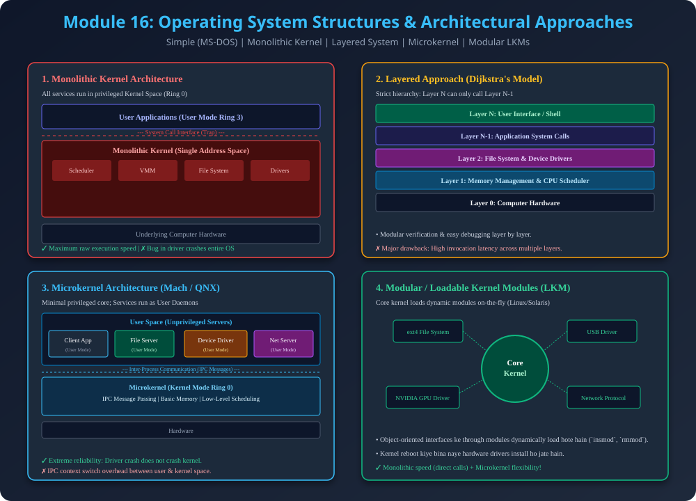

# Module 16: Operating System Structures & Architectures

> **Reference Note:** Yeh module [Module 4: Kernel and Operations](../4_Kernel_and_Operations/README.md) ke Monolithic vs Microkernel introduction ko complete architectural depth provide karta hai.

---

## 1. Evolution of Operating System Design

Operating system software world ka sabse complex code base hota hai (Linux kernel mein 30+ million lines of code hain). Isliye ise bina structured architecture ke maintain karna impossible hai. History mein 5 prominent architectural approaches evolve hue hain:
1. Simple Structure (MS-DOS)
2. Monolithic Structure (UNIX, Early Linux)
3. Layered Approach (Dijkstra's THE System)
4. Microkernel Architecture (Mach, QNX, Minix)
5. Modular / Loadable Kernel Module (LKM) Structure (Modern Linux, Solaris)

---

## 2. Simple Structure (MS-DOS)

### 2.1 Design & Working
- **Initial Goal:** 1980s mein Intel 8086 processors par limited memory (640 KB) ke liye likha gaya tha.
- **Flaw - No Dual Mode Hardware Isolation:**
  - MS-DOS mein User Mode aur Kernel Mode ka hardware protection bit nahi tha.
  - User application directly ROM BIOS aur hardware device drivers ko modify kar sakti thi.
- **Drawback:** Agar user application mein koi bug aa jaye ya infinite write execute ho jaye, to poora BIOS aur disk filesystem corrupt ho jata tha.

---

## 3. Monolithic Kernel Architecture

### 3.1 Architectural Working
- **Concept:** Saare core OS subsystems (**Process Scheduler, Virtual Memory Manager, File System, Network Stack, aur Hardware Device Drivers**) ek hi single address space mein privileged **Kernel Mode (Ring 0)** par execute hote hain.
- **Communication:** Subsystems aapas mein direct C function calls ke through communicate karte hain.
- **Advantages:**
  - **Blazing Fast Performance:** Zero context-switch ya message-passing IPC latency. Memory mein direct pointer dereference se data transfer hota hai.
- **Disadvantages (Critical AKTU PYQ Topic):**
  - **Lack of Fault Isolation:** Kyunki saare drivers kernel mode mein hain, agar third-party sound card ya Wi-Fi driver crash hota hai, to poora operating system crash ho jayega (BSOD / Kernel Panic).
  - **Codebase Complexity:** Subsystems tightly coupled hote hain, isliye naya feature add karna ya debug karna risky hota hai.

---

## 4. Layered Approach (Dijkstra's Model)

### 4.1 Concept
- **Strict Hierarchy:** OS ko $N$ layers mein divide kiya jata hai:
  - **Layer 0:** Hardware (CPU, Memory, Disks).
  - **Layer 1 to $N-1$:** Device drivers, Memory manager, File system.
  - **Layer $N$:** User Interface (Shell / GUI).
- **Fundamental Rule:** Layer $i$ sirf apne niche wali Layer $i-1$ ke functions call kar sakti hai. Kisi bhi layer ko apne upar wali layer ka koi knowledge nahi hota.

### 4.2 Advantages & Disadvantages
- **Advantages:** Easy debugging and verification. Layer 0 test hone ke baad Layer 1 test hoti hai; agar Layer 1 fail ho to hume pata hai bug Layer 1 mein hi hai.
- **Disadvantages:**
  - **Defining Layer Ordering is Difficult:** Memory manager ko disk I/O driver chahiye (backing store ke liye), lekin disk driver ko memory buffers chahiye. Circular dependency resolve karna mushkil hota hai.
  - **Performance Overhead:** User request ko 6-7 layers traverse karni padti hai, har layer par function call overhead add hota hai.

---

## 5. Microkernel Architecture (Mach, QNX)

### 5.1 Concept & Philosophy
- **Minimal Privilege Principle:** Kernel space se saare non-essential components bahar nikaal kar **User Space** mein normal background daemons (servers) ki tarah run karaye jate hain.
- **What remains in Microkernel?**
  1. Inter-Process Communication (IPC Message Passing).
  2. Low-level process scheduling.
  3. Minimal virtual memory primitives.
- **What moves to User Space?** File System Server, Network Server, Device Drivers, Process Management Server.

### 5.2 How Applications Access Services
Jab user program file read karna chahta hai:
1. User App $\rightarrow$ sends IPC message to Microkernel.
2. Microkernel $\rightarrow$ context switches and routes message to File System Server in User Space.
3. File Server $\rightarrow$ checks permissions and sends message to Disk Driver Server.
4. Microkernel $\rightarrow$ returns result to User App.

### 5.3 Pros & Cons
- **Pros (High Reliability & Extensibility):** Agar Wi-Fi driver ya File Server crash ho jaye, to sirf wo user daemon restart hoga; OS kernel unaffected rehta hai.
- **Cons (IPC Overhead):** Multiple user-mode to kernel-mode switches hone ki wajah se monolithic kernel se $10\%-20\%$ slower hota hai.

---

## 6. Modular / Loadable Kernel Module (LKM) Structure

### 6.1 Modern Industry Standard (Linux, Solaris)
- **Concept:** Best of both worlds!
  - Monolithic kernel jaisi speed: Loaded modules direct kernel space mein run karte hain (zero IPC overhead).
  - Microkernel jaisi modularity: Kernel reboot kiye bina naye hardware drivers (`.ko` files) runtime par dynamic link aur unload kiye ja sakte hain via `insmod` aur `rmmod`.

---

## 7. Architectural Summary Diagram

---

## 8. Comprehensive Comparison Table (AKTU 10 Marks)

| Parameter | Monolithic Kernel | Layered System | Microkernel | Modular (LKM) |
| :--- | :--- | :--- | :--- | :--- |
| **Driver Location** | Kernel Space | Respective Layer | User Space | Kernel Space (Dynamically Loaded) |
| **Communication** | Direct Function Call | Strict Layer Calls | IPC Message Passing | Direct Function Call |
| **Reliability** | Low (Driver bug halts OS) | Moderate | Very High (Isolated crash) | High (Dynamic unload) |
| **Performance** | Fastest | Slower (Stack traversal) | Slowest (IPC overhead) | Fastest |
| **Examples** | Original UNIX, MS-DOS | THE System | Mach, QNX, Minix | Linux, macOS, Solaris |

---

## 9. PDF Notes
📄 **[Download Module 16 Notes (PDF)](./16_Operating_System_Structures_and_Architectures.pdf)**
