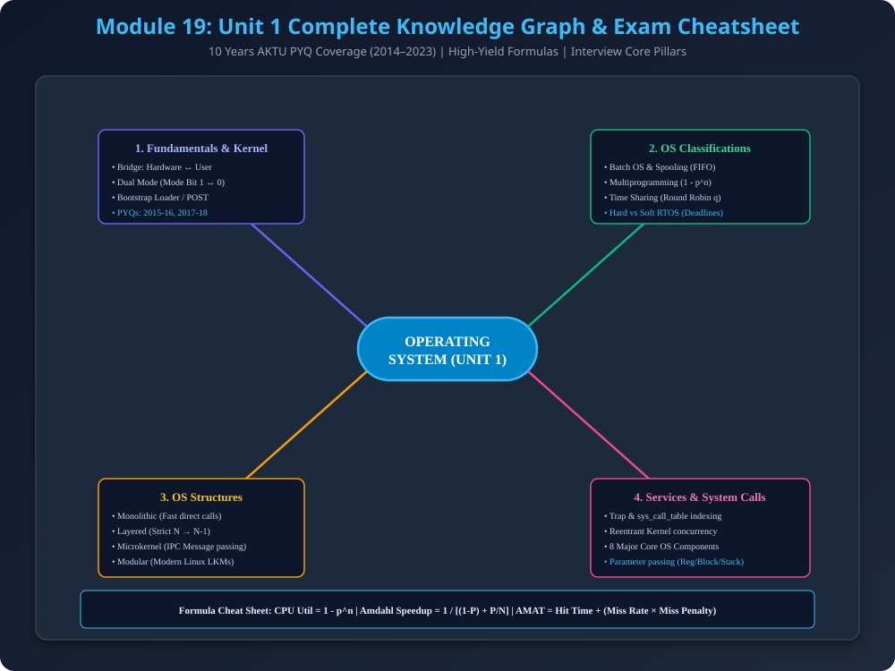

# Module 19: AKTU Previous Year Questions (PYQs) & Interview Cheatsheet

> **Master Exam Document:** Yeh module Unit 1 ke sabhi 5 lectures ke **10 Years ke AKTU University Exam Questions (2014–2023)** ke solved model answers, detailed comparisons, aur top tech company interview questions provide karta hai.

---

## 1. Unit 1 Complete Mind Map & Knowledge Graph



---

## 2. Section A: Solved 2-Marks Short Questions (AKTU Standard)

### Q1: What do you mean by Kernel? (AKTU 2015-16, 2018-19)
- **Answer:** Kernel operating system ka **central core component** hai jo computer startup ke baad se system shutdown hone tak permanently Main Memory (RAM) mein resident rehta hai. Yeh hardware aur application software ke beech direct bridge banata hai aur 5 core functions (CPU scheduling, memory management, device control, file operations, security) perform karta hai.

### Q2: Define Operating System and list its two main objectives. (AKTU 2016-17, 2017-18, 2021-22)
- **Answer:** Operating System ek system software hai jo computer hardware ko manage karta hai aur user programs ke liye ek execution environment provide karta hai.
- **Two Objectives:**
  1. **User Convenience (User View):** Computer ko use karne mein aasan aur user-friendly banana.
  2. **Resource Efficiency (System View):** Hardware resources (CPU, Memory, I/O) ko optimize aur safely manage karna.

### Q3: Define a Multiprogramming System and its principal advantage. (AKTU 2016-17, 2022-23)
- **Answer:** Multiprogramming ek aisa OS architecture hai jahan main memory (RAM) mein ek se zyada active processes simultaneously load rehte hain.
- **Principal Advantage:** Jab currently running process I/O wait mein jata hai, CPU idle rehne ke bajaye doosre process par switch kar jata hai. Isse CPU utilization 30% se badhkar 90%+ ho jati hai.

### Q4: What do you mean by Multitasking? (AKTU 2018-19)
- **Answer:** Multitasking (Time-Sharing) multiprogramming ka logical extension hai jahan CPU multiple jobs ke beech fixed time slices (Time Quantum $q$) par round-robin switch karta hai, jisse multiple users interactively computer share kar sakte hain.

### Q5: Briefly define the term Real-Time Operating System (RTOS). (AKTU 2021-22)
- **Answer:** RTOS ek aisa time-bound system hai jahan correctness sirf computational result par hi nahi, balki strict deadline ke andar deliver hone par depend karti hai ($WCET \le \text{Deadline}$). Examples: VxWorks, QNX.

### Q6: What is Spooling? (AKTU 2014-15, 2015-16)
- **Answer:** Spooling (*Simultaneous Peripheral Operation On-Line*) ek mechanism hai jahan slow peripheral devices (printers, card readers) ke I/O data ko high-speed hard disk buffer par FIFO queue mein temporarily store kiya jata hai taaki CPU fast compute kar sake aur I/O overlap ho sake.

### Q7: How is a system call handled by the system? (AKTU 2015-16)
- **Answer:** User program library function call karta hai $\rightarrow$ CPU registers mein syscall number load hota hai $\rightarrow$ Software interrupt (Trap / `syscall`) execute hota hai $\rightarrow$ Hardware Mode Bit ko $1$ se $0$ switch karta hai $\rightarrow$ Kernel `sys_call_table` index lookup karke handler run karta hai $\rightarrow$ Result store karke Mode Bit $0$ se $1$ flip hota hai aur control user program ko return hota hai.

---

## 3. Section B: Solved 5-Marks & 7-Marks Questions

### Q8: Differentiate between Interactive and Batch Operating Systems. (AKTU 2017-18, 7 Marks)

| Parameter | Batch Operating System | Interactive Operating System |
| :--- | :--- | :--- |
| **User Interaction** | Zero interaction during execution | High continuous interaction via keyboard/mouse |
| **Job Submission** | Grouped in batches via punch cards/operator | Direct launch via Terminal (CLI) or GUI |
| **Turnaround Time** | Very high (hours to days) | Very low (seconds/milliseconds) |
| **Debugging Ease** | Difficult; only post-execution dump available | Immediate runtime feedback and interactive debugging |
| **Primary Goal** | Maximize batch throughput | Minimize user response time |

---

### Q9: Discuss the difference between Time-Sharing System and Real-Time System. (AKTU 2018-19, 10 Marks)

| Parameter | Time-Sharing System | Real-Time System (RTOS) |
| :--- | :--- | :--- |
| **Primary Metric** | Minimize average response time | Strictly meet guaranteed deadlines |
| **Scheduling Model** | Round Robin with Time Quantum ($q$) | Priority-driven (RMS, EDF) preemptive scheduling |
| **Virtual Memory** | Heavily used (Paging & Swapping) | Disabled / strictly restricted (to prevent jitter) |
| **Deadline Miss Impact** | Mild inconvenience (slight UI lag) | Catastrophic failure in Hard RTOS (fatal crash) |
| **Use Cases** | General computing (macOS, Windows, Linux) | Avionics, Automotive ECUs, Medical life support |

---

### Q10: Explain the Layered Structure approach of an Operating System with a neat sketch. List its advantages and disadvantages. (AKTU 2014-15, 2017-18, 7 Marks)

#### Answer & Architecture:
Layered approach mein operating system ko vertically stacked $N$ modular layers mein organize kiya jata hai:
- **Layer 0:** Bare Computer Hardware (CPU, Memory, Registers).
- **Layer 1:** Memory Management & Process Dispatcher.
- **Layer 2:** Device Drivers & I/O Channel Controllers.
- **Layer 3:** File System Subsystem.
- **Layer 4 / Layer N:** User Interface (CLI Shell / GUI).

**Core Design Rule:** Layer $i$ sirf apne strictly niche wali Layer $i-1$ ke functions call kar sakti hai.

#### Advantages:
1. **Modularity & Debugging Ease:** System ko layer-by-layer independently verify kiya ja sakta hai. Agar Layer 2 par bug aata hai, to confirm hai ki Layer 0 aur 1 bug-free hain.
2. **Information Hiding:** Har layer internal data structures ko encapsulate karti hai aur upar wali layer ko clean API expose karti hai.

#### Disadvantages:
1. **Layer Ordering Complexity:** Practical systems mein layers define karna bohot tough hota hai (e.g., virtual memory manager ko disk backing store chahiye, lekin disk driver ko memory buffer chahiye).
2. **Performance Degradation:** Ek simple user request ko 5 layers cross karke traverse karna padta hai, jisse call stack overhead increase ho jata hai.

---

### Q11: Explain in detail about Monolithic and Microkernel Systems. (AKTU 2021-22, 10 Marks)

#### Detailed Comparison Matrix:

```
[Monolithic Architecture]                  [Microkernel Architecture]
+-------------------------------+          +-------------------------------+
| User Applications (Ring 3)    |          | User Apps | File Srv | Net Srv|
+-------------------------------+          +-------------------------------+
| === Syscall (Trap) ========= |          | === IPC Message Passing ===== |
| Kernel Space (Ring 0):        |          | Microkernel (Ring 0):         |
| [Scheduler] [VMM] [File Sys]  |          | [IPC] [Scheduling] [Low Mem]  |
| [Device Drivers] [Network]    |          +-------------------------------+
+-------------------------------+          | Computer Hardware             |
| Computer Hardware             |          +-------------------------------+
+-------------------------------+
```

1. **Kernel Address Space:**
   - **Monolithic:** Saare OS services (VMM, scheduler, drivers, network) ek single large address space mein privileged ring 0 par execute hote hain.
   - **Microkernel:** Sirf basic IPC, low-level scheduling, aur address spaces kernel mode mein hote hain. File systems, networking stacks, aur device drivers unprivileged user mode mein independent servers ki tarah run karte hain.
2. **Inter-Service Communication:**
   - **Monolithic:** Direct C function call (Zero context switch overhead).
   - **Microkernel:** IPC Message Passing (User $\to$ Microkernel $\to$ Server context switches).
3. **Fault Tolerance & Reliability:**
   - **Monolithic:** Low. Third-party sound card driver crash hone par poora OS crash ho jata hai (BSOD / Kernel panic).
   - **Microkernel:** Very High. Driver crash hone par sirf wo individual user process crash hota hai; microkernel bina reboot ke use restart kar deta hai.
4. **Real World Examples:**
   - **Monolithic:** Linux, Original UNIX, MS-DOS.
   - **Microkernel:** Mach (macOS foundation), QNX (Used in cars & space missions), Minix.

---

## 4. Top 5 Product Company Interview Questions (Google, Amazon, Microsoft)

| # | High-Yield Interview Question | 1-Minute Rapid Answer |
| :---: | :--- | :--- |
| **1** | **Why does an OS need dual-mode operation?** | System integrity protect karne ke liye. Agar dual-mode na ho, to koi bhi buggy user program direct hardware control registers overwrite kar dega ya doosre process ki private memory hijack kar lega. |
| **2** | **What actually happens during a Context Switch?** | CPU current process ke registers, Program Counter, aur stack pointer ko uske PCB mein save karta hai; MMU page table pointer update karta hai (TLB flush hota hai); aur new process ke PCB se state CPU registers mein restore karta hai ($pprox 1-5\mu s$ latency). |
| **3** | **Why don't modern production OS use pure Microkernels?** | Pure microkernels mein extreme IPC message-passing context switch overhead hota hai, jisse system monolithic systems ke muqable $10\%-20\%$ slower ho jata hai. Modern OS (Linux, Windows) isliye **Hybrid / Modular LKM** approach use karte hain. |
| **4** | **What is Amdahl's Law and what is its implication on multicore systems?** | Speedup serial fraction $(1 - P)$ par bound hota hai: $S = \frac{1}{(1-P) + P/N}$. Agar program ka $20\%$ code serial hai, to infinite cores lagane par bhi max speedup $5\times$ se upar nahi ja sakta. |
| **5** | **How does Spooling differ from Buffering?** | Buffering RAM mein single device aur CPU ke temporary speed mismatch ko handle karta hai. Spooling secondary disk storage par multiple processes ke concurrent I/O requests ko FIFO queue karta hai. |

---

## 5. Comprehensive Formula & Rapid Revision Cheatsheet

1. **CPU Utilization with Multiprogramming:**
   $$\text{CPU Utilization} = 1 - p^n$$
   *(where $p$ = fraction of time process spends in I/O, $n$ = degree of multiprogramming)*

2. **Amdahl's Speedup Formula:**
   $$S = \frac{1}{(1 - P) + \frac{P}{N}}$$
   *(where $P$ = parallelizable fraction, $N$ = processor cores)*

3. **Average Memory Access Time (AMAT):**
   $$\text{AMAT} = T_{\text{hit}} + (\text{Miss Rate} \times \text{Miss Penalty})$$

4. **Context Switching Overhead in Time Sharing:**
   $$\text{Overhead} = \frac{\delta}{q + \delta}$$
   *(where $\delta$ = context switch latency, $q$ = time slice)*

---

## 6. PDF Notes
📄 **[Download Module 19 Notes (PDF)](./19_AKTU_PYQs_and_Interview_Cheatsheet.pdf)**
