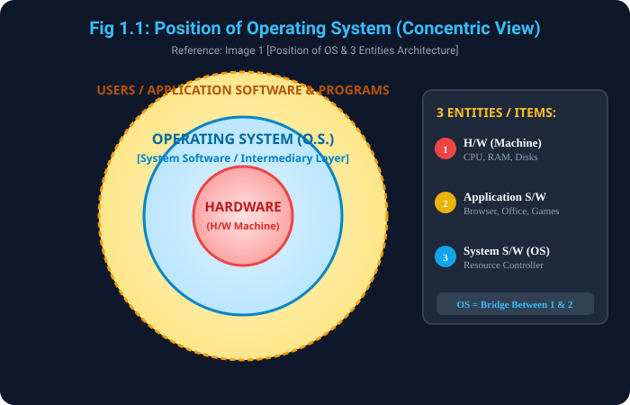

# 1. Operating System (OS) kya hai aur iska Position

> **Reference Note:** Yeh topic aapke dwara provide ki gayi **Image 1** par aadharit hai jisme OS ki definition, concentric position diagram aur computer system ke 4 components explain kiye gaye hain.

---

## 1.1 Operating System ki Basic Definition
- **Master Program:** Operating System ek aisa **program / system software** hai jo computer ke physical hardware (H/W) ko poori tarah manage aur control karta hai.
- **Intermediary / Bridge Role:** Yeh user aur raw computer hardware ke beech ek **intermediary (madhyasth)** ka kaam karta hai. Agar OS na ho, toh user ko computer ke binary circuits, registers aur memory buses se direct baat karni padegi jo aam insaan ke bas ki baat nahi hai.
- **Foundation / Basis for Apps:** OS ek aisa basic foundation provide karta hai jiske upar saare application software (jaise Web Browser, MS Office, Code Editors, Games) install hokar run kar sakte hain.
- **User-Friendly Environment:** OS ek convenient aur easy-to-use environment taiyar karta hai jisme user bina kisi technical complexity ke apne programs execute kar sake.

---

## 1.2 Diagram Reference & Handwritten Notes (Image 1)
- **Diagram Reference:** Original Image 1 mein ek concentric circle (onion-like) diagram diya gaya hai jiska title hai **`Fig: - Position of Operating System`**.
- **Handwritten Notes:** Image 1 ke right side mein 3 items/entities note kiye gaye hain:
  - `(1) H/W — Machine`
  - `(2) Application S/W`
  - `(3) System S/W / OS` (lagbhag 50% core management)

### Visual Representation of OS Position


```
+-----------------------------------------------------------+
|               USERS & APPLICATION PROGRAMS                |
|       (Chrome, VS Code, MS Word, VLC, Video Games)        |
+-----------------------------------------------------------+
                             |
                             v
+-----------------------------------------------------------+
|                 OPERATING SYSTEM (O.S.)                   |
|       (Windows, Linux, macOS, Android, iOS)               |
|      [Intermediary & Resource Management Layer]           |
+-----------------------------------------------------------+
                             |
                             v
+-----------------------------------------------------------+
|                 COMPUTER HARDWARE (H/W)                   |
|           (CPU, RAM, Storage SSD/HDD, I/O Devices)        |
+-----------------------------------------------------------+
```

---

## 1.3 Computer System ke 3 Main Entities (Items)
- **1.3.1 Hardware (H/W - Machine):**
  - Yeh computer ka physical infrastructure hai (jaise CPU, RAM, Hard Disk, Motherboard, Graphics Card).
  - Yeh computing capability aur raw processing power provide karta hai.
- **1.3.2 Application Software (Application S/W):**
  - Yeh specific end-user problems ko solve karne ke liye banaye gaye programs hote hain.
  - Examples: Web Browser (surfing ke liye), Word Processor (documentation ke liye), Media Player (entertainment ke liye).
- **1.3.3 System Software (OS & Utilities):**
  - Yeh hardware aur application software ke beech coordination banata hai.
  - Yeh hardware resources ko control karta hai aur application software ko resource allocate karta hai taaki system smoothly run kare.

---

## 1.4 Computer System ke 4 Core Components
Ek computer system ko 4 mukhya bhaagon mein divide kiya jata hai:
- **(i) The Hardware (H/W):**
  - Basic computing resources provide karta hai (CPU, Memory, I/O Devices).
- **(ii) The Operating System (O.S.):**
  - Hardware ke use ko control aur coordinate karta hai different users aur application programs ke beech.
- **(iii) The Application Programs:**
  - Define karta hai ki hardware resources ka use karke user ki computing problems ko kaise solve kiya jaye.
- **(iv) The Users:**
  - End-users jo computer ko use karte hain (Humans, remote machines, ya automated background bots).

---
*Next Module: [2. Components and Abstract View of Computer System](../2_Components_and_Abstract_View/README.md)*
