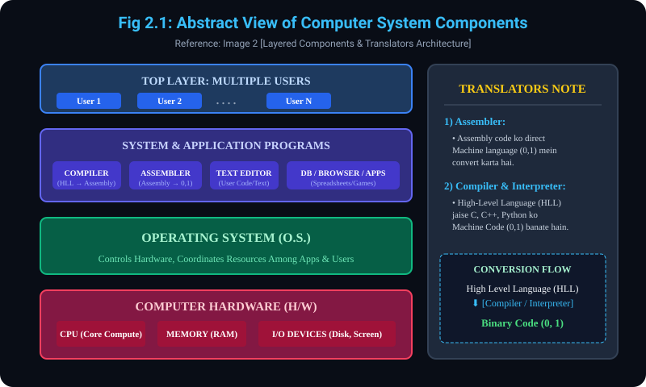

# 2. Computer System ka Abstract View aur Component Hierarchy

> **Reference Note:** 
> - **Pichle Concept ka Reference:** Jaise humne **Concept 1.4** mein dekha ki computer system ke 4 components hote hain (Hardware, OS, Application Programs, Users). 
> - Yeh topic aapke dwara provide ki gayi **Image 2** par aadharit hai jisme inn chaaron components ka **Abstract View Architecture** aur right side mein **Translators** ka concept explain kiya gaya hai.

---

## 2.1 Abstract View of Components (Layered Architecture)
- **Layer 1 (Bottom Most) - Computer Hardware (H/W):**
  - Yeh core computing machine hai jisme CPU, Main Memory (RAM), aur I/O devices aate hain.
- **Layer 2 - Operating System (OS):**
  - Hardware ke upar direct layer OS ki hoti hai. Yeh hardware ko wrap karke ek safe aur standard interface deta hai.
- **Layer 3 - System & Application Programs:**
  - OS ke upar different system utilities aur application software run hote hain jaise:
    - `COMPILER` (Code translation)
    - `ASSEMBLER` (Low-level translation)
    - `TEXT EDITOR` (Code / file editing)
    - `DATABASE (DBs), WEB BROWSERS, SPREADSHEETS`
- **Layer 4 (Top Most) - Multiple Users:**
  - `User 1, User 2, User 3, ... User N`. Yeh alag-alag users alag-alag programs ko access karte hain. OS ka kaam hai in sabhi users ke programs ke beech balance banana.

---

## 2.2 Translators (Handwritten Note Reference from Image 2)
Image 2 ke top-right corner mein likha hai:
`TRANSLATORS :- 1) ASSEMBLER 2) COMPILER, INTERPRETER | HLL -> 0, 1`

- **Translators ki Zaroorat Kyun Hai?**
  - Computer Hardware (CPU) sirf aur sirf **Machine Language (0 aur 1 / Binary Bits)** samajhta hai.
  - Hum insaan high-level English-like code likhte hain (C, C++, Java, Python).
  - Translators ka kaam iss Human-readable code ko Computer-readable binary bits (0, 1) mein convert karna hai.

- **2.2.1 Assembler:**
  - Assembly Language (Low-Level Language jaise `MOV AX, BX`, `ADD AX, 1`) ko seedhe Machine Language (0 aur 1) mein convert karta hai.
- **2.2.2 Compiler:**
  - High-Level Language (HLL) jaise C/C++ ke poore source code ko ek saath analyze karta hai aur target machine code / assembly code generate karta hai.
- **2.2.3 Interpreter:**
  - High-Level Language (jaise Python, JavaScript) ko line-by-line read karke execute karta hai.

### Translation Flow:
```
[ High Level Code (C/Python) ]
             |
             v  (Compiler / Interpreter)
[ Assembly Code (Mnemonic) ]
             |
             v  (Assembler)
[ Binary Machine Code (0, 1) ]  -->  Physical CPU Hardware
```

---

## 2.3 Hardware Resources (H/W Deep Dive)
Hardware basic computing resources provide karta hai jisme mukhyatah shamil hain:
- **(a) The Memory (RAM):**
  - Programs ko execute hone ke liye memory chahiye hoti hai. Variables aur active data yahin store hota hai.
- **(b) Input & Output (I/O) Devices:**
  - Disks (Storage), Keyboard, Mouse, Monitor, Network cards jinke zariye data in aur out hota hai.
- **(c) CPU (Central Processing Unit):**
  - Arithmetic aur logic operations perform karne wala main computing core.

---

## 2.4 Application Programs vs OS Coordination
- **Application Programs:**
  - Word Processors, Spreadsheets, Games, Database Management Systems (DBMS), Compilers etc.
  - Yeh programs define karte hain ki hardware resources ko kis tareeqe se use karke user ki specific computing problems solve karni hain.
- **Operating System ki Coordination Duty:**
  - OS hardware ko control karta hai aur ensure karta hai ki different application programs aur different users ke beech hardware resources (CPU, RAM, Disk) ka proper, fair aur collision-free use ho sake.
  - Reference to Concept 1.2: Jaise humne padha tha, OS resource controller ke roop mein intermediary ka kaam karta hai.

---

## 2.5 Diagram Reference (Image 2)
### Visual Representation of Abstract View


---
*Next Module: [3. User View vs System View of OS](../3_User_vs_System_View/README.md)*
