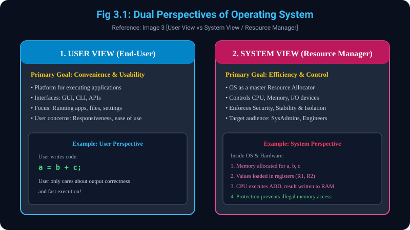

# 3. User's aur System's Point of View of Operating System

> **Reference Note:**
> - **Pichle Concepts ka Reference:** 
>   - **Concept 1.2** mein humne dekha ki OS intermediary program hai.
>   - **Concept 2.1** mein humne Abstract View dekha jisme Top par `User` tha aur Bottom par `Hardware / System`.
> - Yeh topic aapke dwara provide ki gayi **Image 3** par aadharit hai jisme OS ko do nazariyon se dekha gaya hai: **(i) User View** aur **(ii) System View (Resource Manager)**.

---

## 3.1 User View (End-User Perspective)
- **Primary Goal: Convenience, Usability & Ease of Use:**
  - Ek aam user ke perspective se, OS ka primary objective yeh hai ki computer ko use karna kitna easy, responsive aur convenient hai.
- **Interface Modes:**
  - User OS ke saath interact karta hai via:
    - **GUI (Graphical User Interface):** Windows, icons, buttons (e.g., Windows Desktop, macOS Finder).
    - **CLI (Command-Line Interface):** Terminal, PowerShell, Bash commands.
    - **APIs (Application Programming Interfaces):** Developers ke programs jo OS services call karte hain.
- **User Focus Areas:**
  - Applications run karna (browser kholna, gaana bajana).
  - Files manage karna (folders create karna, copy/paste).
  - Settings configure karna (Wi-Fi, Bluetooth).
  - Peripherals se interact karna (printer, mouse).
- **User Concerns:**
  - Usability, responsiveness (system hang na ho), aur accessible features.

---

## 3.2 System View (Resource Manager Perspective)
*(Image 3 handwritten note: "Resource Manager" - marked VERY IMPORTANT)*
- **Primary Goal: Efficiency, Control & Resource Optimization:**
  - System ke perspective se OS ek **Resource Allocator / Resource Manager** hai.
  - Physical resources (CPU time, RAM capacity, I/O bandwidth, File space) limited hote hain. OS ka kaam hai in limited resources ko multiple applications ke beech efficiently aur bina kisi conflict ke baantna.
- **System Components:**
  - **Kernel:** OS ka core engine.
  - **Device Drivers:** Hardware ke sath communication handles.
  - **Memory Management:** RAM allotment aur isolation.
  - **Process Management:** CPU scheduling aur concurrency.
  - **File Systems & Networking Protocols:** Data storage aur secure network communication.
- **Emphasis Points:**
  - **Efficiency:** Hardware ka maximum utilization (CPU idle na baithe).
  - **Resource Allocation:** Fair distribution taaki koi process starve na kare.
  - **Security & Stability:** Koi application system ko crash na kar sake ya dusre application ka data na chura sake.

---

## 3.3 Numerical Example & Step-by-Step Thought Process: `a = b + c`
*(Image 3 handwritten note: `a = b + c`)*

Aaiye ek clear example ke thought process se samjhein ki `a = b + c` ko User View aur System View kaise dekhte hain:

### Scenario:
User apne code mein likhta hai:
```c
int b = 10;
int c = 20;
int a = b + c;
```

### Thought Process Breakdown:

#### 1. User View ka Thought Process:
- **User ka Sochna:** "Maine `10` aur `20` add karne ko bola hai, mujhe result `30` turant milna chahiye."
- **User ki Concern:** Calculation accurate ho aur application bina lag ke fast output de. User ko isse koi farak nahi padta ki CPU ke kis core ya RAM ke kis byte par yeh calculation hui.

#### 2. Translators ka Role (Reference to Concept 2.2):
- Compiler ne iss HLL code ko CPU instructions mein tod diya:
  1. `LOAD R1, [Addr_B]`  *(Register R1 mein 10 load karo)*
  2. `LOAD R2, [Addr_C]`  *(Register R2 mein 20 load karo)*
  3. `ADD R3, R1, R2`    *(ALU calculation: 10 + 20 = 30)*
  4. `STORE [Addr_A], R3` *(Memory address A par 30 store karo)*

#### 3. System View (Resource Manager) ka Step-by-Step Thought Process:
- **Step 1 - Process Creation & Allocation:**
  - OS ne iss program ke liye ek **Process ID (PID)** allot kiya aur RAM mein ek isolated memory space allocate ki.
- **Step 2 - Memory Management Check (Safety):**
  - Jab program ne memory addresses `[Addr_A]`, `[Addr_B]`, `[Addr_C]` ko access kiya, toh OS ke **Memory Management Unit (MMU)** ne verify kiya ki kya yeh process apni hi boundary mein hai? Agar yeh kisi dusre software ke memory block ko chhoota, toh OS turant **Segmentation Fault** throw karke program ko rok deta.
- **Step 3 - CPU Scheduling & State Preservation:**
  - OS ke CPU Scheduler ne process ko CPU core par schedule kiya. CPU registers `R1`, `R2`, `R3` par data calculate hua. Agar theek isi samay koi higher priority interrupt aaya, toh OS ne in registers ka state save kiya taaki calculation kharab na ho.
- **Step 4 - Result & Resource Cleanup:**
  - `a = 30` memory mein safely write hone ke baad, OS ne resources release kiye aur terminal ko display signal diya.

> **Conclusion:** User ko jo sirf ek line ka addition lagta hai (`a = b + c`), System View mein OS uske piche Memory Protection, Register Allocation, CPU Scheduling aur Hardware Isolation manage kar raha hota hai!

---

## 3.4 User View vs System View Comparison Table

| Feature / Paimana | User View (End-User) | System View (Resource Manager) |
| :--- | :--- | :--- |
| **Main Objective** | Convenience, Ease of Use, Good GUI | Efficiency, Resource Utilization, Stability |
| **Primary Interaction** | GUI, CLI, Application Apps | System Calls, Hardware Interrupts, Drivers |
| **Target Audience** | Aam user, Gamer, Office worker | OS Kernel, SysAdmins, System Engineers |
| **Focus Area** | Application Output & Response Time | Memory Allocation, CPU Scheduling, Protection |
| **Example Reaction (`a=b+c`)** | "30 print ho gaya, simple!" | "RAM allocated, Registers loaded, MMU verified, CPU cycle scheduled!" |

---

## 3.5 Diagram Reference (Image 3)
### Visual Representation of User View vs System View


---
*Next Module: [4. Kernel and its Operations](../4_Kernel_and_Operations/README.md)*
