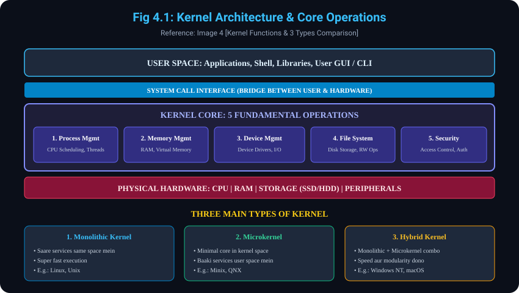

# 4. Kernel aur uske Core Operations (With Types of Kernel)

> **Reference Note:**
> - **Pichle Concepts ka Reference:**
>   - **Concept 1.1** mein humne dekha tha ki OS hardware ko manage karta hai.
>   - **Concept 3.2 (System View)** mein humne dekha tha ki Kernel OS ka core component hai jo resource management handle karta hai.
> - Yeh topic aapke dwara provide ki gayi **Image 4** par aadharit hai jisme **Kernel Definition**, uske **5 Core Functions** aur **3 Types of Kernel** detail kiye gaye hain.

---

## 4.1 Kernel kya hota hai (The Core Bridge)
- **Heart of the OS:** Kernel Operating System ka **sabse mukhya (core) component** hota hai. Yeh computer start (boot) hote hi RAM mein load hota hai aur jab tak computer on rehta hai, yeh memory mein bana rehta hai.
- **Hardware-Software Bridge:** Kernel hardware aur application software ke beech ek direct **bridge (pul)** ka kaam karta hai. Koi bhi application program hardware ko directly access nahi kar sakta; usse Kernel ke through hi permission leni padti hai via **System Calls**.
- **Crucial Responsibilities:** System ki stability, efficiency aur security maintain karna Kernel ki primary responsibility hai.

---

## 4.2 Key Functions / Operations of Kernel (5 Pillars)
Image 4 mein Kernel ke 5 fundamental operations bataye gaye hain:

- **4.2.1 Process Management:**
  - Process ka matlab hota hai "Program in Execution" (jaise chal raha browser ya code).
  - Kernel har process ko CPU time allot karta hai (CPU Scheduling), naye processes create aur terminate karta hai, aur unke beech coordination banata hai.
- **4.2.2 Memory Management:**
  - Kernel RAM ke allocation aur deallocation ko dekhta hai.
  - Yeh **Memory Protection** ensure karta hai taaki Process A kabhi Process B ki memory ko corrupt na kare.
  - Virtual Memory aur Paging/Mapping ko handle karta hai taaki kam RAM mein bhi bade programs run ho sakein.
- **4.2.3 Device Management:**
  - Kernel computer se jude sabhi hardware devices (Keyboard, Mouse, Disk, GPU, Network Card) ko Device Drivers ke zariye manage karta hai.
  - Applications ke liye ek standardized I/O interface provide karta hai taaki developers ko har alag printer ya keyboard ke liye alag code na likhna pade.
- **4.2.4 File System Management:**
  - Storage devices (SSD, HDD, Pen Drive) par data ko organize, read, write aur delete karne ki zimmedari Kernel ki hoti hai.
  - Files aur directories ka structure, indexing aur disk blocks ko efficiently maintain karta hai.
- **4.2.5 Security and Access Control:**
  - Kernel security policies enforce karta hai.
  - Yeh check karta hai ki kaun sa user ya process kis file ya resource ko access karne ka haqdar hai (User Authentication & Permissions).
  - System operations ki confidentiality aur integrity ko safeguard karta hai.

---

## 4.3 Types of Kernel (Handwritten & Slide Reference from Image 4)
Image 4 ke bottom section mein Kernel ke 3 types discuss kiye gaye hain:

### 4.3.1 Monolithic Kernel
- **Definition:** Saare ke saare OS services (Process Management, Memory Management, File System, Device Drivers) **ek hi address space (Kernel Space)** mein run karte hain.
- **Key Characteristics:**
  - Saare components ek saath tightly coupled hote hain.
  - System calls aur internal communication direct memory function calls se hota hai, isliye yeh **super fast** hota hai.
- **Drawback:** Agar koi third-party device driver crash hota hai, toh poora Operating System crash (Blue Screen of Death / Kernel Panic) ho sakta hai.
- **Examples:** Linux, Traditional Unix.

### 4.3.2 Microkernel
- **Definition:** Yeh kernel ko **bahut chhota (minimal)** rakhta hai. Kernel space mein sirf sabse zaroori cheezein hoti hain: Basic Process Scheduling, Inter-Process Communication (IPC), aur Basic Memory Management.
- **Key Characteristics:**
  - Baaki saari services (Device Drivers, File System, Networking) **User Space** mein independent servers ke form mein run karti hain.
  - Agar File System ya koi Driver crash bhi ho jaye, toh Kernel safe rehta hai aur system reboot karne ki zaroorat nahi padti.
  - Extremely modular, reliable aur secure.
- **Drawback:** User space aur kernel space ke beech baar-baar message passing (IPC) ki wajah se yeh Monolithic ke mukable thoda **slow** hota hai.
- **Examples:** Minix, QNX (medical aur automotive devices mein used), L4 Microkernel.

### 4.3.3 Hybrid Kernel
- **Definition:** Yeh Monolithic Kernel ki high speed aur Microkernel ki modularity aur security ko aapas mein **combine** karta hai.
- **Key Characteristics:**
  - Critical services (jaise Display drivers, File system) kernel space mein rakhi jaati hain taaki speed bani rahe, lekin architecture modular rehta hai.
- **Examples:** Windows NT architecture (Windows 10, Windows 11), macOS (XNU Kernel).

---

## 4.4 Kernel Types Comparison Table

| Property / Feature | Monolithic Kernel | Microkernel | Hybrid Kernel |
| :--- | :--- | :--- | :--- |
| **Address Space** | Saare services ek hi Kernel Space mein | Sirf basic core kernel space mein, baaki User Space mein | Mixture (Speed ke liye critical parts kernel space mein) |
| **Size** | Bada (Large codebase) | Chhota (Minimal codebase) | Medium to Large |
| **Performance (Speed)**| Bahut Fast (Direct function calls) | Thoda Slow (IPC message passing overhead) | Fast aur Balanced |
| **Fault Tolerance / Security**| Ek driver crash = Poora OS crash | Highly Stable (Driver crash hone par OS nahi girta) | High Stability with good recovery |
| **Real-World Examples**| Linux, BSD Unix | Minix, QNX, Symbian | Windows 10/11 (NT), macOS / iOS |

---

## 4.5 Diagram Reference (Image 4)
### Visual Representation of Kernel Architecture & Types

---
*Back to [Operating System Master Index](../README.md)*
